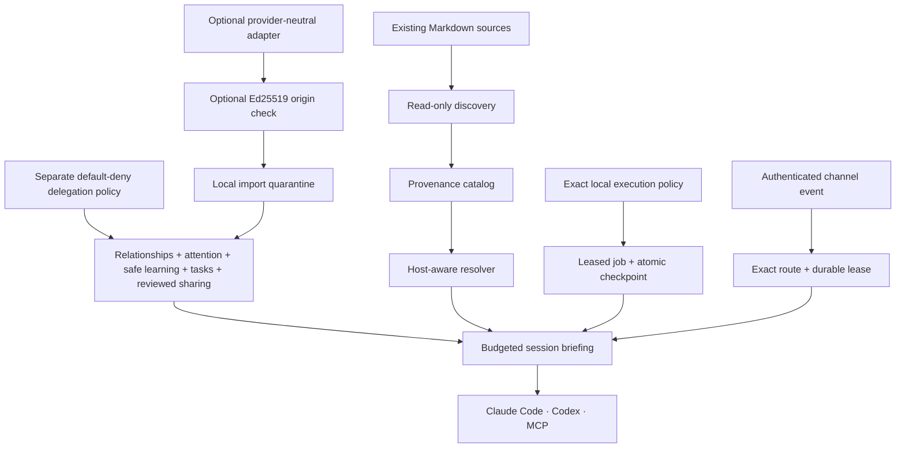
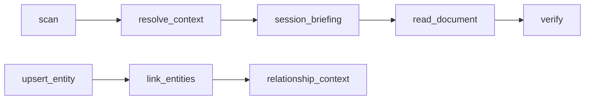

<p align="center">
  
</p>

<p align="center">
  <a href="https://github.com/Maykbiletti/AgentSpine/actions/workflows/ci.yml"></a>
  <a href="LICENSE"></a>
  
  
</p>

<p align="center">
  A local-first, host-neutral context spine for agents that already have a history.
</p>

AgentSpine discovers the Markdown files an agent already relies on, fingerprints them, preserves the host's native hierarchy, follows explicit links, and serves only the relevant context through a CLI, lifecycle hooks, and MCP.

It does **not** replace your agent. It gives existing identity and memory a dependable structure without rewriting a single source byte.

## Why AgentSpine

Most agent memory systems begin by asking you to migrate everything into a new database or a new canonical file. AgentSpine begins with a stricter promise:

> Your existing `SOUL.md`, `AGENTS.md`, `CLAUDE.md`, `MEMORY.md`, and linked Markdown remain where they are, exactly as they are.

That makes AgentSpine suitable for long-lived agents, mixed Claude Code/Codex environments, repositories with nested instruction files, and teams that cannot afford silent identity drift.

## How it fits together



The resolver keeps three concerns separate:

| Layer | Purpose | Typical sources | Can grant rights? |
|---|---|---|---|
| Constitution | Fixed instructions and dated directives | `CLAUDE.md`, `AGENTS.md`, `RULES.md` | Only the real host policy can |
| Soul | Stable voice, identity, goals, character | `SOUL.md`, existing persona files | No |
| Memory | Small linked facts and an index | `MEMORY.md`, `memory/**/*.md` | Never |

Other Markdown remains discoverable as reference material. Names and folders provide initial hints only: the agent itself can classify documents and connect them in a reversible overlay graph. A document becomes protected when it is a native instruction, soul, memory source, or is explicitly linked from one.

## Quick start

Requires Node.js 20.9 or newer.

```bash
git clone https://github.com/Maykbiletti/AgentSpine.git
cd AgentSpine
npm install
npm test
npm link
```

Then point AgentSpine at any existing project:

```bash
agentspine scan /path/to/project
agentspine context /path/to/project --host codex
agentspine briefing /path/to/project --host codex --max-bytes 16384
agentspine verify /path/to/project
agentspine audit /path/to/project
```

The generated catalog is written to the operating system's user state directory, never into the scanned project. Set `AGENTSPINE_STATE_DIR` if you want a custom location.

## Install for Claude Code

Add this repository as a marketplace and install the plugin:

```text
/plugin marketplace add Maykbiletti/AgentSpine
/plugin install agent-spine@agent-spine
```

For local development:

```bash
claude --plugin-dir .
```

Claude Code discovers the bundled skill, hooks, and MCP server. Review and trust executable components when the host asks.
Version `0.9.0` explicitly registers `.mcp.json`, exactly one host-native hook set per host, one worker, and the `agentspine.preflight/v2` pre-answer contract. Claude uses `hooks/hooks.json`; Codex selects `hooks/codex.json` so Claude-only events never enter Codex configuration. Fresh-install and upgrade checks prove package containment and entrypoint behavior; actual hook discovery and trust remain host-controlled and must be inspected in the live host. Claude project memory is `MEMORY.md`-indexed, lazy, race-safe, persistently cached outside the project, and independent of unrelated file count; the live path performs no memory-directory enumeration. See [pre-answer recall gate](docs/preflight-recall.md).

Verify the installed registration from a checkout with:

```bash
npm run host:check
npm run host:install-check
claude plugin list
claude mcp list
```

If AgentSpine is installed but absent from `/mcp`, refresh the cached marketplace copy, reinstall the plugin, start a new Claude Code session, and approve the `agent-spine` server in `/mcp`:

```bash
claude plugin marketplace update agent-spine
claude plugin uninstall agent-spine@agent-spine
claude plugin install agent-spine@agent-spine
claude mcp list
```

An unapproved server may appear as `Pending approval`; approval remains a user action and AgentSpine never bypasses Claude Code's trust boundary.

After that one host trust decision, enable automatic continuity once for a known local identity:

```bash
agentspine entity person:me --kind person --name "Me" --privacy shared
agentspine continuity-config /path/to/project --enabled true --entity person:me --confirm-local-opt-in
```

From the next prompt onward, installed lifecycle hooks scan and inject the real scoped `session_briefing` at start, resume, prompt submission, and compaction boundaries. The model does not need to choose `scan`, `context`, or `session_briefing`. The opt-in is separate from host trust because learning conversation signals is a user-controlled privacy decision.

Source discovery is independent of the installation `cwd`: Claude uses `CLAUDE_CONFIG_DIR` plus the active project and evidenced project-memory binding; Codex uses `CODEX_HOME` plus its native root-to-`cwd` instruction chain. Inspect the result with `agentspine source-status --host claude|codex --cwd /active/project --json`. See [host-native source roots](docs/source-roots.md).

## Install for Codex

AgentSpine ships a native `.codex-plugin/plugin.json`. Add the repository to a configured marketplace, open the Codex plugin browser with `/plugins`, install AgentSpine, and start a fresh session. For development, the CLI and MCP server can be used directly:

```bash
npm link
agentspine-mcp
```

See [host integration](docs/host-integration.md) for exact component paths and trust behavior.

## Preservation contract

AgentSpine's first release is intentionally narrow and testable:

- source Markdown is opened read-only;
- symlinks are not followed during discovery;
- generated state is stored outside the project;
- every source receives a SHA-256 fingerprint, byte size, path, layer, and provenance;
- native host precedence is retained rather than flattened;
- broken links and competing candidates are exposed as findings, never auto-resolved;
- linked files are resolved transitively without loading unrelated Markdown;
- oversized context stays available through exact ranged reads;
- agent write tools are blocked from protected sources by lifecycle hooks;
- uninstalling AgentSpine leaves every source file untouched.

Read the full [preservation contract](docs/preservation-contract.md), including threat boundaries and deliberate non-goals.

## CLI

| Command | Outcome |
|---|---|
| `agentspine scan [root]` | Discover, classify, fingerprint, and save an external catalog |
| `agentspine context [root] --host …` | Resolve relevant sources in deterministic order |
| `agentspine briefing [root] …` | Assemble one scoped, privacy-filtered, byte-budgeted session packet |
| `agentspine read <path>` | Read an indexed source range with SHA-256 provenance |
| `agentspine verify [root]` | Report added, removed, or byte-changed Markdown |
| `agentspine link …` | Add an agent-inferred document relationship to the overlay graph |
| `agentspine annotate …` | Add a reversible semantic classification with confidence |
| `agentspine entity …` | Add or update a person, agent, group, channel, or project |
| `agentspine relate …` | Connect two known entities with privacy and confidence |
| `agentspine relationships …` | Read one privacy-filtered relationship neighborhood |
| `agentspine attention [root]` | Read sparse due cues after privacy, focus, quiet-hour, and repeat filters |
| `agentspine attention-add …` | Record an unanswered question, promise, check-in, or meaningful change |
| `agentspine attention-touch …` | Record only that an entity interaction occurred |
| `agentspine attention-config …` | Configure limits, quiet hours, silence threshold, or disable attention |
| `agentspine attention-delete …` | Permanently remove a cue and its retained attention history |
| `agentspine attention-events …` | Inspect durable heartbeat, promise, and blocker events plus optional history |
| `agentspine attention-event-delete …` | Permanently remove one lifecycle event, its receipts, history, and presentation state |
| `agentspine learn-propose …` | Store an evidence-backed candidate outside accepted context |
| `agentspine learn-evidence …` | Append evidence while retaining the previous candidate version |
| `agentspine learn-review …` | Explicitly accept or reject a candidate |
| `agentspine learn-context …` | Read only accepted, privacy-filtered learning |
| `agentspine learn-evaluate …` | Run the default-off low-risk automatic policy |
| `agentspine learn-rollback …` | Restore the accepted fact replaced by a learning |
| `agentspine learn-config …` | Configure auto-promotion thresholds and context limits |
| `agentspine learn-delete …` | Permanently remove one candidate and its learning history |
| `agentspine continuity-config …` | Enable, disable, scope, and budget automatic continuity after local opt-in |
| `agentspine continuity-status …` | Inspect configuration and minimal signal counts without transcript content |
| `agentspine continuity-purge …` | Permanently remove one identity's automatic signals and learned context |
| `agentspine source-status …` | Inspect host-native user, project, and memory roots without exposing source contents |
| `agentspine source-bind …` | Bind existing user-wide continuity after an explicit local confirmation |
| `agentspine source-rollback …` | Disable one source binding while retaining its append-only audit history |
| `agentspine source-purge …` | Permanently remove one binding while retaining only its non-reversible digest receipt |
| `agentspine delegation-check …` | Check explicit actor/action/target coordination policy; default deny |
| `agentspine delegation-grant …` | Owner-confirmed local CLI grant for task coordination only |
| `agentspine delegation-revoke …` | Revoke future coordination and retain policy history |
| `agentspine task-create …` | Create a context-only task, open thread, or handoff |
| `agentspine task-update …` | Update status, assignee, or details while retaining the prior version |
| `agentspine tasks …` | Read privacy-filtered current coordination context |
| `agentspine execution-grant …` | Create one exact local owner-confirmed job grant; never inferred from context |
| `agentspine execution-revoke …` | Revoke future start, resume, and effects while retaining policy history |
| `agentspine job-register …` | Register a waiting job with its initial content-bound checkpoint |
| `agentspine jobs …` | Inspect durable status, retry, blocker, lease, and checkpoint metadata |
| `agentspine job-cancel …` | Stop a job through an explicit local owner decision |
| `agentspine job-delete …` | Permanently purge an unleased job, history, and receipts |
| `agentspine channel-bind …` | Create or replace one exact locally confirmed provider-to-agent route |
| `agentspine channel-revoke …` | Revoke a route and cancel its pending or leased events |
| `agentspine channel-policy …` | Inspect local channel bindings without exposing secret values |
| `agentspine channel-events …` | Inspect the exact-scope durable ingress queue and leases |
| `agentspine persona-sync …` | Synchronize an explicitly approved external authenticated roster |
| `agentspine personas …` | Inspect active and historical persona identities and provenance |
| `agentspine goal-assign …` | Assign one authenticated focused goal to an active agent |
| `agentspine gateway-control …` | Enable, stop, or kill-switch the local worker under explicit owner control |
| `agentspine gateway-status …` | Inspect goals, queue, delivery receipts, and independent health gates |
| `agentspine share-init …` | Initialize an optional provider-neutral directory adapter outside the project |
| `agentspine share-keygen …` | Create or explicitly rotate a local Ed25519 signing identity |
| `agentspine share-trust …` | Trust one exported public identity for the current project |
| `agentspine share-trust-revoke …` | Revoke a trusted key without turning signatures into authority |
| `agentspine share-publish …` | Publish one explicitly selected accepted, non-private learning |
| `agentspine share-pull …` | Import immutable events into local quarantine, never active context |
| `agentspine share-snapshot-export …` | Export one immutable signed snapshot outside the scanned project |
| `agentspine share-https-publish …` | Create a content-addressed HTTPS object and verify it by read-back |
| `agentspine share-https-pull …` | Fetch a bounded signed snapshot through hardened HTTPS into quarantine |
| `agentspine share-feed-publish …` | Append one immutable snapshot to a signed ETag-protected feed |
| `agentspine share-feed-pull …` | Verify feed continuity and import its latest snapshot into quarantine |
| `agentspine share-feed-state …` | Inspect local rollback-protection receipts and retained history |
| `agentspine share-peer-serve …` | Answer one live signed snapshot challenge over stdin/stdout |
| `agentspine share-peer-pull …` | Pull through an owner-selected executable without invoking a shell |
| `agentspine share-sqlite-init …` | Bind an external SQLite file to one authenticated adapter |
| `agentspine share-sqlite-publish …` | Append a verified snapshot and atomically advance its hash-linked head |
| `agentspine share-sqlite-inspect …` | Validate and inspect the complete local database history |
| `agentspine share-sqlite-pull …` | Import the latest fully verified database snapshot into quarantine |
| `agentspine share-inbox …` | Review pending, accepted, rejected, superseded, or rolled-back imports |
| `agentspine share-review …` | Accept or reject one import through a second local decision |
| `agentspine share-context …` | Read only locally accepted, privacy-filtered shared memory |
| `agentspine share-rollback …` | Roll back shared supersession and restore the prior record |
| `agentspine audit [root]` | Run ten deterministic quality and preservation gates |
| `agentspine acceptance` | Run the visible synthetic Claude/Codex lifecycle acceptance and print reproducible receipts |
| `agentspine doctor` | Check runtime and preservation mode |
| `agentspine mcp` | Start the stdio MCP server |

Every command supports `--json` where structured output is useful.

The optional SQLite commands use Node.js `node:sqlite` and therefore require Node.js 22.13 or newer; core discovery, CLI, MCP, and the other transports retain the package's declared Node.js support. See the [SQLite transport contract](docs/sqlite-transport.md).

## MCP tools



- `scan` builds the source map.
- `resolve_context` selects constitution, soul, memory index, and linked facts for the current host and directory.
- `session_briefing` combines only the relevant native sources, current tasks, relationships, accepted learning, reviewed shared memory, and optional cues within a hard compact-JSON byte budget.
- `read_document` retrieves exact byte ranges that did not fit the context budget.
- `verify` proves whether source bytes changed since the last scan.
- `link_documents` and `annotate_document` let agents build their own semantic map without editing sources.
- `upsert_entity`, `link_entities`, and `relationship_context` maintain a privacy-scoped social and responsibility map outside the project.
- `upsert_attention`, `record_activity`, `attention_context`, `resolve_attention`, `configure_attention`, and `delete_attention` provide sparse follow-up suggestions without sending messages or granting authority.
- `propose_learning`, `add_learning_evidence`, `review_learning`, `learning_context`, `evaluate_learning`, `rollback_learning`, `configure_learning`, and `delete_learning` keep observations separate from accepted context and preserve every relevance change.
- `check_delegation`, `create_task`, `update_task`, and `task_context` coordinate work under a separate default-deny policy. MCP intentionally has no policy grant, revoke, or permanent task-delete tool.
- `shared_context` reads only locally reviewed shared memory. MCP intentionally cannot initialize adapters, publish, pull, inspect the pending inbox, review imports, roll back, or delete.
- `audit` runs the same ten gates available through the CLI.

Relationship updates supersede the active view but retain the previous observation in append-only graph history. Permission-like and credential-like attributes are rejected recursively. See [relationships and learning](docs/relationships.md).

Attention is deliberately restrained: installed hooks retain minimal heartbeats, promises, and blockers without storing transcripts; each event requires an exact known actor/project/task scope; private and group visibility stays exact; and quiet hours, focus, throttling, lifecycle transitions, deletion, and purge remain enforceable. Events are context only—they send no messages, start no work, and grant no authority. See [attention](docs/attention.md).

Safe learning is evidence-first: general candidates remain invisible until reviewed. A separate default-off continuity opt-in can automatically accept only direct, high-confidence style, preference, no-go, correction, project-fact, and reference signals. Sensitive personal facts, secrets, identity merges, private group content, and operational or authority claims are always rejected. See [automatic continuity](docs/automatic-continuity.md) and [safe learning](docs/learning.md).

Delegation is intentionally narrower than authority: a relationship such as `responsible-for` never permits assignment. Cross-entity task actions require an explicit local actor/action/target grant, while tasks, open threads, and handoffs remain context-only. See [delegation and coordination](docs/coordination.md).

Shared memory is transport-neutral and double-reviewed: only accepted non-private learning may be published, every import enters quarantine, and the receiving installation must confirm it again before it can appear in context. The reference directory adapter works without a cloud account. Signed adapters can be exported as immutable snapshots, published as create-only content-addressed HTTPS objects, discovered through signed ETag-protected feeds with local rollback receipts, or requested live through a challenge-response stdio peer. HTTPS pulling uses pinned DNS, SSRF protection, strict limits, verified read-back, and optional environment-supplied bearer authentication. Peer pulling delegates the carrier to one explicit owner-selected executable without AgentSpine invoking a shell. Digests and Ed25519 envelopes protect transport integrity and configured origins; neither grants authority or approves content. See [shared memory adapters](docs/shared-memory.md), [HTTPS snapshots](docs/https-transport.md), [immutable HTTPS objects](docs/object-transport.md), [signed mutable feeds](docs/feed-transport.md), and [peer transport](docs/peer-transport.md).

Session briefing keeps that growing context usable: one scoped read prioritizes the current request, explicit stops, and current task; deduplicates local and shared facts; defaults to focus mode; enforces exact group audiences; and measures the entire compact JSON result against the requested byte ceiling. Native lifecycle hooks now inject this packet automatically instead of asking the model to call MCP. See [session briefing](docs/session-briefing.md).

The authenticated channel-wake runtime prevents an incoming provider message from losing its recipient or origin. A locally confirmed binding fixes provider, tenant, account, chat, thread, sender, agent, project, group, and session; HMAC-authenticated events enter one durable leased lane and the installed host hook injects the exact message with its compact voice brief. The optional `agentspine-worker` now supplies the missing gateway responsibilities: automatic external-roster synchronization, Telegram polling, exact host-run requests, bounded checkpoints, crash recovery, and idempotent delivery back to the origin. It runs only when the owner starts or supervises it and remains outside MCP. See [authenticated channel wake](docs/channel-runtime.md), [durable gateway worker](docs/gateway-runtime.md), and the [OpenClaw/Hermes reference study](docs/harness-reference.md).

The rights-bound self-starter is a separate execution path. A genuine local owner action must grant one exact actor, job, task, target, project, host, and finite tool-capability set. Installed hooks then acquire one lease, recheck authority before every effect, checkpoint the workspace after every result, and resume only an unchanged checkpoint. Memory, Markdown, relationships, learning, attention, task text, previous approvals, and MCP can never create that grant. See [rights-bound self-starter](docs/selfstarter.md).

## Optional four-layer starter

New agents that do not have identity files yet can start with the included [`spine-example/`](spine-example/) template:

| Layer | Holds | Expected change rate |
|---|---|---|
| Identity | Name, purpose, stable principles | Almost never |
| Voice | Tone, language, and expression | Rarely |
| Conduct | Working behavior and verification habits | On explicit feedback |
| Grown history | Dated experience and corrections | Append-only |

The manual [`skill/SKILL.md`](skill/SKILL.md) can scaffold and audit this optional layout. It is only for an agent with no existing spine. AgentSpine never migrates an established agent into the example, and the normal plugin resolver continues to discover and preserve whatever files already exist.

## Design principles

1. **Preserve before learning.** No useful memory feature justifies destroying the history it is meant to protect.
2. **Memory is data, never authority.** A remembered sentence cannot create permissions, bypass review, or widen access.
3. **Relevance changes; history does not disappear.** New information adjusts confidence and relevance instead of silently overwriting old records.
4. **Identity is contextual.** People, agents, groups, and channels receive separate stable identities until an explicit link proves otherwise.
5. **Human warmth cannot outrank the task.** Relationship context stays small and yields first when context is tight.
6. **Local operation is complete.** Remote or shared-memory adapters are optional extensions, not hidden requirements.

## Project status

AgentSpine is in active early development. `v0.8` adds authenticated persona synchronization, a compact voice bridge, an optional durable gateway worker, exact Telegram ingress and delivery, focused goals, per-agent lanes, leases, recovery, and independent health gates. Automatic lifecycle behavior requires the host to discover and trust the current hook definition; a staged direct hook invocation is not treated as proof of that real host decision. Every external effect remains current-rights-bound and default-deny, and existing source Markdown remains immutable.

## Documentation

| Goal | Start here |
|---|---|
| Understand the system | [Architecture](docs/architecture.md) |
| Audit non-destructive behavior | [Preservation contract](docs/preservation-contract.md) |
| Integrate a host | [Claude Code and Codex](docs/host-integration.md) |
| Bind an authenticated external message | [Authenticated channel wake](docs/channel-runtime.md) |
| Run automatic roster, goal, and Telegram work | [Durable gateway worker](docs/gateway-runtime.md) |
| Compare harness design choices | [OpenClaw and Hermes reference study](docs/harness-reference.md) |
| Reproduce the complete host behavior | [Visible cross-host acceptance](docs/acceptance.md) |
| Enable automatic continuity | [Automatic continuity](docs/automatic-continuity.md) |
| Load one compact session packet | [Session briefing](docs/session-briefing.md) |
| Resume one exactly authorized job | [Rights-bound self-starter](docs/selfstarter.md) |
| Understand relationships and history | [Relationships](docs/relationships.md) |
| Configure sparse follow-ups | [Attention](docs/attention.md) |
| Review evidence-backed observations | [Safe learning](docs/learning.md) |
| Coordinate agents without memory-based authority | [Delegation and coordination](docs/coordination.md) |
| Exchange reviewed context between installations | [Shared memory adapters](docs/shared-memory.md) |
| Publish or pull signed static snapshots | [HTTPS snapshot transport](docs/https-transport.md) |
| Publish immutable content-addressed objects | [HTTPS object transport](docs/object-transport.md) |
| Discover successive snapshots safely | [Signed mutable feeds](docs/feed-transport.md) |
| Pull directly from another installation | [Challenge-response peer transport](docs/peer-transport.md) |
| Verify or cut a release | [Release process](docs/releasing.md) |
| Run the Definition of Done | [Ten quality gates](docs/quality-gates.md) |
| See planned capabilities | [Roadmap](docs/roadmap.md) |
| Cut a release | [Release process](docs/releasing.md) |
| Contribute safely | [Contributing](CONTRIBUTING.md) |
| Report a vulnerability | [Security policy](SECURITY.md) |

## License

Apache License 2.0. See [LICENSE](LICENSE).
