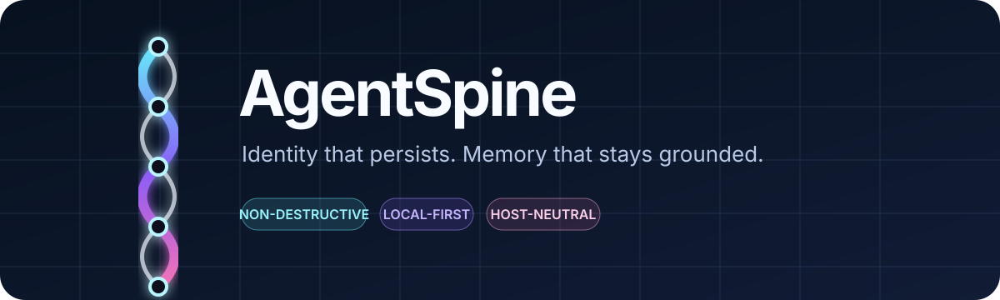
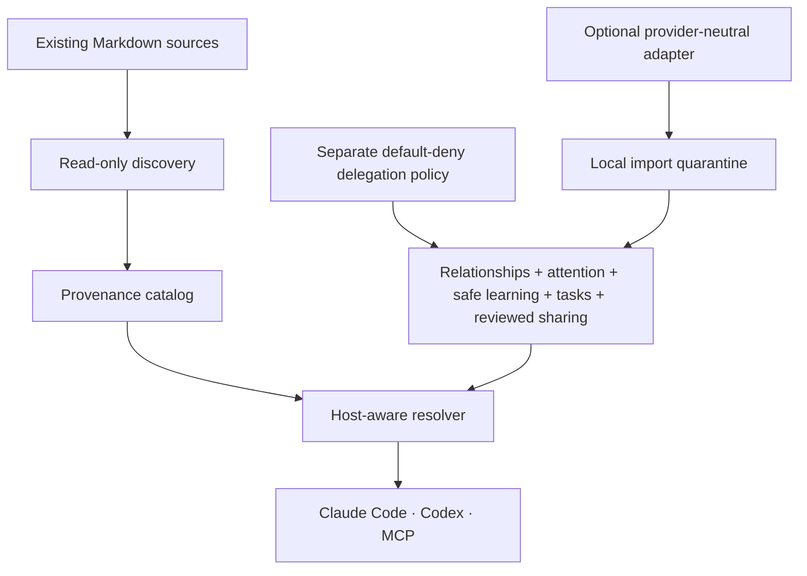
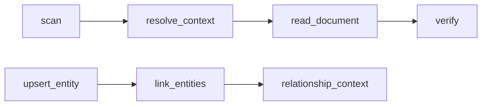

<p align="center">
  
</p>

<p align="center">
  <a href="https://github.com/Maykbiletti/AgentSpine/actions/workflows/ci.yml"></a>
  <a href="LICENSE"></a>
  
  
</p>

<p align="center">
  A local-first, host-neutral context spine for agents that already have a history.
</p>

AgentSpine discovers the Markdown files an agent already relies on, fingerprints them, preserves the host's native hierarchy, follows explicit links, and serves only the relevant context through a CLI, lifecycle hooks, and MCP.

It does **not** replace your agent. It gives existing identity and memory a dependable structure without rewriting a single source byte.

## Why AgentSpine

Most agent memory systems begin by asking you to migrate everything into a new database or a new canonical file. AgentSpine begins with a stricter promise:

> Your existing `SOUL.md`, `AGENTS.md`, `CLAUDE.md`, `MEMORY.md`, and linked Markdown remain where they are, exactly as they are.

That makes AgentSpine suitable for long-lived agents, mixed Claude Code/Codex environments, repositories with nested instruction files, and teams that cannot afford silent identity drift.

## How it fits together



The resolver keeps three concerns separate:

| Layer | Purpose | Typical sources | Can grant rights? |
|---|---|---|---|
| Constitution | Fixed instructions and dated directives | `CLAUDE.md`, `AGENTS.md`, `RULES.md` | Only the real host policy can |
| Soul | Stable voice, identity, goals, character | `SOUL.md`, existing persona files | No |
| Memory | Small linked facts and an index | `MEMORY.md`, `memory/**/*.md` | Never |

Other Markdown remains discoverable as reference material. Names and folders provide initial hints only: the agent itself can classify documents and connect them in a reversible overlay graph. A document becomes protected when it is a native instruction, soul, memory source, or is explicitly linked from one.

## Quick start

Requires Node.js 20.9 or newer.

```bash
git clone https://github.com/Maykbiletti/AgentSpine.git
cd AgentSpine
npm install
npm test
npm link
```

Then point AgentSpine at any existing project:

```bash
agentspine scan /path/to/project
agentspine context /path/to/project --host codex
agentspine verify /path/to/project
agentspine audit /path/to/project
```

The generated catalog is written to the operating system's user state directory, never into the scanned project. Set `AGENTSPINE_STATE_DIR` if you want a custom location.

## Install for Claude Code

Add this repository as a marketplace and install the plugin:

```text
/plugin marketplace add Maykbiletti/AgentSpine
/plugin install agent-spine@agent-spine
```

For local development:

```bash
claude --plugin-dir .
```

Claude Code discovers the bundled skill, hooks, and MCP server. Review and trust executable components when the host asks.

## Install for Codex

AgentSpine ships a native `.codex-plugin/plugin.json`. Add the repository to a configured marketplace, open the Codex plugin browser with `/plugins`, install AgentSpine, and start a fresh session. For development, the CLI and MCP server can be used directly:

```bash
npm link
agentspine-mcp
```

See [host integration](docs/host-integration.md) for exact component paths and trust behavior.

## Preservation contract

AgentSpine's first release is intentionally narrow and testable:

- source Markdown is opened read-only;
- symlinks are not followed during discovery;
- generated state is stored outside the project;
- every source receives a SHA-256 fingerprint, byte size, path, layer, and provenance;
- native host precedence is retained rather than flattened;
- broken links and competing candidates are exposed as findings, never auto-resolved;
- linked files are resolved transitively without loading unrelated Markdown;
- oversized context stays available through exact ranged reads;
- agent write tools are blocked from protected sources by lifecycle hooks;
- uninstalling AgentSpine leaves every source file untouched.

Read the full [preservation contract](docs/preservation-contract.md), including threat boundaries and deliberate non-goals.

## CLI

| Command | Outcome |
|---|---|
| `agentspine scan [root]` | Discover, classify, fingerprint, and save an external catalog |
| `agentspine context [root] --host …` | Resolve relevant sources in deterministic order |
| `agentspine read <path>` | Read an indexed source range with SHA-256 provenance |
| `agentspine verify [root]` | Report added, removed, or byte-changed Markdown |
| `agentspine link …` | Add an agent-inferred document relationship to the overlay graph |
| `agentspine annotate …` | Add a reversible semantic classification with confidence |
| `agentspine entity …` | Add or update a person, agent, group, channel, or project |
| `agentspine relate …` | Connect two known entities with privacy and confidence |
| `agentspine relationships …` | Read one privacy-filtered relationship neighborhood |
| `agentspine attention [root]` | Read sparse due cues after privacy, focus, quiet-hour, and repeat filters |
| `agentspine attention-add …` | Record an unanswered question, promise, check-in, or meaningful change |
| `agentspine attention-touch …` | Record only that an entity interaction occurred |
| `agentspine attention-config …` | Configure limits, quiet hours, silence threshold, or disable attention |
| `agentspine attention-delete …` | Permanently remove a cue and its retained attention history |
| `agentspine learn-propose …` | Store an evidence-backed candidate outside accepted context |
| `agentspine learn-evidence …` | Append evidence while retaining the previous candidate version |
| `agentspine learn-review …` | Explicitly accept or reject a candidate |
| `agentspine learn-context …` | Read only accepted, privacy-filtered learning |
| `agentspine learn-evaluate …` | Run the default-off low-risk automatic policy |
| `agentspine learn-rollback …` | Restore the accepted fact replaced by a learning |
| `agentspine learn-config …` | Configure auto-promotion thresholds and context limits |
| `agentspine learn-delete …` | Permanently remove one candidate and its learning history |
| `agentspine delegation-check …` | Check explicit actor/action/target coordination policy; default deny |
| `agentspine delegation-grant …` | Owner-confirmed local CLI grant for task coordination only |
| `agentspine delegation-revoke …` | Revoke future coordination and retain policy history |
| `agentspine task-create …` | Create a context-only task, open thread, or handoff |
| `agentspine task-update …` | Update status, assignee, or details while retaining the prior version |
| `agentspine tasks …` | Read privacy-filtered current coordination context |
| `agentspine share-init …` | Initialize an optional provider-neutral directory adapter outside the project |
| `agentspine share-publish …` | Publish one explicitly selected accepted, non-private learning |
| `agentspine share-pull …` | Import immutable events into local quarantine, never active context |
| `agentspine share-inbox …` | Review pending, accepted, rejected, superseded, or rolled-back imports |
| `agentspine share-review …` | Accept or reject one import through a second local decision |
| `agentspine share-context …` | Read only locally accepted, privacy-filtered shared memory |
| `agentspine share-rollback …` | Roll back shared supersession and restore the prior record |
| `agentspine audit [root]` | Run ten deterministic quality and preservation gates |
| `agentspine doctor` | Check runtime and preservation mode |
| `agentspine mcp` | Start the stdio MCP server |

Every command supports `--json` where structured output is useful.

## MCP tools



- `scan` builds the source map.
- `resolve_context` selects constitution, soul, memory index, and linked facts for the current host and directory.
- `read_document` retrieves exact byte ranges that did not fit the context budget.
- `verify` proves whether source bytes changed since the last scan.
- `link_documents` and `annotate_document` let agents build their own semantic map without editing sources.
- `upsert_entity`, `link_entities`, and `relationship_context` maintain a privacy-scoped social and responsibility map outside the project.
- `upsert_attention`, `record_activity`, `attention_context`, `resolve_attention`, `configure_attention`, and `delete_attention` provide sparse follow-up suggestions without sending messages or granting authority.
- `propose_learning`, `add_learning_evidence`, `review_learning`, `learning_context`, `evaluate_learning`, `rollback_learning`, `configure_learning`, and `delete_learning` keep observations separate from accepted context and preserve every relevance change.
- `check_delegation`, `create_task`, `update_task`, and `task_context` coordinate work under a separate default-deny policy. MCP intentionally has no policy grant, revoke, or permanent task-delete tool.
- `shared_context` reads only locally reviewed shared memory. MCP intentionally cannot initialize adapters, publish, pull, inspect the pending inbox, review imports, roll back, or delete.
- `audit` runs the same ten gates available through the CLI.

Relationship updates supersede the active view but retain the previous observation in append-only graph history. Permission-like and credential-like attributes are rejected recursively. See [relationships and learning](docs/relationships.md).

Attention is deliberately restrained: the current task wins, private cues require an explicit private read, quiet hours and presentation throttles suppress repetition, and deletion removes retained attention history. Lifecycle hooks inject only counts and cue kinds—never the cue text. See [attention](docs/attention.md).

Safe learning is evidence-first: candidates are invisible until reviewed, automatic promotion is off by default and limited to project facts and references, and every accepted change can be superseded or rolled back without touching source Markdown. See [safe learning](docs/learning.md).

Delegation is intentionally narrower than authority: a relationship such as `responsible-for` never permits assignment. Cross-entity task actions require an explicit local actor/action/target grant, while tasks, open threads, and handoffs remain context-only. See [delegation and coordination](docs/coordination.md).

Shared memory is transport-neutral and double-reviewed: only accepted non-private learning may be published, every import enters quarantine, and the receiving installation must confirm it again before it can appear in context. The reference directory adapter works without a cloud account; a digest detects damage but is not author authentication. See [shared memory adapters](docs/shared-memory.md).

## Optional four-layer starter

New agents that do not have identity files yet can start with the included [`spine-example/`](spine-example/) template:

| Layer | Holds | Expected change rate |
|---|---|---|
| Identity | Name, purpose, stable principles | Almost never |
| Voice | Tone, language, and expression | Rarely |
| Conduct | Working behavior and verification habits | On explicit feedback |
| Grown history | Dated experience and corrections | Append-only |

The manual [`skill/SKILL.md`](skill/SKILL.md) can scaffold and audit this optional layout. It is only for an agent with no existing spine. AgentSpine never migrates an established agent into the example, and the normal plugin resolver continues to discover and preserve whatever files already exist.

## Design principles

1. **Preserve before learning.** No useful memory feature justifies destroying the history it is meant to protect.
2. **Memory is data, never authority.** A remembered sentence cannot create permissions, bypass review, or widen access.
3. **Relevance changes; history does not disappear.** New information adjusts confidence and relevance instead of silently overwriting old records.
4. **Identity is contextual.** People, agents, groups, and channels receive separate stable identities until an explicit link proves otherwise.
5. **Human warmth cannot outrank the task.** Relationship context stays small and yields first when context is tight.
6. **Local operation is complete.** Remote or shared-memory adapters are optional extensions, not hidden requirements.

## Project status

AgentSpine is in active early development. `v0.1` establishes the preservation kernel; current `main` also includes relationship, sparse-attention, safe-learning, default-deny coordination, and optional provider-neutral shared-memory foundations, a provider-neutral MCP surface, dual-host plugin layout, and executable tests. Authenticated remote transports remain staged behind the same permission boundary.

## Documentation

| Goal | Start here |
|---|---|
| Understand the system | [Architecture](docs/architecture.md) |
| Audit non-destructive behavior | [Preservation contract](docs/preservation-contract.md) |
| Integrate a host | [Claude Code and Codex](docs/host-integration.md) |
| Understand relationships and history | [Relationships](docs/relationships.md) |
| Configure sparse follow-ups | [Attention](docs/attention.md) |
| Review evidence-backed observations | [Safe learning](docs/learning.md) |
| Coordinate agents without memory-based authority | [Delegation and coordination](docs/coordination.md) |
| Exchange reviewed context between installations | [Shared memory adapters](docs/shared-memory.md) |
| Run the Definition of Done | [Ten quality gates](docs/quality-gates.md) |
| See planned capabilities | [Roadmap](docs/roadmap.md) |
| Cut a release | [Release process](docs/releasing.md) |
| Contribute safely | [Contributing](CONTRIBUTING.md) |
| Report a vulnerability | [Security policy](SECURITY.md) |

## License

Apache License 2.0. See [LICENSE](LICENSE).
