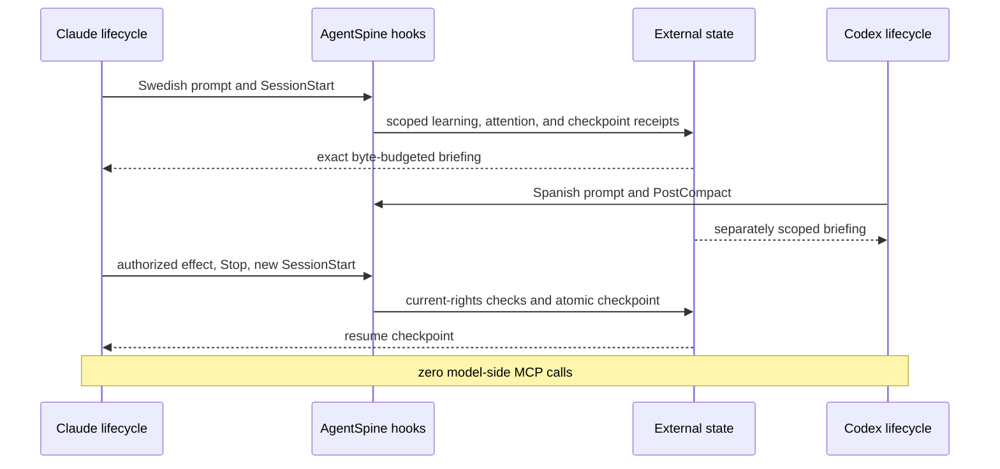

# Visible cross-host acceptance

AgentSpine `0.51.0` runs a visible, reproducible 15-gate acceptance scenario for the lifecycle adapter, including complete mandatory host instructions, required provider recall and a fail-closed missing-provider probe. Staged installed-entrypoint source-root and indexed-memory scaling smoke tests execute the same bundled adapter used by Claude Code and Codex and never select an MCP tool, but they do not substitute for the hosts' own plugin discovery and hook-trust UI.

```bash
agentspine acceptance
agentspine acceptance --json
npm run acceptance
```

The runner creates a temporary synthetic project and a separate temporary AgentSpine state directory. It uses new fictional identities, groups, projects, tasks, and fixed event times. It neither reads real user context nor stores a conversation transcript. Both temporary directories are removed after success or failure.

## What the run proves



The human-readable report contains these gates:

| Gate | Evidence |
|---|---|
| Canonical identities | Freja Åström and Lucía Ortega, their groups, projects, and tasks have separate stable IDs |
| Multilingual style continuity | Direct Swedish and Spanish style requests are minimally captured after opt-in |
| Attention lifecycle | Heartbeat, promise, and blocker events retain scope, provenance, and deduplication |
| Real restart | Claude receives the correct style and promise on a new `SessionStart` |
| Real compaction boundary | Codex receives the correct Spanish context on `PostCompact` |
| Person and group isolation | The other person and group cannot see foreign private or group context |
| Correction and history | A Swedish correction becomes active without replacing prior history |
| Atomic rollback | Rollback removes the correction and restores the earlier accepted style |
| Authorized resume | An exact local grant starts and resumes one job on its durable checkpoint |
| Denied foreign effect | A different actor cannot use the active lease or known task |
| Durable checkpointing | Effect, result, stop, and resume retain idempotent external receipts |
| Complete person purge | Later Codex startup cannot recall the purged person's context |
| Byte preservation | `AGENTS.md`, `CLAUDE.md`, and `SOUL.md` hashes remain identical |
| Final audit | All ten preservation and safety gates pass |

Every line includes a SHA-256 receipt derived from the acceptance schema, gate ID, and bounded evidence. The final digest binds the ordered gate receipts. JSON output uses `agentspine.acceptance/v1` and is suitable for CI without exposing source content.

## Installation proof

`npm run host:install-check` stages both a fresh installation and an upgrade from `0.7.0`. Each installed `0.8.0` bundle must contain exactly one MCP server, one hook set, and one worker entrypoint, then pass the complete visible acceptance run with `mcpCalls: 0`. It directly invokes the packaged hook entrypoint from an AgentSpine checkout and a foreign `cwd` with sources only in a custom Claude profile, and repeats the Codex-shaped event path with a custom home, two Git projects, a fallback name, and a nested override. Uninstall removes only staged plugin and generated state; all synthetic source hashes remain unchanged. A real Codex session must separately show the plugin source in `/hooks`, record trust for the current definition hash, and inject the briefing after a new session starts.

## Deliberate trust boundaries

The acceptance runner proves software behavior; it does not simulate or bypass host trust. A real Claude Code or Codex installation still asks once before executable plugin components become active. Automatic conversation learning additionally requires the separate local privacy opt-in.

The self-starter demonstration uses a synthetic owner-confirmed grant created inside the isolated scenario. In a real installation, execution grants and job registration remain explicit local owner operations. Memory, Markdown, conversation, relationships, attention, signatures, tasks, acceptance receipts, and prior approvals can never create or widen rights.
