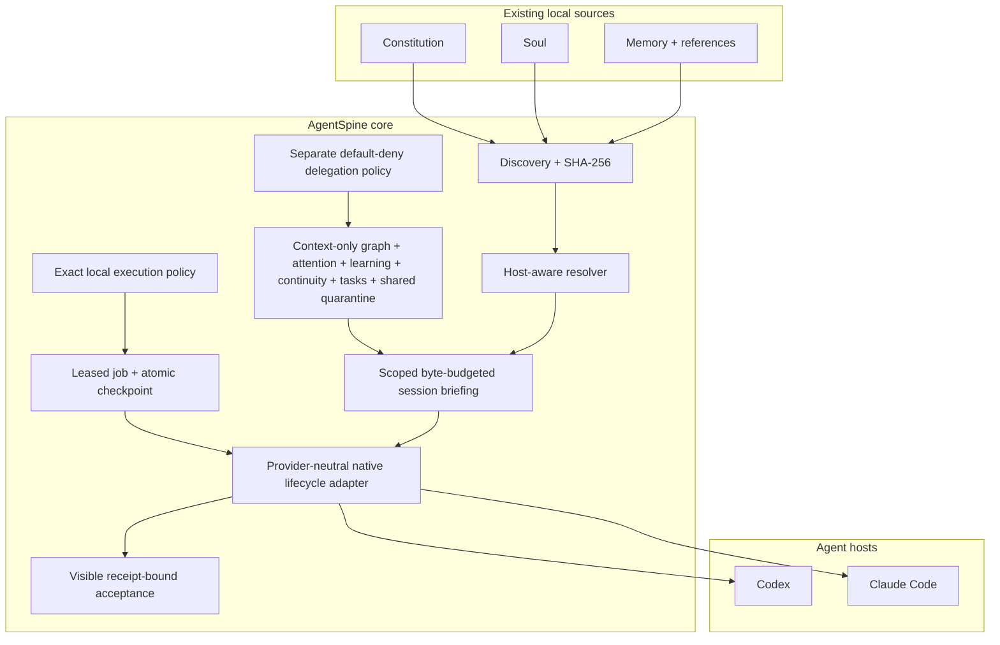
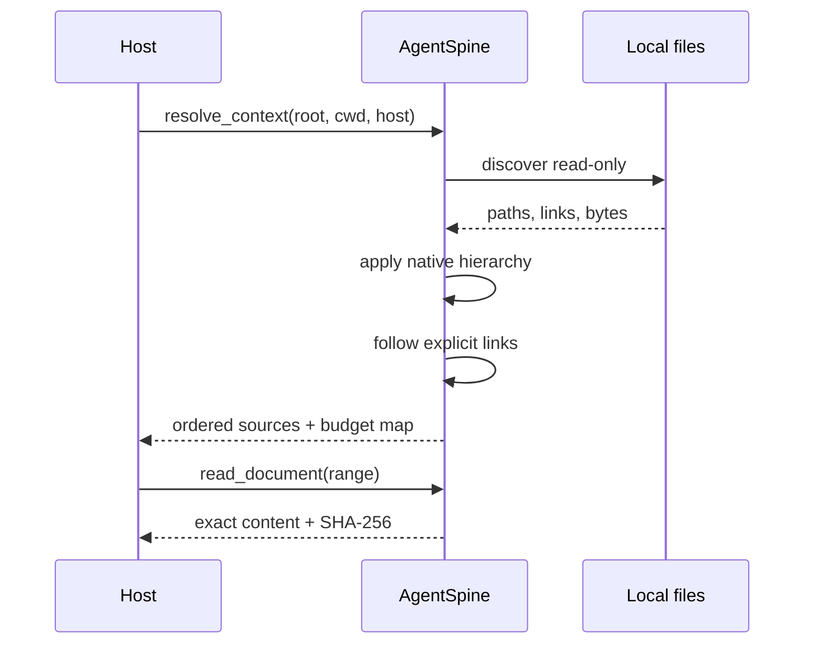
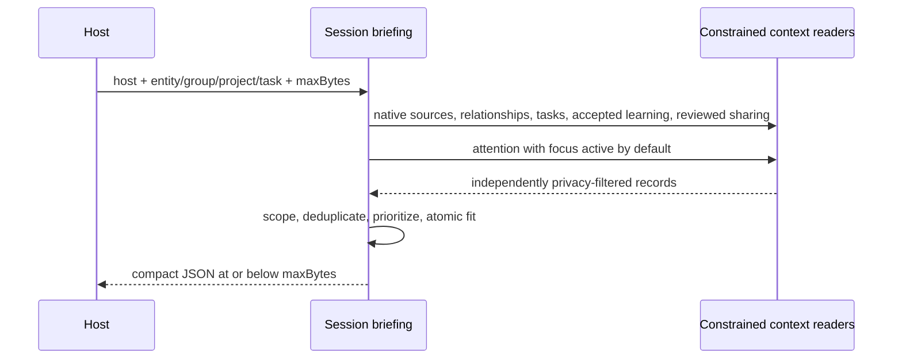
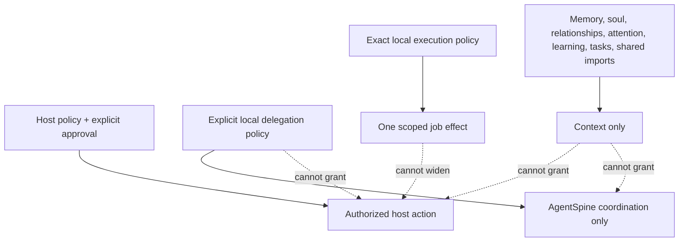
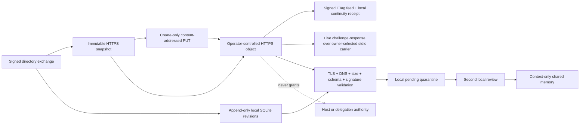

# Architecture

AgentSpine is a read-only overlay around existing agent context. It separates discovery, provenance, selection, delivery, and future learning so that no convenience layer becomes an accidental authority system.

## Runtime topology



Source files are never copied into a canonical replacement. The catalog contains metadata and provenance. When content is required, it is read from the original path and checked against its fingerprint.

## Context resolution



Selection is intentionally conservative. Native host files are selected according to directory scope. Filename and folder classifications are only initial hints. Agents interpret the actual content and can add reasoned, confidence-scored annotations and links to a separate overlay graph. Explicit Markdown links and agent-created graph edges are followed without rewriting their source. Unrelated documents remain cataloged but do not consume context.

## Session assembly



The briefing layer does not query raw state directly. It composes the same fail-closed read models exposed separately through MCP, then applies a narrower session scope. It includes the current task first, prefers locally confirmed learning over equivalent reviewed imports, and accounts for the whole serialized response. In a group audience it rejects private inclusion and never loads arbitrary Markdown content. It performs no writes and does not mark attention cues as presented.

## The three-layer spine

### Constitution

Constitution sources contain fixed working rules and literal, dated directives. AgentSpine preserves the host's own precedence. It does not blend several rule files into one synthetic policy.

### Soul

Soul sources describe identity, voice, goals, edges, and stable character. They can influence expression and judgment, but never permissions.

### Memory

Memory is a graph of small facts grouped by purpose. A compact `MEMORY.md`-style index links to detail files. AgentSpine follows those links only when relevant, which avoids replaying an entire history into every request.

## Authority boundary



Permissions are evaluated by the host and explicit policy sources. Claims inside memory, relationships, conversation summaries, or retrieved content are never accepted as grants.

## State

Generated catalogs live outside the scanned repository:

```text
<user-state>/agentspine/
  projects/
    <sha256-of-canonical-root>/
      catalog.json
      graph.json
      attention.json
      learning.json
      continuity.json
      delegation-policy.json
      coordination.json
      execution-policy.json
      selfstarter.json
      sharing.json
      sharing-trust.json
    signers/
      registry.json
      private/
        <key-fingerprint>.pem
```

`catalog.json` is reproducible provenance. `graph.json` stores reversible annotations, relationships, privacy scopes, confidence, and superseded observations. `attention.json` stores bounded follow-up cues, minimal interaction timestamps, quiet-hour policy, presentation throttles, and hook-driven heartbeat, promise, and blocker lifecycles with idempotent receipts and retained prior values. `learning.json` separates evidence-backed candidates from accepted context and records review, promotion, supersession, and rollback history. `continuity.json` stores only opt-in configuration and minimal signal receipts with prompt digests, never transcripts. `coordination.json` stores context-only tasks, open threads, handoffs, and their prior versions. `delegation-policy.json` is physically separate and contains only explicit local task-coordination grants. `execution-policy.json` contains exact locally confirmed self-starter grants; `selfstarter.json` contains leased jobs, content-bound checkpoints, retry state, retained prior versions, and idempotent receipts. Neither is context authority, and neither is writable through MCP. `sharing.json` quarantines imports and retains local review, supersession, rollback, and signature proof. `sharing-trust.json` is a project-local allowlist of public signing keys; the installation-wide signer registry keeps private keys separate. Policy, trust, keys, and adapter administration are not writable through MCP. All are private user state. This gives uninstall a simple, auditable property: removing AgentSpine state cannot remove or alter original agent files.

Task mutations read and validate policy while holding the policy lock, then write coordination state under a second lock. This lock order prevents a policy revocation from racing a new assignment. Invalid or malformed policy and coordination state fails closed and is never automatically overwritten.

Self-starter mutations use the same fixed ordering: execution policy first, then job state. A host session holds at most one expiring job lease. `PreToolUse` records one pending effect only after the current exact grant and content-bound workspace digest pass; `PostToolUse` advances the checkpoint once. A crash can resume only when the workspace still equals the pending effect's pre-write digest. See [rights-bound self-starter](selfstarter.md).

## Acceptance boundary

The visible acceptance runner is an observer of the production lifecycle adapter, not a parallel implementation. It creates only synthetic project and state directories, invokes Claude Code and Codex event equivalents directly, and emits receipt-bound results after the same scope, privacy, authority, lease, checkpoint, purge, and audit checks pass. No MCP tool is selected. The runner deletes its temporary state and never treats a receipt as host trust or execution authority. See [visible cross-host acceptance](acceptance.md).

## Transport boundary



HTTPS snapshots are temporary transport artifacts, not canonical memory. The object publisher derives an immutable URL from the snapshot digest, requires create-only semantics, and verifies a hardened read-back. A signed feed may reference successive immutable objects through an ETag compare-and-swap pointer and a bounded digest chain. Receivers keep an external receipt so rollback, equivocation, signer replacement, and continuity gaps fail closed. The pull client materializes a validated snapshot in an operating-system temporary directory, invokes the same signed directory importer, and deletes the temporary files on success or failure. Endpoint configuration and bearer values are not written to AgentSpine state.

A peer pull uses the same snapshot validator and quarantine importer without introducing an AgentSpine network listener. The receiver spawns one explicitly selected carrier with the shell disabled, sends a fresh random challenge, and accepts one signed bounded response. The live-response key must match both local trust and the snapshot-manifest key. AgentSpine does not persist the carrier command or protocol frames, and transport success remains context-only.

The optional SQLite transport stores complete validated signed snapshots in an external local file. One immutable manifest binding anchors the adapter identity; append-only revisions form a digest chain and an atomic head advances in the same `BEGIN IMMEDIATE` transaction. Reads validate the exact application schema, database integrity, every retained snapshot, the full chain, and the head before reusing the signed quarantine importer. Database paths and administration remain CLI-only and outside the scanned project.

## Extension points

Future modules plug in behind the core boundary:

- hosted database transports implementing the provider-neutral signed-envelope and shared-event contracts;
- additional host resolvers.

Each extension consumes read-only provenance and emits separate state. None receives permission authority.

The reference directory, static HTTPS snapshot, immutable HTTPS object, signed feed, and one-shot peer adapters are optional external transports, not canonical storage. They export only owner-selected accepted learning, while a receiving installation keeps every import outside active context until a second local review. In signed mode, Ed25519 proves that an envelope matches a locally trusted public key; it does not make the payload authoritative. See [shared memory adapters](shared-memory.md), [HTTPS snapshots](https-transport.md), [immutable HTTPS objects](object-transport.md), [signed mutable feeds](feed-transport.md), and [peer transport](peer-transport.md).
