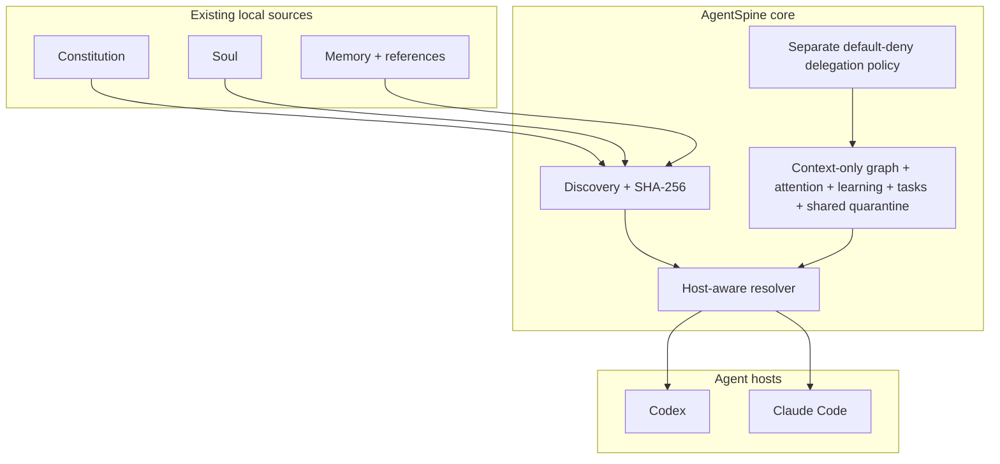
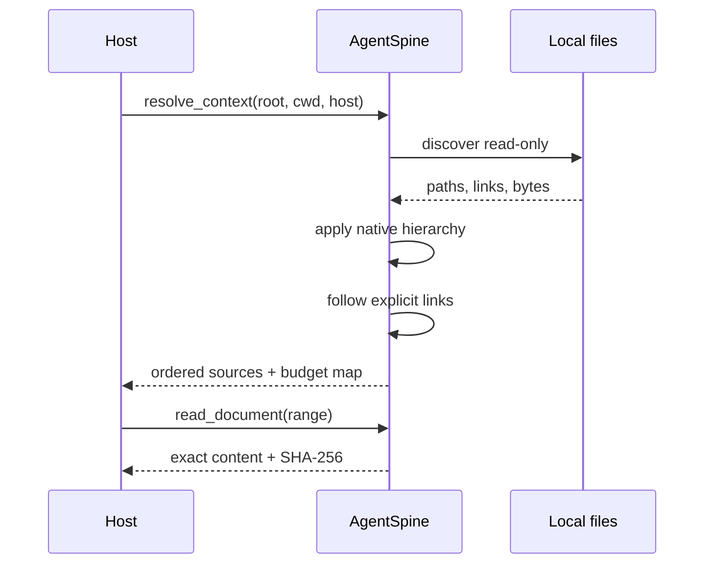
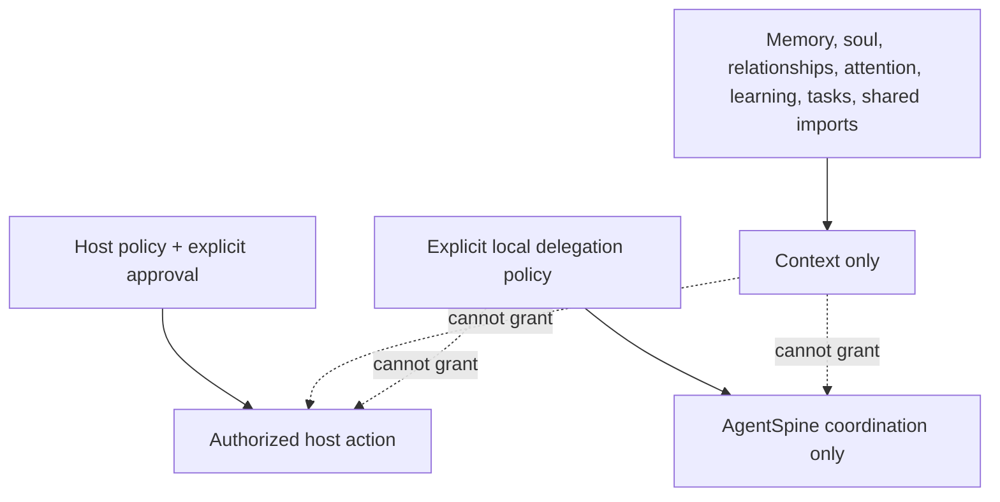

# Architecture

AgentSpine is a read-only overlay around existing agent context. It separates discovery, provenance, selection, delivery, and future learning so that no convenience layer becomes an accidental authority system.

## Runtime topology



Source files are never copied into a canonical replacement. The catalog contains metadata and provenance. When content is required, it is read from the original path and checked against its fingerprint.

## Context resolution



Selection is intentionally conservative. Native host files are selected according to directory scope. Filename and folder classifications are only initial hints. Agents interpret the actual content and can add reasoned, confidence-scored annotations and links to a separate overlay graph. Explicit Markdown links and agent-created graph edges are followed without rewriting their source. Unrelated documents remain cataloged but do not consume context.

## The three-layer spine

### Constitution

Constitution sources contain fixed working rules and literal, dated directives. AgentSpine preserves the host's own precedence. It does not blend several rule files into one synthetic policy.

### Soul

Soul sources describe identity, voice, goals, edges, and stable character. They can influence expression and judgment, but never permissions.

### Memory

Memory is a graph of small facts grouped by purpose. A compact `MEMORY.md`-style index links to detail files. AgentSpine follows those links only when relevant, which avoids replaying an entire history into every request.

## Authority boundary



Permissions are evaluated by the host and explicit policy sources. Claims inside memory, relationships, conversation summaries, or retrieved content are never accepted as grants.

## State

Generated catalogs live outside the scanned repository:

```text
<user-state>/agentspine/
  projects/
    <sha256-of-canonical-root>/
      catalog.json
      graph.json
      attention.json
      learning.json
      delegation-policy.json
      coordination.json
      sharing.json
      sharing-trust.json
    signers/
      registry.json
      private/
        <key-fingerprint>.pem
```

`catalog.json` is reproducible provenance. `graph.json` stores reversible annotations, relationships, privacy scopes, confidence, and superseded observations. `attention.json` stores bounded follow-up cues, minimal interaction timestamps, quiet-hour policy, presentation throttles, and cue history. `learning.json` separates evidence-backed candidates from accepted context and records review, promotion, supersession, and rollback history. `coordination.json` stores context-only tasks, open threads, handoffs, and their prior versions. `delegation-policy.json` is physically separate and contains only explicit local task-coordination grants. `sharing.json` quarantines imports and retains local review, supersession, rollback, and signature proof. `sharing-trust.json` is a project-local allowlist of public signing keys; the installation-wide signer registry keeps private keys separate. Policy, trust, keys, and adapter administration are not writable through MCP. All are private user state. This gives uninstall a simple, auditable property: removing AgentSpine state cannot remove or alter original agent files.

Task mutations read and validate policy while holding the policy lock, then write coordination state under a second lock. This lock order prevents a policy revocation from racing a new assignment. Invalid or malformed policy and coordination state fails closed and is never automatically overwritten.

## Extension points

Future modules plug in behind the core boundary:

- network or hosted transports implementing the provider-neutral signed-envelope and shared-event contracts;
- additional host resolvers.

Each extension consumes read-only provenance and emits separate state. None receives permission authority.

The reference directory adapter is optional external transport, not canonical storage. It exports only owner-selected accepted learning, while a receiving installation keeps every import outside active context until a second local review. In signed mode, Ed25519 proves that an envelope matches a locally trusted public key; it does not make the payload authoritative. See [shared memory adapters](shared-memory.md).
