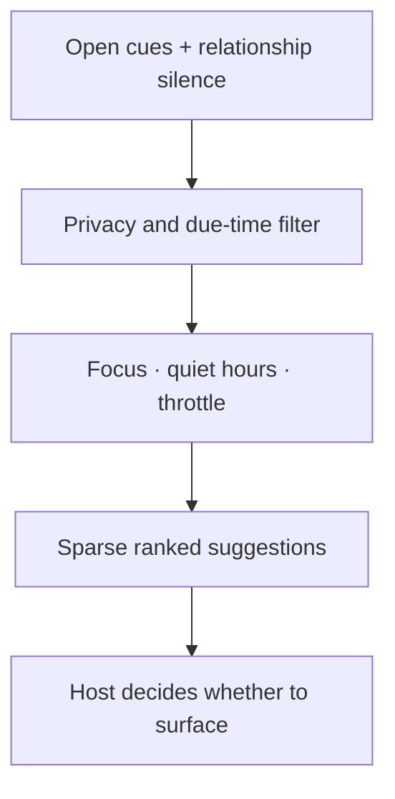

# Sparse attention

AgentSpine attention helps an agent notice a small number of relevant follow-ups without turning relationships into surveillance or interruption. It operates entirely in local external state and never sends a message, assigns a task, or invokes another tool.

## What becomes a cue

| Kind | Example purpose | Base ranking |
|---|---|---:|
| `unanswered-question` | A question still needs a response | Highest |
| `promise` | A promised hand-off or follow-up is due | High |
| `meaningful-change` | A material change may deserve acknowledgement | Medium |
| `check-in` | A natural, non-urgent check-in may be useful | Low |

The relationship graph can also suggest a check-in when a known person or agent connected by a team relation has no recent activity timestamp. AgentSpine records only that an interaction happened, not its conversation text.



## Hard restraints

1. A cue is always `context-only`; it cannot grant permissions or delegation authority.
2. `focusActive` suppresses every cue. The current task wins.
3. Quiet hours suppress every cue, including overnight ranges.
4. Private cues and cues for private entities require `includePrivate: true`.
5. Group cues require a known group entity and an exact matching `groupId` audience; entity-specific cues also require a visible `member-of` edge.
6. `maxItems` limits a result to a small set; the default is three.
7. `minIntervalHours` prevents a surfaced cue from repeating too soon.
8. Lifecycle hooks inject only a count and cue kinds, never summaries, private text, or group cues without an audience.
9. No network, messaging, notification, or scheduling action occurs automatically.

## CLI walkthrough

Create a shared promise, inspect it, and mark it presented only when it reaches the user:

```bash
agentspine attention-add signal:handoff \
  --kind promise \
  --summary "Review the synthetic hand-off." \
  --privacy shared \
  --due 2027-01-15T09:00:00Z

agentspine attention . --mark-presented --json
agentspine attention-resolve signal:handoff --status completed
```

Record minimal interaction recency for an existing relationship entity:

```bash
agentspine attention-touch agent:builder --kind interaction --privacy private
```

For group-scoped state, create or discover the group entity first and pass the same ID while writing and reading:

```bash
agentspine attention-add signal:group-check \
  --kind check-in \
  --summary "Ask whether the group needs anything else." \
  --privacy group \
  --group group:alpha

agentspine attention . --group group:alpha --mark-presented --json
```

Configure a sparse policy. Hours are interpreted using the explicit UTC offset, avoiding hidden locale assumptions:

```bash
agentspine attention-config . \
  --max-items 2 \
  --min-interval-hours 48 \
  --silence-days 21 \
  --quiet-start 22 \
  --quiet-end 7 \
  --utc-offset 120
```

Disable attention without deleting its state:

```bash
agentspine attention-config . --enabled false
```

Delete one cue and its retained attention history, or purge all attention data associated with an entity:

```bash
agentspine attention-delete signal:handoff
agentspine attention-purge agent:builder
```

## History and deletion

Updating or resolving a cue first retains its previous value in private attention history. This preserves how relevance changed without rewriting source Markdown. Permanent deletion is different: it removes the active cue, its retained versions, and its presentation timestamp. Entity purge additionally removes matching activity timestamps and relationship-silence presentation state.

## Concurrency and limits

Attention mutations use an external per-project lock and atomic file replacement so concurrent local agents do not silently overwrite one another. A stale lock is recoverable after 15 seconds. State is capped at 5 MiB; reaching the limit stops new writes instead of discarding old observations.

The attention layer does not infer emotion, wellbeing, crisis, relationship status, or personal life facts. Those require conversation-appropriate judgment and separate safety behavior; silence alone is never evidence that something is wrong.
