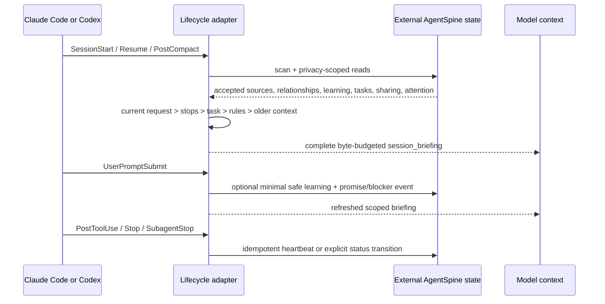

# Automatic continuity

AgentSpine `0.5.0` connects the portal-neutral memory, briefing, attention, and exactly authorized job-checkpoint layers to installed Claude Code and Codex lifecycle hooks. The result is real host context, durable scoped attention state, and an optional rights-bound resume path at lifecycle boundaries—not a counter or a suggestion that the model should call an MCP tool later.

## One-time setup

The host first asks the user to trust the executable plugin components. AgentSpine cannot and must not approve itself. Conversation learning then needs one separate local privacy opt-in:

```bash
agentspine entity person:me --kind person --name "Me" --privacy shared
agentspine continuity-config /path/to/project \
  --enabled true \
  --entity person:me \
  --confirm-local-opt-in
```

The selected identity must already exist in the relationship graph. A direct session may use this default. A bridge serving multiple people or groups must pass exact `entity_id`, `group_id`, `project_id`, and `task_id` scope values in each native hook payload; AgentSpine does not merge identities by name.

## Lifecycle



The model does not need to call `scan`, `context`, or `session_briefing`. Those tools remain available for explicit inspection only.

## What can be learned automatically

Only direct, high-confidence, locally opted-in signals are eligible. An explicit style request, no-go, or correction is itself a user confirmation; project facts and references require the configured number of distinct observations (two by default):

- response style and preferences;
- explicit no-gos and corrections;
- project facts;
- references.

Each retained signal has a stable digest, exact subject/project scope, time, kind, confidence, directness, provenance receipt, deduplication key, and context-only authority. The full prompt is never stored. Repeated hook delivery is idempotent. Accepted records use the existing learning history, rollback, and purge paths.

The following are always rejected from automatic acceptance:

- secrets, credentials, tokens, or access material;
- sensitive personal facts;
- identity merging or alias claims;
- any private group or private-chat content;
- rights, roles, delegation, approval, tool, file, network, database, production, payment, or policy claims.

Conversation, memory, Markdown, relationships, signatures, and learned context can never create host or AgentSpine coordination rights.

## Failure and deletion

Corrupt continuity or dependent state yields a visible `failedClosed` hook packet. The adapter says recall was not loaded and continues under current host rules; it never fabricates a successful briefing.

```bash
agentspine continuity-status /path/to/project --json
agentspine continuity-config /path/to/project --enabled false
agentspine continuity-purge person:me --root /path/to/project --confirm-local-purge
agentspine audit /path/to/project --json
```

Generated state remains in the operating system's private user-state directory. `SOUL.md`, `AGENTS.md`, `CLAUDE.md`, and every other existing Markdown source remain byte-for-byte unchanged during learning, rollback, purge, upgrade, and uninstall.

## Deliberate boundary

Promises, blockers, and heartbeats persist through automatic lifecycle events with exact actor, group, project, and task scope. A waiting job can start or resume only through the separate rights-bound self-starter and only while a current exact local host/owner grant passes again before every effect. Learning, attention, and briefing content never satisfy that grant. The full path is reproducible through the [visible cross-host acceptance](acceptance.md).
