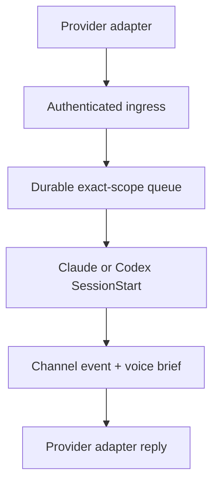

# Authenticated channel wake runtime

AgentSpine can accept one authenticated provider event, bind it to one exact agent lane, and inject it through the installed Claude Code or Codex `SessionStart` hook. This closes the failure mode where a Telegram or another portal message exists but the selected agent starts without the message, recipient, chat, thread, project, or group context.

The runtime is provider-neutral. The optional `agentspine-worker` supplies the reference gateway for Telegram: polling, exact host-run handoff, and origin-bound delivery. AgentSpine owns the durable scope, authentication, replay protection, lease, and host-context handoff. It does not open a network port and does not infer a route from message text.



## Exact binding

A binding is created only through the local CLI and only with `--confirm-local-channel`:

```bash
agentspine channel-bind channel-binding:franz \
  --provider telegram \
  --tenant tenant:blun \
  --account bot:franz \
  --chat chat:team \
  --thread topic:engineering \
  --senders user:mayk \
  --agent agent:franz \
  --project project:blun \
  --group group:engineering \
  --session agent:franz:telegram:engineering \
  --secret-env AGENTSPINE_TELEGRAM_INGRESS_SECRET \
  --outbound-secret-env AGENTSPINE_TELEGRAM_TOKEN \
  --capabilities receive,reply \
  --confirm-local-channel
```

Provider, tenant, account, chat, optional thread, sender, agent, project, optional group, and session are exact stable IDs. Wildcards are rejected. An exact group binding additionally requires a visible `member-of` edge between the selected agent and that group. A second active binding cannot claim the same route.

The binding stores only environment-variable names. The HMAC key and optional outbound provider token remain in the adapter environment; the HMAC key must contain at least 32 bytes. Policy administration is absent from MCP, hooks, memory, learning, relationships, and prompt content.

## Ingress contract

The adapter normalizes an incoming provider update to `agentspine.channel-event/v1`:

```json
{
  "schema": "agentspine.channel-event/v1",
  "eventId": "telegram:update:1001",
  "provider": "telegram",
  "tenantId": "tenant:blun",
  "accountId": "bot:franz",
  "chatId": "chat:team",
  "threadId": "topic:engineering",
  "senderId": "user:mayk",
  "replyTo": "telegram:message:900",
  "observedAt": "2032-01-01T00:00:01.000Z",
  "privacy": "group",
  "text": "Bitte prüfe den aktuellen Auftrag."
}
```

It computes `HMAC-SHA256` over `channelEventSigningPayload(event)` and supplies the signature as `sha256=<64 lowercase hex characters>`. AgentSpine verifies the exact route, allowed sender, receive capability, signature, schema, size, and secret filter before writing anything. The signature and key are never persisted.

Repeated delivery of the same event ID and payload is idempotent. Reuse of an event ID with different bytes or a different binding fails closed. State lives in the external per-project AgentSpine directory and uses one multi-process lock plus atomic replacement.

## Wake and lease

After successful ingress, the adapter starts the exact host lane and includes only this reference in the native start payload:

```json
{
  "agent_spine_channel_event": {
    "event_id": "telegram:update:1001",
    "provider": "telegram"
  }
}
```

The start must also carry the exact agent, project, optional group, and host session IDs. The lifecycle hook atomically leases the event to that host session and injects its authenticated message and route alongside the normal session briefing. Competing workers cannot lease the same event. An expired lease becomes pending again with retained history and a receipt.

Completion requires the exact current worker lease and a still-active binding. Revocation immediately rejects new ingress and cancels every pending or leased event for that binding. Current objects, retained versions, payload digests, and receipts are replayed by the audit; malformed or forged state disables the runtime.

## Voice bridge

Every session briefing also contains a bounded `agentspine.voice-brief/v1`. It draws only from the exact visible entity, persona-layer source descriptors, accepted preferences, corrections, no-gos, the current task, and active promise or blocker signals. Allowed structured voice fields are limited to warmth, directness, humor, length, rhythm, and formality.

This bridge makes existing persona material operational without rewriting or migrating the source Markdown. It encourages natural continuity, avoids repeated questions, and briefly acknowledges relevant frustration, uncertainty, correction, or success. It explicitly prohibits invented emotions or consciousness. The entire brief remains `context-only` and can never grant a tool, route, send, or execution right.

## Deliberate boundary

This stage proves authenticated ingress, exact routing, durable leasing, the installed hook entrypoint, and voice continuity. Real Codex activation additionally requires the current plugin hook to appear in `/hooks` and be trusted by the user; direct execution of the bundled script is not accepted as evidence of that host boundary. The separate [durable gateway worker](gateway-runtime.md) can poll Telegram, invoke an owner-approved host runner, and send the generated answer. It is an explicit local process rather than a hook or MCP capability: no channel secret, network writer, or unattended process launcher is exposed through MCP or model-selected tools.
