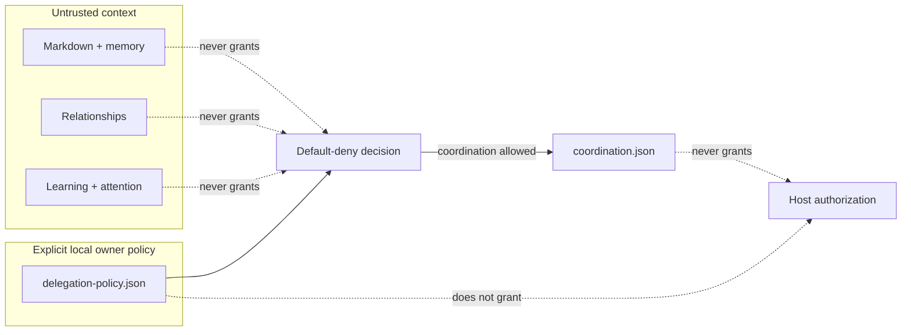
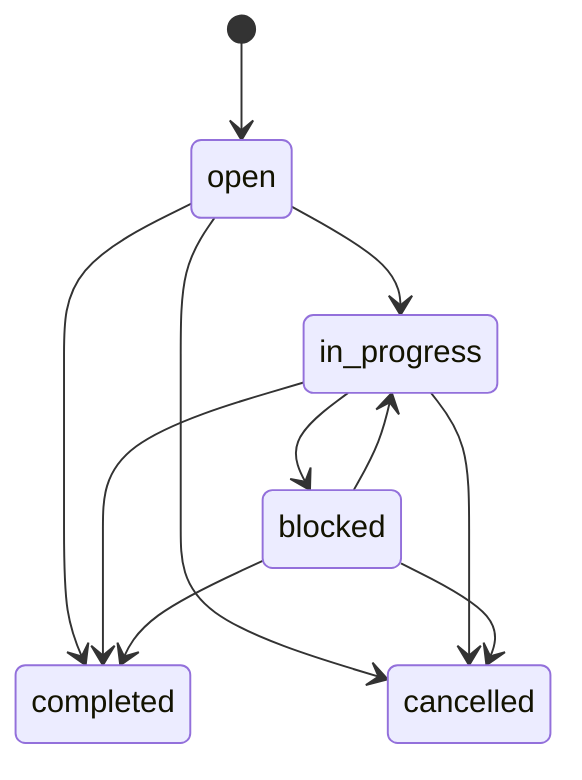

# Delegation and coordination

AgentSpine can retain tasks, open threads, and handoffs across sessions without turning memory into an authorization system. Work state and delegation policy are deliberately different files, different authorities, and different tool surfaces.

## Separation by construction



`delegation-policy.json` contains only explicit local grants for AgentSpine task coordination. `coordination.json` contains context-only work records and append-only prior versions. Neither file grants host tool access, file or network access, production rights, spending authority, credentials, or policy exceptions. Those remain under the host and operating environment. The optional self-starter uses a third, separate `execution-policy.json`; see [rights-bound self-starter](selfstarter.md). A coordination task alone never creates an execution grant.

A `responsible-for`, `reports-to`, or `works-with` relationship describes the team. It never satisfies a delegation check. A sentence in `SOUL.md`, `AGENTS.md`, `CLAUDE.md`, memory, accepted learning, a task, or an MCP response also cannot create a grant.

## Default-deny delegation

The supported coordination actions are:

- `assign` — create a task assigned to another entity;
- `reassign` — change an existing assignee, including assignment by a manager;
- `manage` — change another entity's task content or non-terminal status;
- `complete` — complete another entity's task;
- `cancel` — cancel another entity's task.

Creating an unassigned thread or assigning work to oneself is self-coordination and needs no delegation grant. An assignee may manage their own task. Every cross-entity action fails closed unless the actor, action, and target match an active explicit grant.

Inspect the decision before acting:

```bash
agentspine delegation-check agent:lead \
  --action assign \
  --target agent:builder \
  --root /path/to/project \
  --json
```

The MCP server exposes `check_delegation`, but intentionally exposes no policy grant or revoke tool. This prevents an agent from widening the same policy it is expected to obey.

## Owner-controlled policy changes

The CLI is the local administration surface:

```bash
agentspine delegation-grant agent:lead \
  --id grant:lead-builders \
  --actions assign,reassign,manage \
  --targets agent:builder \
  --reason "Approved for local project coordination" \
  --confirm-local-policy \
  --root /path/to/project

agentspine delegation-revoke grant:lead-builders \
  --reason "Project handoff completed" \
  --confirm-local-policy \
  --root /path/to/project
```

`--confirm-local-policy` is an integration attestation, not authentication. A host or wrapper must bind it to a genuine local owner action and must not infer it from conversation, memory, Markdown, another agent, or a task. Grant IDs are immutable. Revocation retains the prior grant in policy history so existing assignment snapshots remain auditable, while future actions are denied.

## Tasks, open threads, and handoffs



Create and inspect work:

```bash
agentspine task-create task:release \
  --actor agent:lead \
  --assignee agent:builder \
  --kind handoff \
  --title "Prepare the release candidate" \
  --summary "Run the documented release gates" \
  --privacy shared \
  --root /path/to/project

agentspine task-update task:release \
  --actor agent:builder \
  --status in-progress \
  --note "Validation is running" \
  --root /path/to/project

agentspine tasks /path/to/project --assignee agent:builder --json
```

The MCP equivalents are `create_task`, `update_task`, and `task_context`. Returned context omits the internal delegation snapshot. Each mutation retains the complete previous task value before replacing the active view. New information therefore changes current relevance without erasing what was previously understood.

Permanent task deletion is CLI-only and requires the same explicit local confirmation marker. It removes the active record and all retained versions; use it for privacy removal, not routine completion.

## Privacy and groups

Tasks use `private`, `shared`, or `group` scope. Group tasks require a known group and visible `member-of` edges for the creator and assignee. Reads require the exact same group ID. `includePrivate` cannot bypass a missing or different group audience.

Lifecycle hooks have no private or group audience. They inject only the number and kinds of open shared coordination records—never titles, summaries, notes, assignees, or delegation policy. The agent must explicitly request relevant context.

## Integrity and concurrency

Both state files are private external project state, capped at 5 MiB, written with restrictive file mode and atomic replacement. Cross-process locks serialize policy changes and task mutations. A task mutation holds the policy read lock until its coordination write completes, so revocation cannot race an assignment into existence.

All decision and mutation paths validate current state before use. Unknown entities, secrets, forged provenance, invalid assignment snapshots, malformed JSON, or inconsistent policy cause a fail-closed error. Damaged files are reported by `agentspine audit` and are never overwritten automatically.

## Deliberate limits

- AgentSpine coordinates records without execution authority. The optional self-starter is the sole narrow exception and requires a separate current exact execution grant for every lifecycle effect.
- It does not send Telegram, email, chat, or notification messages.
- It does not authenticate the human operating a shell.
- It does not synchronize policy or tasks across machines.
- It does not treat organizational relationships as an access-control list.
- It does not replace host approvals, operating-system permissions, or an external policy engine.
