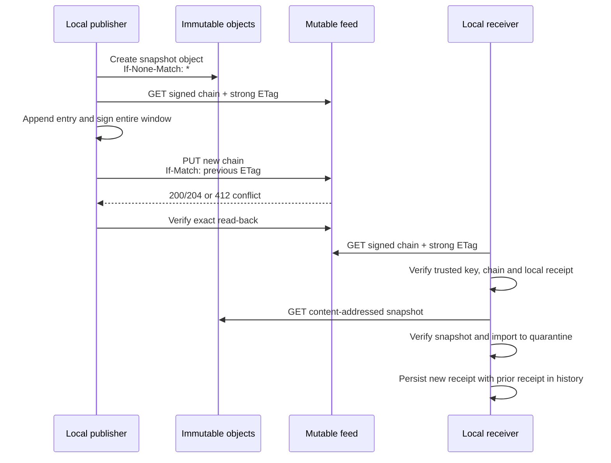

# Signed mutable feed transport

AgentSpine can discover successive immutable HTTPS snapshots through one signed, compare-and-swap feed. The feed is provider-neutral and deliberately narrow: it is a bounded hash-chain window of snapshot references, not a remote database, command queue, permission source, or replacement for local review.



## Publish

The directory adapter must already be authenticated, and the named signer must remain stable for the lifetime of one feed:

```bash
export AGENTSPINE_FEED_TOKEN='deployment-supplied-value'

agentspine share-feed-publish /srv/agent-memory/team-alpha \
  --root /path/to/publisher-project \
  --base https://memory.example.org/agentspine/team-alpha \
  --feed feed:team-alpha \
  --signer signer:team-alpha \
  --id snapshot:team-alpha-2026-08-28-01 \
  --token-env AGENTSPINE_FEED_TOKEN \
  --confirm-local-share
```

Publication first creates and verifies the immutable object. It then reads the current feed, appends one entry, signs the entire retained window, updates using the previous strong ETag, and verifies an exact read-back. A `412` is a normal concurrency conflict: no retry is hidden, and the caller must fetch the winning feed before deciding whether to publish another snapshot.

The stable feed URL is derived from the SHA-256 digest of `feedId`:

```text
https://memory.example.org/agentspine/team-alpha/feeds/{sha256(feedId)}.json
```

## Pull

The receiver explicitly trusts the publisher's exported Ed25519 identity before pulling:

```bash
agentspine share-feed-pull \
  --root /path/to/receiver-project \
  --base https://memory.example.org/agentspine/team-alpha \
  --feed feed:team-alpha \
  --token-env AGENTSPINE_FEED_TOKEN
```

The first observation may join an established feed at its current tip. Every later pull must prove continuity from the locally stored receipt. A lower sequence is a rollback. A different entry at an observed sequence is equivocation. A newer feed whose bounded window no longer contains the observed tip is a continuity gap and fails closed instead of silently skipping history.

The feed retains at most 256 references. Receivers that may remain offline for more than 255 publications should poll less sparsely or begin a new explicitly trusted feed after operator review. Feed signer rotation also requires a new `feedId`; this avoids treating a same-name key as the old identity.

`share-feed-state` shows local receipts and retained prior receipts. There is intentionally no automatic reset command. Removing or replacing rollback protection is an operator decision outside the agent-controlled CLI workflow.

## Server contract

For a new feed, the service must atomically create the resource:

```http
PUT /agentspine/team-alpha/feeds/{feed-id-sha256}.json
Content-Type: application/vnd.agentspine.feed+json
If-None-Match: *
```

It returns `201` or `204`, then serves the exact document with a strong ETag. Updates require:

```http
PUT /agentspine/team-alpha/feeds/{feed-id-sha256}.json
Content-Type: application/vnd.agentspine.feed+json
If-Match: "the-etag-returned-by-the-last-get"
```

The service returns `200` or `204` only when that exact ETag still matches. It returns `412` without changing the feed after a competing update. Weak ETags are rejected because they cannot protect byte-exact compare-and-swap semantics. Responses are uncompressed JSON, no larger than 256 KiB, and redirects are never followed.

The object endpoints continue to implement the create-only contract in [immutable HTTPS objects](object-transport.md). A production service should independently authenticate writers, verify request sizes and preconditions atomically, rate-limit access, and avoid logging bearer values or feed bodies.

## Security and authority boundary

- TLS, vetted and pinned DNS, SSRF protection, strict timeouts, no redirects, exact limits, and environment-only bearer tokens apply to both feed reads and writes.
- Every network write requires explicit local owner confirmation. Private-network access requires the same confirmation plus an explicit opt-in.
- The signed feed authenticates one configured origin and detects history changes. It does not approve any referenced claim.
- The referenced snapshot is independently digest-checked and signature-checked, then imported through the existing quarantine. A second local user review remains mandatory before context use.
- Feed receipts and their history live outside the scanned project and are checked by the ten-gate audit. Corrupt state is never overwritten automatically.
- Feed payloads, receipts, snapshots, bearer authentication, signatures, and remote service responses always remain `context-only`. They cannot grant permissions, delegation, production access, spending rights, or policy exceptions.
- Feed publication, pulling, endpoint selection, tokens, and receipt mutation are absent from MCP and hooks.

Existing `AGENTS.md`, `CLAUDE.md`, `SOUL.md`, `MEMORY.md`, and other discovered Markdown files are never transported or modified by this layer.
