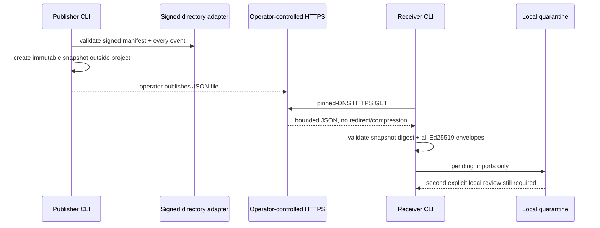

# HTTPS snapshot transport

AgentSpine can carry a signed directory exchange across ordinary HTTPS without depending on a particular cloud, database, or agent vendor. The basic workflow is deliberately static: AgentSpine creates one immutable JSON snapshot, an operator publishes that file through existing infrastructure, and receivers pull it into the normal local quarantine. For direct create-only uploads, use the separate [immutable HTTPS object transport](object-transport.md).



The web server never becomes an authority source. A TLS connection protects bytes in transit. The snapshot digest detects truncation or bundle mutation. The existing Ed25519 envelopes authenticate the configured manifest and event keys. The receiving project's trust store decides which keys are recognized. None of those checks approves a claim, grants a permission, or bypasses review.

## Publish a snapshot

Snapshots require a signed directory adapter. First create the signer, trust distribution, adapter, and events as described in [shared memory adapters](shared-memory.md). Then export:

```bash
agentspine share-snapshot-export /srv/agent-memory/team-alpha \
  --root /path/to/publisher-project \
  --out /srv/static/agent-memory/team-alpha-2026-08-28.json \
  --id snapshot:team-alpha-2026-08-28 \
  --confirm-local-share
```

The output must be outside the scanned project and must not already exist. AgentSpine writes it with owner-only mode on POSIX systems. Updating a feed means exporting a new file or atomically changing a server-side alias outside this static workflow. `share-https-publish` can create immutable remote objects, but AgentSpine still has no remote overwrite, delete, listing, or mutable alias command.

Serve the exact file over HTTPS with:

- a certificate accepted by the local Node.js trust store;
- `Content-Type: application/json`;
- no content compression;
- no redirect at the configured URL;
- access logs and retention appropriate for the snapshot's metadata sensitivity.

Snapshots contain shared claims, group IDs, timestamps, public signing identities, and signatures. They contain no private learning, source Markdown, evidence text, tasks, delegation policy, credentials, attention state, or relationship profiles. TLS does not encrypt a snapshot stored on the server; secure storage and server access remain deployment responsibilities.

## Pull a public endpoint

Trust every expected event signer in the receiving project first, then run:

```bash
agentspine share-https-pull \
  https://memory.example.org/team-alpha-2026-08-28.json \
  --root /path/to/receiving-project

agentspine share-inbox /path/to/receiving-project --status pending --json
```

The pull validates the entire response before writing local sharing state. All imports remain `pending` and invisible to `shared_context` until the receiving user accepts each item through `share-review --confirmed-by-user`.

For an endpoint protected by a bearer token, provide only the environment variable name:

```bash
export AGENTSPINE_SNAPSHOT_TOKEN='deployment-supplied-value'
agentspine share-https-pull \
  https://memory.example.org/private/team-alpha.json \
  --token-env AGENTSPINE_SNAPSHOT_TOKEN \
  --root /path/to/receiving-project
```

Tokens are read at request time. They are not accepted in URLs, command arguments, snapshots, local sharing state, hook context, MCP results, or command output. Shell history, process environment access, and server logs are still operating-system concerns.

## Private networks

Public mode rejects loopback, private, link-local, carrier-grade NAT, multicast, reserved, and documentation address ranges. Every DNS answer is checked and the HTTPS connection is pinned to one vetted answer, preventing a second unvalidated lookup from rebinding the request. Mixed public/private answer sets fail closed.

Self-hosted private endpoints require both flags:

```bash
agentspine share-https-pull \
  https://memory.internal.example/team-alpha.json \
  --allow-private-network \
  --confirm-local-share \
  --root /path/to/receiving-project
```

The confirmation is a local integration attestation, not permission derived from memory or an agent. TLS certificate verification remains enabled for private networks.

## Network safety limits

The reference client:

- accepts one explicit `https://` JSON resource with no embedded credentials, query, or fragment;
- performs one `GET`, disables connection pooling, pins validated DNS, and follows no redirects;
- rejects non-JSON media types and compressed responses;
- defaults to a 10-second timeout, configurable only from 1 to 30 seconds;
- caps the response and validated snapshot at 21 MiB and the event set at 2,000;
- rejects unknown fields, duplicate IDs, collisions, metadata mismatches, invalid bundle digests, unsigned documents, bad signatures, and untrusted keys before quarantine mutation;
- deletes its temporary materialization after every success or failure;
- exposes no HTTPS export or pull operation through MCP.

The static client intentionally does not execute remote instructions, enumerate endpoints, accept remote redirects, refresh tokens, upload data, or implement a hosted control plane. Writable object-store, database, and peer adapters remain separate extension work and must preserve the same local validation and review boundary.

## Snapshot schema

`agentspine.https-snapshot/v1` has exact top-level fields:

- stable snapshot, scope, and adapter IDs;
- generation timestamp;
- one signed `agentspine.directory-adapter/v1` manifest envelope;
- up to 2,000 signed `agentspine.shared-event/v1` event envelopes;
- `authority: context-only`;
- canonical SHA-256 digest over the complete snapshot body.

Snapshot integrity is packaging evidence, not source identity. Manifest and event signatures are verified independently, and every event signer needs explicit local trust.
