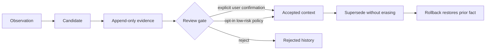

# Safe learning

AgentSpine separates an observation from a fact that may enter future context. An agent can propose a candidate and append evidence, but the candidate remains invisible to `learning_context` until it passes an explicit review or the narrowly scoped, default-off automatic policy.



## Candidate kinds

| Kind | Normal review path | Automatic eligibility |
|---|---|---|
| `preference` | Explicit confirmation | Never |
| `no-go` | Explicit confirmation | Never |
| `goal` | Explicit confirmation | Never |
| `correction` | Explicit confirmation | Never |
| `personal-fact` | Explicit confirmation | Never |
| `project-fact` | Explicit confirmation | Opt-in, evidence-gated |
| `reference` | Explicit confirmation | Opt-in, evidence-gated |

Every candidate and evidence record carries `authority: context-only`. Accepted learning can improve relevance and consistency, but it cannot grant permissions, delegation, production access, spending rights, policy exceptions, or instructions to act.

## Evidence and provenance

Evidence is append-only while a candidate is awaiting review. Supported evidence types are `user-statement`, `document`, `interaction`, and `test`. Document evidence must reference a discovered Markdown source; AgentSpine records that source's SHA-256 at observation time without editing it.

Adding evidence stores the previous candidate version in history before recalculating confidence. Distinct evidence IDs or source fingerprints are counted for automatic evaluation. Secret-shaped content is rejected before it reaches learning state.

## Explicit review

Acceptance requires the `confirmedByUser` marker and a review reason. The marker is an integration attestation, not identity proof: a host adapter should set it only after an actual user gesture or unambiguous user instruction. AgentSpine never infers confirmation from another memory, Markdown sentence, candidate, agent message, or relationship edge.

```bash
agentspine learn-propose learning:concise \
  --kind preference \
  --claim "The preferred output is concise." \
  --evidence "The user explicitly requested concise output." \
  --privacy private

agentspine learn-review learning:concise \
  --decision accept \
  --reason "Explicitly confirmed by the user." \
  --confirmed-by-user

agentspine learn-context . --include-private --json
```

Candidates never appear in learned context before acceptance. Native lifecycle hooks inject only accepted, exactly scoped learning inside the byte-budgeted session briefing. They never inject unreviewed candidates.

## Optional automatic promotion

Automatic promotion is disabled by default. When deliberately enabled, it applies only to `project-fact` and `reference`, and only when both confidence and distinct-evidence thresholds pass.

```bash
agentspine learn-config . \
  --auto-promote true \
  --min-confidence 0.9 \
  --min-evidence 2

agentspine learn-evaluate . --json
```

The accepted record stores the policy thresholds, evidence count, and evaluation time used for that decision. The audit rejects an accepted record with no valid manual-review proof or automatic-promotion snapshot. Personal facts, preferences, goals, corrections, and no-gos are never automatically promoted by this general evaluator.

This evaluator is separate from [automatic continuity](automatic-continuity.md). After its own local privacy opt-in, the lifecycle adapter may accept only direct, high-confidence style preferences, no-gos, corrections, project facts, and references with a recorded threshold proof. Personal facts, group conversation content, identity claims, secrets, authority, access, and operational permissions are never eligible. The continuity path is not exposed through MCP.

## Supersession and rollback

New information does not overwrite an accepted fact. Propose a new candidate with `--supersedes` and the same kind, subject, and privacy scope. Acceptance marks the prior record `superseded` and retains both versions. Rollback deactivates the replacement and restores the prior accepted record atomically.

```bash
agentspine learn-propose learning:new-goal \
  --kind goal \
  --claim "The current goal is the new synthetic milestone." \
  --evidence "The user changed the goal." \
  --supersedes learning:old-goal

agentspine learn-rollback learning:new-goal \
  --reason "The change was recorded incorrectly."
```

Permanent deletion removes one candidate and its learning history. An accepted superseding record must be rolled back before deletion so its predecessor is not stranded.

## Privacy and groups

Private learning requires an explicit `includePrivate` read. Group learning requires a known group entity, an exact `groupId`, and—when a subject is present—a visible `member-of` edge. `includePrivate` does not bypass a different or missing group audience. Session hooks have no group audience and therefore expose no group learning.

## Storage and concurrency

`learning.json` lives in the same external per-project state directory as the catalog, graph, and attention state. Mutations use a per-project lock and atomic replacement, so concurrent agents cannot silently discard evidence. State is capped at 5 MiB and original Markdown remains byte-for-byte unchanged.
