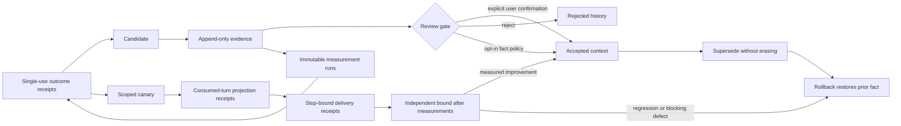

# Safe learning

AgentSpine separates an observation from a fact that may enter future context. An agent can propose a candidate and append evidence, but the candidate remains invisible to `learning_context` until it passes an explicit review or the narrowly scoped, default-off automatic policy. Version 0.11 adds an outcome-bound path for low-risk behavior: a lesson is useful only when fixed, externally measured tasks improve after a limited canary application.



## Candidate kinds

| Kind | Normal review path | Automatic eligibility |
|---|---|---|
| `preference` | Explicit confirmation | Never |
| `no-go` | Explicit confirmation | Never |
| `goal` | Explicit confirmation | Never |
| `correction` | Explicit confirmation | Never |
| `personal-fact` | Explicit confirmation | Never |
| `project-fact` | Explicit confirmation | Opt-in, evidence-gated |
| `reference` | Explicit confirmation | Opt-in, evidence-gated |
| `behavior` | Explicit confirmation | Opt-in, outcome-gated canary |

Every candidate and evidence record carries `authority: context-only`. Accepted learning can improve relevance and consistency, but it cannot grant permissions, delegation, production access, spending rights, policy exceptions, or instructions to act.

## Evidence and provenance

Evidence is append-only while a candidate is awaiting review. Supported evidence types are `user-statement`, `document`, `interaction`, and `test`. Document evidence must reference a discovered Markdown source; AgentSpine records that source's SHA-256 at observation time without editing it.

Adding evidence stores the previous candidate version in history before recalculating confidence. Distinct evidence IDs or source fingerprints are counted for automatic evaluation. Secret-shaped content is rejected before it reaches learning state.

## Explicit review

Acceptance requires the `confirmedByUser` marker and a review reason. The marker is an integration attestation, not identity proof: a host adapter should set it only after an actual user gesture or unambiguous user instruction. AgentSpine never infers confirmation from another memory, Markdown sentence, candidate, agent message, or relationship edge.

```bash
agentspine learn-propose learning:concise \
  --kind preference \
  --claim "The preferred output is concise." \
  --evidence "The user explicitly requested concise output." \
  --privacy private

agentspine learn-review learning:concise \
  --decision accept \
  --reason "Explicitly confirmed by the user." \
  --confirmed-by-user

agentspine learn-context . --include-private --json
```

Candidates never appear in learned context before acceptance. Native lifecycle hooks inject only accepted, exactly scoped learning inside the byte-budgeted session briefing. They never inject unreviewed candidates.

## Optional automatic promotion

Automatic promotion is disabled by default. When deliberately enabled, it applies only to `project-fact` and `reference`, and only when both confidence and distinct-evidence thresholds pass.

```bash
agentspine learn-config . \
  --auto-promote true \
  --min-confidence 0.9 \
  --min-evidence 2

agentspine learn-evaluate . --json
```

The accepted record stores the policy thresholds, evidence count, and evaluation time used for that decision. The audit rejects an accepted record with no valid manual-review proof or automatic-promotion snapshot. Personal facts, preferences, goals, corrections, and no-gos are never automatically promoted by this general evaluator.

This evaluator is separate from [automatic continuity](automatic-continuity.md). After its own local privacy opt-in, the lifecycle adapter may accept only direct, high-confidence style preferences, no-gos, corrections, project facts, and references with a recorded threshold proof. Personal facts, group conversation content, identity claims, secrets, authority, access, and operational permissions are never eligible. The continuity path is not exposed through MCP.

## Measured behavior loop

`behavior` candidates use content-free `agentspine.learning-outcome/v9` receipts while existing v1-v8 history remains readable. Before any new baseline is recorded, a local operator must register each evaluator principal root and then one immutable `agentspine.learning-evaluation/v14` contract. The contract fixes SHA-256 digests for the exact evidence-backed candidate revision, task, dataset and evaluator protocol, the exact persona/user/tenant/project/group/task scope, the metric and direction, eligible evaluator IDs, one distinct locally confirmed SHA-256 principal root per evaluator, minimum case count, expiry, promotion and regression thresholds, same-root pairing, the initial measurement trials, their completion policy and their staleness policy.

Version 0.19 adds `agentspine.learning-measurement/v2` and measurement-lineage v2 receipts. The local registration freezes an opaque principal digest for each evaluator ID; the receipt binds that digest and a hash of principal root plus run ID. Every counted after-outcome must use the principal root that produced one frozen before-outcome under the same contract, measurement kind and case count. Only one outcome per principal root and phase counts, and every after-outcome binds a different completed model turn. The Canary score is the mean of root-local deltas, not the difference between two independently weighted cohort averages. Repeated runs therefore cannot overweight one evaluator, two names for one evaluator cannot simulate independence, evaluator or measurement-kind substitution cannot simulate improvement, and two evaluations of one response cannot simulate two applications.

Version 0.20 adds a separate local evaluator registry and immutable `agentspine.learning-evaluator-binding/v1` receipts. Registration and revocation are CLI-only operations requiring explicit local confirmation. A principal digest can belong to only one stable evaluator ID and cannot be reactivated under an alias after revocation. Evaluation v7 binds the exact active registry-record digests. If any bound root is later revoked or replaced, new measurements and outcomes fail closed, the active Canary is omitted from preflight context immediately, and the next local evaluation pass rolls it back. Historical v1-v6 contracts remain readable and do not become retroactively dependent on a registry that did not exist when they were created. Registry data is content-free, context-only and cannot establish a real-world identity, permission, delegation, tool access or policy exception.

Version 0.21 closes the post-validation evidence gap. Successful evaluation v7 validation creates one immutable `agentspine.learning-validation/v1` lease that binds the exact candidate, contract and registry-binding digests, scope, metric, before/after outcome IDs and digests, paired improvement, validation time and evidence expiry. It contains no prompt, response, task, dataset, evaluator or user content. A validated lesson is projected only while this lease and every bound evaluator root remain current. Expiry, revocation, a missing lease or any digest mismatch removes the lesson before the next model turn; the next local evaluation pass records a single atomic rollback and restores a superseded predecessor. Legacy evaluation v1-v6 validations remain readable without retroactive leases.

Version 0.22 adds evidence renewal without allowing a timestamp-only extension. `learn-revalidation-start` opens a bounded local window only for a current v7 validation whose immutable contract can outlive the existing lease. During that window, the native hook records exact-turn applications and deliveries while the lesson remains context-only. Fresh after-measurements must use the frozen evaluator-root cohort, metric, dataset and case coverage. `learn-revalidate` requires distinct completed turns, the original paired baselines, at least one objective result and the frozen thresholds. Success replaces the active lease with an `agentspine.learning-validation/v2` receipt that binds its predecessor and every measurement, application and delivery digest. Parallel retries can renew exactly once. Replayed evidence, stale windows, root drift and altered receipts fail closed; any blocking defect or paired regression rolls the lesson back and restores its superseded predecessor.

Version 0.23 closes renewal selection bias. Each new `agentspine.learning-revalidation-window/v2` receipt freezes `first-completed-turns` selection, the complete required delivery count and one deterministic evaluator-root assignment for every turn slot before any fresh result exists. Renewal must measure exactly those first completed exact-scope turns. A later successful turn cannot replace an earlier failure, and roots cannot be rearranged after the responses are known. The resulting content-free `agentspine.learning-validation/v3` lease binds the window digest, ordered delivery digests and root assignments. Window, order, omission, replacement and root-assignment tampering fail closed. Revalidation-window v1 and validation-lease v1/v2 history remains readable.

Version 0.24 closes completion-order withholding. New `agentspine.learning-revalidation-window/v3` windows freeze `first-admitted-turns` selection. The first required exact-scope projections receive immutable `agentspine.learning-application/v3` admission receipts and evaluator-root slots atomically, before a response or score exists. A missing `Stop`, crash or intentional delay leaves that admitted slot incomplete; a later successful projection uses the ordinary application schema and cannot replace it. Admitted receipts are bounded by the required cohort and are not removable through stale-delivery purge. Successful renewal produces `agentspine.learning-validation/v4`, binding every admitted application digest, matching delivery digest and root assignment. Admission order, omission, replacement and root drift fail closed while v1/v2 windows and v1-v3 leases remain readable.

Version 0.25 closes post-turn run selection. A new `agentspine.learning-revalidation-window/v4` creates one content-free trial for every required slot before projection. Each trial freezes the evaluation and predecessor-lease digests, evaluator ID and principal root, a single provider run ID, the benchmark digest and exact case count. The first matching projections receive `agentspine.learning-application/v4` admissions. Renewal accepts only measurements whose evaluator, root, run and coverage match those precommitted trials, and records the proof in `agentspine.learning-validation/v5`. A failed run cannot be discarded and repeated under a later run ID. Trial omission, replacement, replay, aliasing, case drift and digest tampering fail closed while v1-v3 windows, v1-v3 applications and v1-v4 leases remain readable.

Version 0.26 applies the same protection to the first experiment rather than only to renewal. `agentspine.learning-evaluation/v8` freezes ordered Before and After trials before the baseline is measured. Each trial binds the contract, phase, evaluator ID, principal root, provider run ID, benchmark digest and exact case count. Once the baseline promotes a Canary, the first required exact-scope projections receive immutable `agentspine.learning-application/v5` admissions for the frozen After slots. A crashed, withheld or failed first turn stays in that cohort; later ordinary turns and favorable reruns cannot replace it. Initial-trial, admission, delivery, measurement, outcome and validation-lease bindings are checked on every state load. Evaluation v1-v7, application v1-v4 and validation v1-v5 state remains readable.

Version 0.27 binds those trials to the exact guidance they are intended to prove. `agentspine.learning-evaluation/v9` adds a content-free `agentspine.learning-target/v1` record containing separate SHA-256 digests for the candidate revision, claim, evidence set and scope. The revision digest also covers kind, subject, privacy, group, confidence, supersession and the local-review boundary. Once the contract exists, additional evidence cannot silently change that revision; changed guidance needs a deduplicated superseding candidate and a new contract. The Canary and each admitted initial `agentspine.learning-application/v6` turn carry the same target digest. Candidate, contract, Canary or admission substitution therefore fails closed on load, while target diagnostics never expose the claim or evidence content. Evaluation v1-v8 and application v1-v5 state remains readable.

Version 0.28 makes incomplete initial trials terminal instead of indefinitely pending. `agentspine.learning-evaluation/v10` freezes `agentspine.learning-completion-policy/v1` before results exist: delivery must complete within five minutes, the outcome deadline is fixed from the locally configured initial-trial window, and either omission is a blocking defect. Each admitted `agentspine.learning-application/v7` turn binds the policy digest and its exact outcome deadline. Once a deadline passes, preflight withholds the Canary immediately; the next local evaluation pass records exactly one content-free `agentspine.learning-trial-failure/v1` receipt and atomically rolls back the lesson. A late `Stop`, backdated measurement or later favorable outcome cannot replace or repair the failed slot. Status, Doctor and audit expose only counts, deadlines, digests and failure classes. Evaluation v1-v9 and application v1-v6 state remains readable.

Version 0.30 adds local withdrawal of invalid measurement evidence. `learn-measurement-revoke` requires explicit local confirmation and writes one immutable `agentspine.learning-measurement-revocation/v1` receipt. It binds the exact candidate target, evaluation, measurement and consumed outcome digests while retaining only a digest of the local explanation. The affected Canary is omitted from the next exact-scope context pass before reconciliation; evaluation then rolls it back atomically and restores a safe predecessor. Revoked measurements cannot be consumed, promoted, renewed, replaced by later favorable runs or removed by stale cleanup. Diagnostics remain content-free and group-isolated, and MCP remains read-only.

Version 0.31 adds local withdrawal of invalid model-turn completion evidence. `learn-delivery-revoke` requires explicit local confirmation and writes one immutable `agentspine.learning-delivery-revocation/v1` receipt. It binds the exact candidate target, evaluation, application, delivery and any consumed outcome digests while retaining only a digest of the local explanation. Any dependent active or validated lesson is omitted from the next exact-scope context pass before reconciliation; evaluation then rolls it back atomically and restores a safe predecessor. A revoked delivery cannot support a new measurement, outcome, promotion or validation renewal, and a later favorable turn cannot replace it. Diagnostics remain content-free and group-isolated, and MCP remains read-only.

Version 0.32 adds precise withdrawal of an invalid measured result without discarding its underlying immutable measurement. `learn-outcome-revoke` requires explicit local confirmation and writes one `agentspine.learning-outcome-revocation/v1` receipt binding the candidate target, evaluation, outcome, measurement, application and delivery digests. The explanation is retained only as a digest. Active and validated lessons are withheld before the next matching context pass; renewed validation follows its immutable predecessor chain so that revoking an original Before/After result cannot be hidden by a later renewal. Evaluation rolls back atomically and restores a safe predecessor. Replay, redirected bindings, conflicting concurrent retries and foreign-scope diagnostics fail closed; MCP remains read-only.

Version 0.33 adds precise withdrawal of an invalid turn projection. `learn-application-revoke` requires explicit local confirmation and writes one `agentspine.learning-application-revocation/v1` receipt binding the candidate target, evaluation, application and any existing delivery and outcome digests. The explanation is retained only as a digest. Active and validated lessons that depend on that projection are withheld before the next exact-scope context pass and rolled back atomically. Revoking a projection before `Stop` prevents that turn from producing delivery evidence; revoking one after completion prevents its application, delivery, measurement and outcome chain from supporting promotion or validation without modifying those underlying receipts. Replay, redirected bindings, conflicting concurrent retries, replacement of a revoked cohort admission and foreign-scope diagnostics fail closed; an unconsumed ordinary projection does not poison a later independent turn. MCP remains read-only.

Version 0.34 adds precise withdrawal of an invalid evaluation contract. `learn-evaluation-revoke` requires explicit local confirmation and writes one `agentspine.learning-evaluation-revocation/v1` receipt binding the exact contract digest, candidate target digest and immutable evaluator-registry binding digest. The explanation is retained only as a digest. Active and validated lessons that depend on the contract are withheld before the next exact-scope context pass and rolled back atomically. Revoked contracts cannot accept new measurements, projections, deliveries, outcomes, promotion or validation renewal; their existing immutable evidence remains unchanged. Replay, redirected bindings, conflicting concurrent retries and foreign-scope diagnostics fail closed. MCP remains read-only.

Version 0.35 adds precise withdrawal of an invalid validation decision. `learn-validation-revoke` requires explicit local confirmation and writes one `agentspine.learning-validation-revocation/v1` receipt binding the exact lease digest, scope digest, candidate target, evaluation and evaluator-registry binding. The explanation is retained only as a digest. The active lease and every immutable predecessor are treated as one validation chain, so renewal cannot hide an invalid earlier decision. The dependent lesson is withheld immediately and rolled back atomically, while contracts, measurements, outcomes and user-owned sources remain unchanged. Replay, redirected bindings, conflicting concurrent retries and foreign-scope diagnostics fail closed. MCP remains read-only.

Version 0.36 adds precise withdrawal of a false blocking initial-trial timeout. `learn-trial-failure-revoke` requires explicit local confirmation and writes one `agentspine.learning-trial-failure-revocation/v1` receipt binding the exact failure, contract, evaluator-registry binding, application, target and scope. The explanation is retained only as a digest. The original failure and underlying evidence remain immutable, and no average can overrule another blocking defect. Revocation never reactivates the failed Canary or accepts late delivery or outcome evidence: a retry requires a fresh candidate and evaluation contract while the safe predecessor stays active. Replay, redirected bindings, conflicting concurrent requests and foreign-group diagnostics fail closed. MCP remains read-only.

Version 0.38 makes that retry objectively comparable. New retries use `agentspine.learning-evaluation/v12` with an embedded `agentspine.learning-trial-retry/v2` admission. Its content-free comparison digest must equal the failed predecessor's metric, benchmark digests and minimum case count, evaluator identities and principal roots, same-evaluator pairing rules, and promotion thresholds. Dataset, protocol, metric, evaluator or threshold drift is rejected before a contract is written. Completion windows are deliberately excluded from the comparison digest so a locally confirmed false timeout can be corrected without changing what success means. Historical v11 retry contracts remain readable.

Version 0.39 bounds corrective selection. New retries use `agentspine.learning-evaluation/v13` with `agentspine.learning-trial-retry/v3`, which binds the exact root evaluation and records the retry as attempt 2 of 2 before the corrective Canary is projected. If that corrective trial fails, a locally confirmed timeout revocation can withdraw the false proof but cannot mint a third attempt. Six concurrent admission requests remain unable to cross the fixed budget, and rewriting the root or attempt counter fails closed on restart. Scoped status, Doctor and audit expose only the bounded-contract count. Historical v11 and v12 retry contracts remain readable.

Version 0.41 adds an immutable terminal fact to that boundary. When the corrective attempt 2-of-2 misses its precommitted delivery or outcome deadline, rollback and `agentspine.learning-trial-retry-exhaustion/v1` creation occur in the same locked mutation. The content-free receipt binds the root evaluation, exact corrective evaluation, terminal failure, target, scope and budget. It remains valid if the timeout is later revoked, so withdrawal cannot reopen a third-attempt window. Parallel reconciliation is idempotent, rewritten bindings fail closed on reload, subject purge removes the complete lineage atomically, and scoped status, Doctor, audit and read-only Context MCP diagnostics expose only the matching exhaustion count and state.

Version 0.42 makes every learning-state mutation use `agentspine.owned-file-lock/v1`. The lock contains only a random owner token, acquisition time, lease duration and coordination-only authority. A heartbeat renews the file lease while work continues; stale takeover rechecks the same file identity before unlinking it. The owner verifies its token again immediately before the atomic state replacement and deletes the lock only when the token still matches. Long evaluation passes therefore cannot be mistaken for crashed writers, while a replaced or manipulated lease aborts without overwriting state. Crash remnants remain recoverable after the fixed local deadline, and no lock field enters model context, MCP diagnostics or authorization.

Version 0.43 prevents mutable configuration from changing an experiment after registration. New initial contracts use `agentspine.learning-evaluation/v14`, and bounded retries use v15. Each embeds a digested `agentspine.learning-staleness-policy/v1` containing only the outcome-age limit, Canary lifetime and fail-closed expiry classifications. Promotion, active Canary checks, validation renewal and revalidation use that frozen policy instead of the current project defaults. Widening `outcomeMaxAgeDays` cannot revive stale receipts, and widening `canaryTtlDays` cannot extend a registered experiment. The v15 comparison digest also binds the policy to the failed predecessor, so a retry cannot move these temporal goalposts. Historical v1-v13 contracts retain their prior behavior. Scoped status and read-only Context MCP diagnostics expose the matching contract count and active policy digest; Doctor and audit expose only aggregate counts. Policy rewriting fails closed, and foreign groups receive neither the count nor digest.

Version 0.44 extends exact-scope isolation to every aggregate diagnostic. Scoped `learn-status` and read-only `learning_outcome_status` derive evaluator registrations and revocations, evaluation bindings, validation leases, retry contracts, terminal exhaustion, staleness contracts and every proof-revocation count only from candidate records visible to that scope. A foreign group receives zero-valued aggregates and cannot infer that protected learning state exists. Unscoped Doctor and audit remain project-wide for local operators. No content, claim, identifier, receipt or user-owned source is rewritten.

Version 0.37 enforces the retry boundary instead of leaving it as operator guidance. Registering the same failed behavior in the same exact scope now requires `--retry-trial-failure`, `--confirm-local-trial-retry` and a new `agentspine.learning-evaluation/v11` contract. Its embedded `agentspine.learning-trial-retry/v1` admission binds the latest matching revocation, the terminal predecessor, the new candidate target and scope. At least two distinct retry evidence items are required; every item must be observed after revocation and must not reuse an evidence identity from the failed predecessor. One revocation can admit only one retry contract; an independently revoked later failure is required for another retry. A live retry lineage can be removed only by atomic subject purge, preventing a delete-and-replay window. Foreign groups receive neither content nor retry diagnostics.

Measurement receipts bind the exact contract, phase, scope, metric value, blocking-defect count, measurement kind, evaluator ID, evaluator-root digest, stable provider run ID, source digest, dataset coverage and measurement time. They store no evaluator name, key, certificate, cases, task, dataset, prompt, answer, transcript, credential, or source content. Source digests, evaluator/run pairs and evaluator-root/run pairs remain globally single-use across the project. `learn-outcome` consumes exactly one receipt; copied metric, scope or coverage fields cannot substitute for its immutable digest, and a receipt cannot be consumed twice. Objective measurements, explicit user feedback and model suggestions remain separate. Model suggestions never count toward automatic promotion or validation. Legacy v1-v8 evaluation contracts, application v1-v5, measurement and lineage v1, and outcome v1-v8 receipts remain readable; new v9 contracts add exact candidate targets to precommitted initial trials, root-bound independence and the current local registry binding.

Before promotion, the candidate needs the contract's number of independent, fresh, non-model receipts, including at least one objective evaluator. All receipts must bind to the same unexpired evaluation contract; changing the metric, scope, evaluator set, benchmark digest or thresholds requires a new candidate and contract. It also needs the normal distinct-evidence and confidence thresholds. A conflicting active candidate blocks automatic promotion. Security, safety, identity, authentication, authorization, credential, policy, production, deployment, payment, and access lessons are marked for local review and cannot receive an automatic evaluation contract. Successful evaluation creates a time-limited canary rather than a final unmeasured claim. Only that exact scope receives the canary in its next briefing.

After the hard preflight receipt has been consumed, `UserPromptSubmit` records one projection receipt for each Canary. The first required projections of an initial v10 experiment use `agentspine.learning-application/v7`, carrying the content-free admission slot, precommitted trial digest, exact target digest, completion-policy digest and outcome deadline; legacy v9 and v8 experiments use application v6 and v5. The first required projections during revalidation use application v4, while later projections use ordinary application v2. These schemas bind the learning ID, exact scope, host session, signed preflight, prompt digest and briefing digests without storing their content. Projection alone is not proof that a model response happened. Only a matching native `Stop` or `SubagentStop` in the same session and scope may append an `agentspine.learning-delivery/v1` receipt. An after-outcome must bind both IDs. A crash between projection and model completion therefore cannot improve or validate a lesson. The frozen delivery window is five minutes, and the configured initial outcome window defaults to 1,440 minutes and accepts 5 through 10,080 minutes via `learn-config --initial-trial-outcome-timeout-minutes`. Expired initial admissions become blocking failure receipts and are rolled back; ordinary stale projections remain visible and can be removed with `learn-delivery-purge --confirm-local-purge`. A failed or ambiguous delivery write degrades learning evidence but never blocks the normal response path.

```bash
agentspine learn-propose learning:check-invariant \
  --kind behavior \
  --claim "Check the fixed invariant before answering." \
  --evidence "Two fixture runs missed the invariant." \
  --privacy shared \
  --persona agent:synthetic --user user:synthetic --tenant tenant:synthetic \
  --project project:synthetic --task task:synthetic

agentspine learn-evaluator-register evaluator:test-a \
  --principal-digest 1111111111111111111111111111111111111111111111111111111111111111 \
  --confirm-local-evaluator

agentspine learn-evaluator-register evaluator:test-b \
  --principal-digest 2222222222222222222222222222222222222222222222222222222222222222 \
  --confirm-local-evaluator

agentspine learn-evaluation evaluation:check-invariant-v1 \
  --learning learning:check-invariant \
  --metric fixed-task-success --direction higher \
  --task-digest aaaaaaaaaaaaaaaaaaaaaaaaaaaaaaaaaaaaaaaaaaaaaaaaaaaaaaaaaaaaaaaa \
  --dataset-digest bbbbbbbbbbbbbbbbbbbbbbbbbbbbbbbbbbbbbbbbbbbbbbbbbbbbbbbbbbbbbbbb \
  --protocol-digest cccccccccccccccccccccccccccccccccccccccccccccccccccccccccccccccc \
  --min-cases 12 --evaluators evaluator:test-a,evaluator:test-b \
  --evaluator-roots evaluator:test-a=1111111111111111111111111111111111111111111111111111111111111111,evaluator:test-b=2222222222222222222222222222222222222222222222222222222222222222 \
  --persona agent:synthetic --user user:synthetic --tenant tenant:synthetic \
  --project project:synthetic --task task:synthetic \
  --confirm-local-evaluation

# After locally revoking one false initial-trial timeout, the retry requires
# a new candidate, evidence observed after revocation, and a new contract.
agentspine learn-evaluation evaluation:check-invariant-retry-v1 \
  --learning learning:check-invariant-retry \
  --metric fixed-task-success --direction higher \
  --task-digest aaaaaaaaaaaaaaaaaaaaaaaaaaaaaaaaaaaaaaaaaaaaaaaaaaaaaaaaaaaaaaaa \
  --dataset-digest bbbbbbbbbbbbbbbbbbbbbbbbbbbbbbbbbbbbbbbbbbbbbbbbbbbbbbbbbbbbbbbb \
  --protocol-digest cccccccccccccccccccccccccccccccccccccccccccccccccccccccccccccccc \
  --min-cases 12 --evaluators evaluator:test-a,evaluator:test-b \
  --evaluator-roots evaluator:test-a=1111111111111111111111111111111111111111111111111111111111111111,evaluator:test-b=2222222222222222222222222222222222222222222222222222222222222222 \
  --persona agent:synthetic --user user:synthetic --tenant tenant:synthetic \
  --project project:synthetic --task task:synthetic \
  --retry-trial-failure trial-failure:synthetic-timeout \
  --confirm-local-trial-retry --confirm-local-evaluation

agentspine learn-measurement measurement:check-invariant-before \
  --learning learning:check-invariant \
  --evaluation evaluation:check-invariant-v1 --phase before \
  --metric fixed-task-success --direction higher --value 0.40 \
  --dataset-digest bbbbbbbbbbbbbbbbbbbbbbbbbbbbbbbbbbbbbbbbbbbbbbbbbbbbbbbbbbbbbbbb \
  --case-count 12 \
  --measurement objective --evaluator evaluator:test-a --run run:baseline-001 \
  --source-digest dddddddddddddddddddddddddddddddddddddddddddddddddddddddddddddddd \
  --persona agent:synthetic --user user:synthetic --tenant tenant:synthetic \
  --project project:synthetic --task task:synthetic \
  --confirm-local-measurement

agentspine learn-outcome learning:check-invariant \
  --id outcome:check-invariant-before \
  --evaluation evaluation:check-invariant-v1 \
  --measurement-receipt measurement:check-invariant-before

agentspine learn-evaluate . --json
agentspine learn-status . --json
```

Before a current validation lease expires, a local operator can collect a fresh delivered-turn cohort and renew it without changing the contract:

```bash
agentspine learn-revalidation-start learning:check-invariant --confirm-local-validation

agentspine learn-revalidate learning:check-invariant \
  --measurements measurement:renew-a,measurement:renew-b \
  --applications application:renew-a,application:renew-b \
  --deliveries delivery:renew-a,delivery:renew-b \
  --confirm-local-validation
```

The three lists are positional bindings. For new windows they must cover the precommitted first-admitted trial cohort and its frozen evaluator, principal root, provider run ID and case count exactly. The generated trial run IDs are visible through the local `learn-revalidation-start` result and `learn-status`; their IDs and digests enter the private external state while prompts, responses, task text, evaluator names and dataset content do not.

After canary use and the matching model-stop event, `agentspine learn-status` reports application and delivery counts. The local outcome evaluator must bind its `after` receipt to both immutable receipts:

```bash
agentspine learn-measurement measurement:check-invariant-after \
  --learning learning:check-invariant \
  --evaluation evaluation:check-invariant-v1 --phase after \
  --metric fixed-task-success --direction higher --value 0.75 \
  --dataset-digest bbbbbbbbbbbbbbbbbbbbbbbbbbbbbbbbbbbbbbbbbbbbbbbbbbbbbbbbbbbbbbbb \
  --case-count 12 \
  --measurement objective --evaluator evaluator:test-a --run run:canary-001 \
  --source-digest eeeeeeeeeeeeeeeeeeeeeeeeeeeeeeeeeeeeeeeeeeeeeeeeeeeeeeeeeeeeeeee \
  --persona agent:synthetic --user user:synthetic --tenant tenant:synthetic \
  --project project:synthetic --task task:synthetic \
  --confirm-local-measurement

agentspine learn-outcome learning:check-invariant \
  --id outcome:check-invariant-after \
  --evaluation evaluation:check-invariant-v1 \
  --measurement-receipt measurement:check-invariant-after \
  --application application:synthetic-turn-receipt \
  --delivery delivery:synthetic-stop-receipt
```

An unplanned, stale, cross-scope, metric-drifted, evaluator-drifted, evaluator-root-drifted, dataset-drifted, under-covered, provenance-free, run-replayed or source-replayed measurement is rejected, as is an unbound or forged application or delivery ID. Independent receipts meeting the frozen contract threshold validate the lesson only when they reference distinct globally registered measurement runs, distinct attested principal roots, the same before/after root cohort and distinct completed turns. A second contract, repeated runs by one evaluator, evaluator substitution, two evaluator names around one principal root or two evaluators of one turn cannot simulate independence. Later configuration changes cannot weaken an already registered experiment. Any blocking defect rolls it back immediately; any paired regression beyond the frozen tolerance, insufficient mean paired improvement, or contract/Canary expiry before validation also rolls it back. A superseded lesson is restored atomically. No average score can override a blocking defect.

Evaluator registration and revocation, evaluation and measurement registration, outcome consumption and policy changes are local CLI/runtime operations. MCP exposes only the read-only `learning_outcome_status` view for this loop; model-side MCP cannot manufacture or reactivate registry records, contracts, evaluator roots, measurements, applications, deliveries or outcome evidence. Doctor distinguishes active and revoked roots, exact registry bindings, registered, consumed and stale-unconsumed measurements, full lineage, root-bound receipts, independent roots, pending and stale projections, completed deliveries, bound after-measurements and stale canaries. `learn-measurement-purge . --confirm-local-purge` removes only expired unconsumed measurement receipts; it never removes consumed evidence or sources. A content-free tombstone retains only the source digest and hashes of evaluator/run and evaluator-root/run identity, so purging a receipt or candidate cannot make its external evidence reusable. The audit replays registry records and bindings plus evaluation, measurement, application, delivery, coverage, provenance and outcome digests, global source/run/root-run uniqueness, exact scopes, authority boundaries and v9 bindings. `learning_context` returns only active, unexpired or validated, exact-scope behavior lessons and reports stale or evaluator-revoked Canaries as degraded instead of silently projecting them.

## Evidence revocation

When a source is retracted, duplicated or later shown invalid, a local operator can revoke the exact evidence item without editing the candidate or its source:

```bash
agentspine learn-evidence-revoke learning:check-invariant \
  --evidence-id evidence:check-invariant-a \
  --reason-code source-invalid \
  --reason "Synthetic benchmark source was withdrawn." \
  --confirm-local-evidence

agentspine learn-measurement-revoke measurement:check-invariant-before \
  --reason-code evaluator-invalid \
  --reason "Locally verified synthetic evaluator fault" \
  --confirm-local-measurement-revocation

agentspine learn-application-revoke application:synthetic-turn-receipt \
  --reason-code projection-invalid \
  --reason "Locally verified synthetic projection binding fault" \
  --confirm-local-application-revocation

agentspine learn-evaluation-revoke evaluation:synthetic-contract \
  --reason-code protocol-invalid \
  --reason "Locally verified synthetic protocol fault" \
  --confirm-local-evaluation-revocation

agentspine learn-validation-revoke validation:synthetic-lease \
  --reason-code decision-invalid \
  --reason "Locally verified synthetic validation fault" \
  --confirm-local-validation-revocation

agentspine learn-trial-failure-revoke trial-failure:synthetic-timeout \
  --reason-code clock-invalid \
  --reason "Locally verified synthetic clock fault" \
  --confirm-local-trial-failure-revocation

agentspine learn-delivery-revoke delivery:synthetic-stop-receipt \
  --reason-code hook-invalid \
  --reason "Locally verified synthetic hook fault" \
  --confirm-local-delivery-revocation

agentspine learn-outcome-revoke outcome:synthetic-measured-result \
  --reason-code binding-invalid \
  --reason "Locally verified synthetic outcome binding fault" \
  --confirm-local-outcome-revocation
```

Each immutable receipt binds the exact source, measurement, application, delivery or outcome object and the candidate target that consumed it; only a reason classification, reason digest and timestamp are retained. It does not store the explanation, claim, evidence summary, model response or source content. Repeating the same operation is idempotent, while a different reason or redirected ID is rejected. The next matching context pass withholds the lesson before reconciliation. `learn-evaluate` then performs the corresponding automatic revocation rollback and restores a superseded predecessor when present. Revoked proof cannot be replaced by changed guidance or a later favorable result. Status, Doctor and read-only Context MCP expose content-free counts and scoped degradation only. Foreign groups receive no revocation diagnostic. Deletion and subject purge remove the receipt with its candidate, and older state loads with empty revocation ledgers.

## Supersession and rollback

New information does not overwrite an accepted fact. Propose a new candidate with `--supersedes` and the same kind, subject, and privacy scope. Acceptance marks the prior record `superseded` and retains both versions. Rollback deactivates the replacement and restores the prior accepted record atomically.

```bash
agentspine learn-propose learning:new-goal \
  --kind goal \
  --claim "The current goal is the new synthetic milestone." \
  --evidence "The user changed the goal." \
  --supersedes learning:old-goal

agentspine learn-rollback learning:new-goal \
  --reason "The change was recorded incorrectly."
```

Permanent deletion removes one candidate and its learning history. An accepted superseding record must be rolled back before deletion so its predecessor is not stranded.

## Privacy and groups

Private learning requires an explicit `includePrivate` read. Group learning requires a known group entity, an exact `groupId`, and—when a subject is present—a visible `member-of` edge. `includePrivate` does not bypass a different or missing group audience. Session hooks have no group audience and therefore expose no group learning.

## Storage and concurrency

`learning.json` lives in the same external per-project state directory as the catalog, graph, and attention state. Mutations use a per-project lock and atomic replacement, so concurrent agents cannot silently discard evidence. Application IDs are deterministic per learning/preflight/briefing binding, making crash retries idempotent; conflicting reuse fails closed. State is capped at 5 MiB and original Markdown remains byte-for-byte unchanged.
