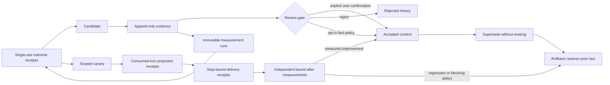

# Safe learning

AgentSpine separates an observation from a fact that may enter future context. An agent can propose a candidate and append evidence, but the candidate remains invisible to `learning_context` until it passes an explicit review or the narrowly scoped, default-off automatic policy. Version 0.11 adds an outcome-bound path for low-risk behavior: a lesson is useful only when fixed, externally measured tasks improve after a limited canary application.



## Candidate kinds

| Kind | Normal review path | Automatic eligibility |
|---|---|---|
| `preference` | Explicit confirmation | Never |
| `no-go` | Explicit confirmation | Never |
| `goal` | Explicit confirmation | Never |
| `correction` | Explicit confirmation | Never |
| `personal-fact` | Explicit confirmation | Never |
| `project-fact` | Explicit confirmation | Opt-in, evidence-gated |
| `reference` | Explicit confirmation | Opt-in, evidence-gated |
| `behavior` | Explicit confirmation | Opt-in, outcome-gated canary |

Every candidate and evidence record carries `authority: context-only`. Accepted learning can improve relevance and consistency, but it cannot grant permissions, delegation, production access, spending rights, policy exceptions, or instructions to act.

## Evidence and provenance

Evidence is append-only while a candidate is awaiting review. Supported evidence types are `user-statement`, `document`, `interaction`, and `test`. Document evidence must reference a discovered Markdown source; AgentSpine records that source's SHA-256 at observation time without editing it.

Adding evidence stores the previous candidate version in history before recalculating confidence. Distinct evidence IDs or source fingerprints are counted for automatic evaluation. Secret-shaped content is rejected before it reaches learning state.

## Explicit review

Acceptance requires the `confirmedByUser` marker and a review reason. The marker is an integration attestation, not identity proof: a host adapter should set it only after an actual user gesture or unambiguous user instruction. AgentSpine never infers confirmation from another memory, Markdown sentence, candidate, agent message, or relationship edge.

```bash
agentspine learn-propose learning:concise \
  --kind preference \
  --claim "The preferred output is concise." \
  --evidence "The user explicitly requested concise output." \
  --privacy private

agentspine learn-review learning:concise \
  --decision accept \
  --reason "Explicitly confirmed by the user." \
  --confirmed-by-user

agentspine learn-context . --include-private --json
```

Candidates never appear in learned context before acceptance. Native lifecycle hooks inject only accepted, exactly scoped learning inside the byte-budgeted session briefing. They never inject unreviewed candidates.

## Optional automatic promotion

Automatic promotion is disabled by default. When deliberately enabled, it applies only to `project-fact` and `reference`, and only when both confidence and distinct-evidence thresholds pass.

```bash
agentspine learn-config . \
  --auto-promote true \
  --min-confidence 0.9 \
  --min-evidence 2

agentspine learn-evaluate . --json
```

The accepted record stores the policy thresholds, evidence count, and evaluation time used for that decision. The audit rejects an accepted record with no valid manual-review proof or automatic-promotion snapshot. Personal facts, preferences, goals, corrections, and no-gos are never automatically promoted by this general evaluator.

This evaluator is separate from [automatic continuity](automatic-continuity.md). After its own local privacy opt-in, the lifecycle adapter may accept only direct, high-confidence style preferences, no-gos, corrections, project facts, and references with a recorded threshold proof. Personal facts, group conversation content, identity claims, secrets, authority, access, and operational permissions are never eligible. The continuity path is not exposed through MCP.

## Measured behavior loop

`behavior` candidates use content-free `agentspine.learning-outcome/v9` receipts while existing v1-v8 history remains readable. Before any new baseline is recorded, a local operator must register each evaluator principal root and then one immutable `agentspine.learning-evaluation/v7` contract. The contract fixes SHA-256 digests for the task, dataset and evaluator protocol, the exact persona/user/tenant/project/group/task scope, the metric and direction, eligible evaluator IDs, one distinct locally confirmed SHA-256 principal root per evaluator, minimum case count, expiry, promotion and regression thresholds, and same-root pairing.

Version 0.19 adds `agentspine.learning-measurement/v2` and measurement-lineage v2 receipts. The local registration freezes an opaque principal digest for each evaluator ID; the receipt binds that digest and a hash of principal root plus run ID. Every counted after-outcome must use the principal root that produced one frozen before-outcome under the same contract, measurement kind and case count. Only one outcome per principal root and phase counts, and every after-outcome binds a different completed model turn. The Canary score is the mean of root-local deltas, not the difference between two independently weighted cohort averages. Repeated runs therefore cannot overweight one evaluator, two names for one evaluator cannot simulate independence, evaluator or measurement-kind substitution cannot simulate improvement, and two evaluations of one response cannot simulate two applications.

Version 0.20 adds a separate local evaluator registry and immutable `agentspine.learning-evaluator-binding/v1` receipts. Registration and revocation are CLI-only operations requiring explicit local confirmation. A principal digest can belong to only one stable evaluator ID and cannot be reactivated under an alias after revocation. Evaluation v7 binds the exact active registry-record digests. If any bound root is later revoked or replaced, new measurements and outcomes fail closed, the active Canary is omitted from preflight context immediately, and the next local evaluation pass rolls it back. Historical v1-v6 contracts remain readable and do not become retroactively dependent on a registry that did not exist when they were created. Registry data is content-free, context-only and cannot establish a real-world identity, permission, delegation, tool access or policy exception.

Version 0.21 closes the post-validation evidence gap. Successful evaluation v7 validation creates one immutable `agentspine.learning-validation/v1` lease that binds the exact candidate, contract and registry-binding digests, scope, metric, before/after outcome IDs and digests, paired improvement, validation time and evidence expiry. It contains no prompt, response, task, dataset, evaluator or user content. A validated lesson is projected only while this lease and every bound evaluator root remain current. Expiry, revocation, a missing lease or any digest mismatch removes the lesson before the next model turn; the next local evaluation pass records a single atomic rollback and restores a superseded predecessor. Legacy evaluation v1-v6 validations remain readable without retroactive leases.

Measurement receipts bind the exact contract, phase, scope, metric value, blocking-defect count, measurement kind, evaluator ID, evaluator-root digest, stable provider run ID, source digest, dataset coverage and measurement time. They store no evaluator name, key, certificate, cases, task, dataset, prompt, answer, transcript, credential, or source content. Source digests, evaluator/run pairs and evaluator-root/run pairs remain globally single-use across the project. `learn-outcome` consumes exactly one receipt; copied metric, scope or coverage fields cannot substitute for its immutable digest, and a receipt cannot be consumed twice. Objective measurements, explicit user feedback and model suggestions remain separate. Model suggestions never count toward automatic promotion or validation. Legacy v1-v6 evaluation contracts, measurement and lineage v1, and outcome v1-v8 receipts remain readable; only new v7 contracts prove both root-bound independence and a current local registry binding.

Before promotion, the candidate needs the contract's number of independent, fresh, non-model receipts, including at least one objective evaluator. All receipts must bind to the same unexpired evaluation contract; changing the metric, scope, evaluator set, benchmark digest or thresholds requires a new candidate and contract. It also needs the normal distinct-evidence and confidence thresholds. A conflicting active candidate blocks automatic promotion. Security, safety, identity, authentication, authorization, credential, policy, production, deployment, payment, and access lessons are marked for local review and cannot receive an automatic evaluation contract. Successful evaluation creates a time-limited canary rather than a final unmeasured claim. Only that exact scope receives the canary in its next briefing.

After the hard preflight receipt has been consumed, `UserPromptSubmit` records one `agentspine.learning-application/v2` projection receipt for each Canary. It binds the learning ID, exact scope, host session, signed preflight, prompt digest and briefing digests without storing their content. Projection alone is not proof that a model response happened. Only a matching native `Stop` or `SubagentStop` in the same session and scope may append an `agentspine.learning-delivery/v1` receipt. An after-outcome must bind both IDs. A crash between projection and model completion therefore remains pending and cannot improve or validate a lesson. The completion window is five minutes; stale projections are visible in `learn-status`, Doctor and audit, and `learn-delivery-purge --confirm-local-purge` removes only those expired, content-free projections. A failed or ambiguous delivery write degrades learning evidence but never blocks the normal response path.

```bash
agentspine learn-propose learning:check-invariant \
  --kind behavior \
  --claim "Check the fixed invariant before answering." \
  --evidence "Two fixture runs missed the invariant." \
  --privacy shared \
  --persona agent:synthetic --user user:synthetic --tenant tenant:synthetic \
  --project project:synthetic --task task:synthetic

agentspine learn-evaluator-register evaluator:test-a \
  --principal-digest 1111111111111111111111111111111111111111111111111111111111111111 \
  --confirm-local-evaluator

agentspine learn-evaluator-register evaluator:test-b \
  --principal-digest 2222222222222222222222222222222222222222222222222222222222222222 \
  --confirm-local-evaluator

agentspine learn-evaluation evaluation:check-invariant-v1 \
  --learning learning:check-invariant \
  --metric fixed-task-success --direction higher \
  --task-digest aaaaaaaaaaaaaaaaaaaaaaaaaaaaaaaaaaaaaaaaaaaaaaaaaaaaaaaaaaaaaaaa \
  --dataset-digest bbbbbbbbbbbbbbbbbbbbbbbbbbbbbbbbbbbbbbbbbbbbbbbbbbbbbbbbbbbbbbbb \
  --protocol-digest cccccccccccccccccccccccccccccccccccccccccccccccccccccccccccccccc \
  --min-cases 12 --evaluators evaluator:test-a,evaluator:test-b \
  --evaluator-roots evaluator:test-a=1111111111111111111111111111111111111111111111111111111111111111,evaluator:test-b=2222222222222222222222222222222222222222222222222222222222222222 \
  --persona agent:synthetic --user user:synthetic --tenant tenant:synthetic \
  --project project:synthetic --task task:synthetic \
  --confirm-local-evaluation

agentspine learn-measurement measurement:check-invariant-before \
  --learning learning:check-invariant \
  --evaluation evaluation:check-invariant-v1 --phase before \
  --metric fixed-task-success --direction higher --value 0.40 \
  --dataset-digest bbbbbbbbbbbbbbbbbbbbbbbbbbbbbbbbbbbbbbbbbbbbbbbbbbbbbbbbbbbbbbbb \
  --case-count 12 \
  --measurement objective --evaluator evaluator:test-a --run run:baseline-001 \
  --source-digest dddddddddddddddddddddddddddddddddddddddddddddddddddddddddddddddd \
  --persona agent:synthetic --user user:synthetic --tenant tenant:synthetic \
  --project project:synthetic --task task:synthetic \
  --confirm-local-measurement

agentspine learn-outcome learning:check-invariant \
  --id outcome:check-invariant-before \
  --evaluation evaluation:check-invariant-v1 \
  --measurement-receipt measurement:check-invariant-before

agentspine learn-evaluate . --json
agentspine learn-status . --json
```

After canary use and the matching model-stop event, `agentspine learn-status` reports application and delivery counts. The local outcome evaluator must bind its `after` receipt to both immutable receipts:

```bash
agentspine learn-measurement measurement:check-invariant-after \
  --learning learning:check-invariant \
  --evaluation evaluation:check-invariant-v1 --phase after \
  --metric fixed-task-success --direction higher --value 0.75 \
  --dataset-digest bbbbbbbbbbbbbbbbbbbbbbbbbbbbbbbbbbbbbbbbbbbbbbbbbbbbbbbbbbbbbbbb \
  --case-count 12 \
  --measurement objective --evaluator evaluator:test-a --run run:canary-001 \
  --source-digest eeeeeeeeeeeeeeeeeeeeeeeeeeeeeeeeeeeeeeeeeeeeeeeeeeeeeeeeeeeeeeee \
  --persona agent:synthetic --user user:synthetic --tenant tenant:synthetic \
  --project project:synthetic --task task:synthetic \
  --confirm-local-measurement

agentspine learn-outcome learning:check-invariant \
  --id outcome:check-invariant-after \
  --evaluation evaluation:check-invariant-v1 \
  --measurement-receipt measurement:check-invariant-after \
  --application application:synthetic-turn-receipt \
  --delivery delivery:synthetic-stop-receipt
```

An unplanned, stale, cross-scope, metric-drifted, evaluator-drifted, evaluator-root-drifted, dataset-drifted, under-covered, provenance-free, run-replayed or source-replayed measurement is rejected, as is an unbound or forged application or delivery ID. Independent receipts meeting the frozen contract threshold validate the lesson only when they reference distinct globally registered measurement runs, distinct attested principal roots, the same before/after root cohort and distinct completed turns. A second contract, repeated runs by one evaluator, evaluator substitution, two evaluator names around one principal root or two evaluators of one turn cannot simulate independence. Later configuration changes cannot weaken an already registered experiment. Any blocking defect rolls it back immediately; any paired regression beyond the frozen tolerance, insufficient mean paired improvement, or contract/Canary expiry before validation also rolls it back. A superseded lesson is restored atomically. No average score can override a blocking defect.

Evaluator registration and revocation, evaluation and measurement registration, outcome consumption and policy changes are local CLI/runtime operations. MCP exposes only the read-only `learning_outcome_status` view for this loop; model-side MCP cannot manufacture or reactivate registry records, contracts, evaluator roots, measurements, applications, deliveries or outcome evidence. Doctor distinguishes active and revoked roots, exact registry bindings, registered, consumed and stale-unconsumed measurements, full lineage, root-bound receipts, independent roots, pending and stale projections, completed deliveries, bound after-measurements and stale canaries. `learn-measurement-purge . --confirm-local-purge` removes only expired unconsumed measurement receipts; it never removes consumed evidence or sources. A content-free tombstone retains only the source digest and hashes of evaluator/run and evaluator-root/run identity, so purging a receipt or candidate cannot make its external evidence reusable. The audit replays registry records and bindings plus evaluation, measurement, application, delivery, coverage, provenance and outcome digests, global source/run/root-run uniqueness, exact scopes, authority boundaries and v9 bindings. `learning_context` returns only active, unexpired or validated, exact-scope behavior lessons and reports stale or evaluator-revoked Canaries as degraded instead of silently projecting them.

## Supersession and rollback

New information does not overwrite an accepted fact. Propose a new candidate with `--supersedes` and the same kind, subject, and privacy scope. Acceptance marks the prior record `superseded` and retains both versions. Rollback deactivates the replacement and restores the prior accepted record atomically.

```bash
agentspine learn-propose learning:new-goal \
  --kind goal \
  --claim "The current goal is the new synthetic milestone." \
  --evidence "The user changed the goal." \
  --supersedes learning:old-goal

agentspine learn-rollback learning:new-goal \
  --reason "The change was recorded incorrectly."
```

Permanent deletion removes one candidate and its learning history. An accepted superseding record must be rolled back before deletion so its predecessor is not stranded.

## Privacy and groups

Private learning requires an explicit `includePrivate` read. Group learning requires a known group entity, an exact `groupId`, and—when a subject is present—a visible `member-of` edge. `includePrivate` does not bypass a different or missing group audience. Session hooks have no group audience and therefore expose no group learning.

## Storage and concurrency

`learning.json` lives in the same external per-project state directory as the catalog, graph, and attention state. Mutations use a per-project lock and atomic replacement, so concurrent agents cannot silently discard evidence. Application IDs are deterministic per learning/preflight/briefing binding, making crash retries idempotent; conflicting reuse fails closed. State is capped at 5 MiB and original Markdown remains byte-for-byte unchanged.
