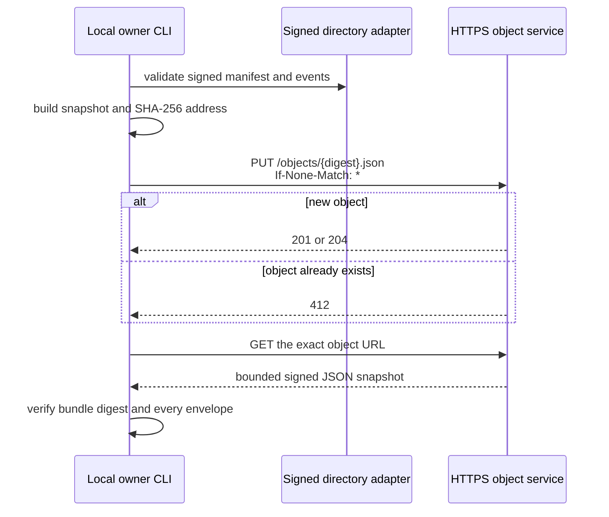

# Immutable HTTPS object transport

AgentSpine can publish a signed snapshot directly to any HTTPS service that implements a tiny create-only object contract. The protocol is provider-neutral: it needs no cloud SDK, account-specific URL format, database driver, or agent vendor.



There is no overwrite, delete, listing, mutable latest pointer, or remote administration operation. A publish counts as successful only after AgentSpine reads the object back through the hardened HTTPS client and verifies the exact snapshot digest plus every nested Ed25519 envelope.

## Publish

Start with an authenticated directory adapter as described in [shared memory](shared-memory.md), then run:

```bash
export AGENTSPINE_OBJECT_TOKEN='deployment-supplied-value'

agentspine share-https-publish /srv/agent-memory/team-alpha \
  --root /path/to/publisher-project \
  --base https://memory.example.org/agentspine/team-alpha \
  --id snapshot:team-alpha-2026-08-28 \
  --token-env AGENTSPINE_OBJECT_TOKEN \
  --confirm-local-share
```

AgentSpine derives the immutable object URL:

```text
https://memory.example.org/agentspine/team-alpha/objects/{snapshot-sha256}.json
```

The token value is read only from the named environment variable. It is never accepted in the URL, persisted, returned, added to hooks, or exposed through MCP. Publishing always requires the explicit local confirmation flag, including public endpoints.

## Server contract

The service receives one request:

```http
PUT /agentspine/team-alpha/objects/{64-lowercase-hex-digest}.json
Content-Type: application/vnd.agentspine.snapshot+json
Content-Length: {exact bytes}
If-None-Match: *
X-AgentSpine-Digest: sha256:{same digest}
Authorization: Bearer {optional deployment token}
```

It must atomically create the resource and return `201` or `204`. If that exact path already exists, it must leave the object untouched and return `412`. AgentSpine deliberately rejects a generic `200` response because it cannot distinguish creation from replacement. The service must then serve the exact bytes at the same URL with the response rules documented in [HTTPS snapshots](https-transport.md).

The digest in the path is a routing and integrity aid, not authorization. Servers should independently compute it, enforce create-only semantics, authenticate writers, rate-limit requests, bound body size to 21 MiB, and retain audit logs that do not record bearer values or bodies.

## Idempotency and failures

- `201` or `204` followed by an exact verified read-back returns `created: true`.
- `412` followed by the exact verified object is a safe idempotent retry and returns `alreadyExisted: true`.
- A different, missing, malformed, unsigned, untrusted, or unreadable object fails the operation.
- Redirects, DNS rebinding to disallowed addresses, TLS errors, oversized responses, compression, ambiguous URLs, timeouts, and unexpected status codes fail closed.
- A failed upload may have reached the server. Retrying the same snapshot is safe because the object address is immutable and the read-back decides the result.

## Private networks

Private, loopback, link-local, reserved, multicast, carrier-grade NAT, and documentation ranges are rejected by default. A deliberately internal service needs both flags:

```bash
agentspine share-https-publish /srv/agent-memory/team-alpha \
  --root /path/to/project \
  --base https://memory.internal.example/agentspine/team-alpha \
  --allow-private-network \
  --confirm-local-share
```

The hostname is resolved and every answer is vetted before the socket is pinned to one approved address. TLS verification remains enabled.

## Trust boundary

Publishing transports only context that already passed the local sharing exporter. It cannot publish source Markdown, evidence text, private learning, relationships, attention, tasks, delegation policy, credentials, or signer private keys. The receiver still uses `share-https-pull`, imports into quarantine, trusts configured public keys, and performs a second local review before any claim reaches context.

The object service never becomes an authority provider. Successful upload, bearer authentication, TLS, digests, and valid signatures grant no permissions, delegation, production access, spending rights, or policy exceptions.

The transport is intentionally absent from MCP and lifecycle hooks. An agent can use reviewed shared context, but it cannot select an endpoint, read a token, publish, overwrite, or opt into a private network through AgentSpine's agent-controlled surfaces.
