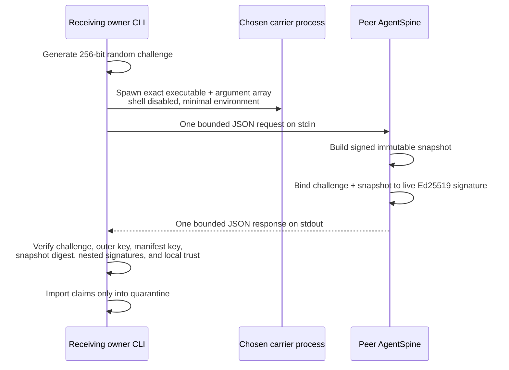

# Challenge-response peer transport

AgentSpine can pull a fresh signed snapshot from another installation through any owner-selected executable that provides stdin and stdout. Typical carriers are SSH, container exec, a local process supervisor, or an organization-specific transport wrapper. AgentSpine itself opens no listening socket, selects no network, invokes no shell, and contains no vendor SDK.



The random challenge proves that the remote peer holding the configured private key answered this request. A captured response cannot be replayed under a later challenge. This authenticates the peer and transport content; it does not make any claim authoritative.

## Remote peer

The serving side is deliberately one-shot. It reads one request, writes one response, and exits:

```bash
agentspine share-peer-serve /srv/agent-memory/team-alpha \
  --root /srv/agent-project \
  --signer signer:team-alpha \
  --timeout-ms 10000 \
  --confirm-local-share
```

The directory must be an authenticated shared-memory adapter. The selected signer must be the same Ed25519 key that signed its manifest. Starting the server requires explicit local owner confirmation; it does not become a background daemon or open a port.

## Receiver

Trust the peer's exported public identity first. Then provide an exact JSON argument array for the carrier:

```bash
agentspine share-peer-pull \
  --root /path/to/receiver-project \
  --command-json '["ssh","memory.example.org","agentspine","share-peer-serve","/srv/agent-memory/team-alpha","--root","/srv/agent-project","--signer","signer:team-alpha","--confirm-local-share"]' \
  --timeout-ms 10000 \
  --confirm-local-share
```

AgentSpine passes the first array item as the executable and every remaining item as a literal argument with Node's shell option disabled. The carrier itself may have additional semantics: for example, an SSH server commonly invokes a remote login shell. Configure and quote carrier-specific remote commands defensively, or use a fixed server-side wrapper that exposes only `share-peer-serve` with predetermined paths and signer.

Both confirmations are intentional. The receiver confirms execution of the chosen local carrier. The peer confirms one export from its selected adapter. Neither confirmation approves imported claims for context.

## Wire protocol

The receiver sends one newline-terminated `agentspine.peer-request/v1` JSON object containing:

- a random request ID;
- a cryptographically random 32-byte lowercase-hex challenge;
- the maximum accepted response bytes;
- `authority: context-only`.

The peer returns one newline-terminated Ed25519 `manifest` envelope. Its `agentspine.peer-response/v1` payload binds the exact request ID and challenge to a validated signed snapshot, creation time, digest, and `context-only` authority. The outer live-response signer must equal the snapshot-manifest signer. The receiving project must already trust that exact public key, and the nested snapshot importer independently revalidates the manifest and every event.

Requests are limited to 4 KiB. Responses are limited to a receiver-selected value from 1 MiB through 22 MiB, with 22 MiB as the default and the existing snapshot limit still enforced. Only the first complete JSON frame is considered. Timeouts range from one to thirty seconds.

## Process boundary

Executing any program is a privileged local action. A malicious carrier executable can act with the user's operating-system permissions before AgentSpine sees a response. Use an absolute path or a trusted `PATH`, verify the executable, constrain SSH identities and remote commands, and apply normal operating-system sandboxing where appropriate.

AgentSpine reduces accidental exposure by:

- requiring explicit local confirmation;
- never invoking a shell itself;
- accepting only a bounded JSON array of bounded strings;
- passing a minimal cross-platform environment containing path, home, temporary-directory, locale, SSH-agent, AgentSpine-state, and platform runtime variables;
- omitting unrelated environment variables, including application tokens;
- bounding and discarding stderr rather than returning it as agent context;
- killing timed-out, noisy, invalid, or completed carrier processes;
- never persisting the executable, arguments, request, challenge, or response.

The SSH agent socket is included so SSH remains usable. Possession of that socket is powerful; operators who do not want agent forwarding should remove it from the invoking environment or use a carrier wrapper with narrower credentials.

## Trust and authority boundary

Successful challenge-response, process exit, SSH authentication, signatures, and digests create no permissions, delegation, production access, spending rights, or policy exceptions. The received snapshot enters the normal shared-memory quarantine. A second local user review remains mandatory before any imported claim can appear in context.

Peer serving, carrier execution, pulls, process arguments, stdin/stdout frames, and signer selection are absent from MCP and lifecycle hooks. Agents may read already reviewed shared context, but they cannot start a peer, select an executable, export data, or approve a received claim through AgentSpine's agent-controlled surfaces.

Only explicitly published accepted, non-private shared events enter the snapshot. Existing `AGENTS.md`, `CLAUDE.md`, `SOUL.md`, `MEMORY.md`, and every other discovered Markdown source remain in place and byte-for-byte unchanged.
