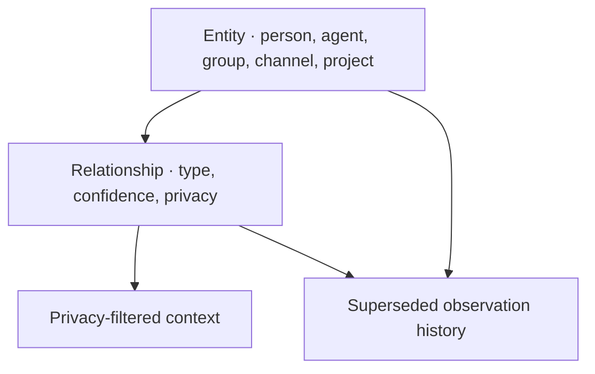
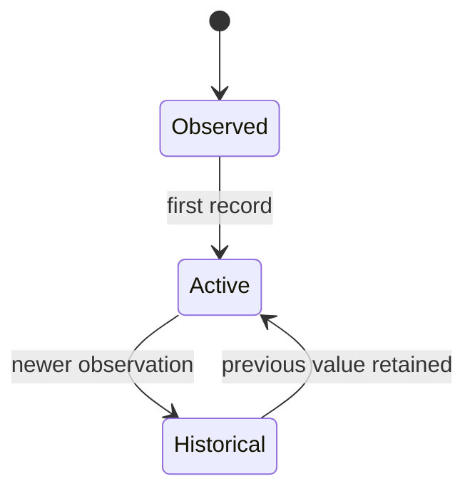

# Relationships and learning

AgentSpine keeps social context in the external overlay graph. It never writes learned facts into `SOUL.md`, `AGENTS.md`, `CLAUDE.md`, memory files, or any other project Markdown.

## Data model



Entities have stable IDs, a kind, optional display name and aliases, attributes, provenance, confidence, and privacy. Relationships connect two known IDs with a typed relation. Name similarity never merges identities.

Supported privacy scopes are:

| Scope | Default visibility |
|---|---|
| `private` | Returned only when private context is explicitly requested |
| `shared` | Available to normal relationship-context reads |
| `group` | Marked for group-specific context selection |

Privacy is a context filter, not an access-control system. The host must still authorize who may invoke the tool and see its output.

## Learning without erasure

An upsert changes the active view. If the same entity, document annotation, or same typed edge already exists, AgentSpine first copies the previous record into append-only `history`. The old observation therefore remains inspectable with its original confidence, reason, and timestamp.



This is supersession in relevance, not deletion or a claim that the newest statement is automatically true. Agents should use evidence, calibrated confidence, and explicit source documents where available.

## Authority boundary

Every entity, relationship, annotation, and history entry carries `authority: context-only`. Permission-like and credential-like attribute keys are rejected recursively. Responsibilities such as `responsible-for` describe the team; they do not authorize task assignment, tool use, access, delegation, billing, deployment, or data disclosure.

## CLI example

Use synthetic IDs in shared examples and stable application IDs in real systems:

```bash
agentspine entity agent:builder --kind agent --name Builder --privacy shared
agentspine entity project:site --kind project --name Site --privacy shared
agentspine relate agent:builder project:site --relation responsible-for --privacy shared
agentspine relationships agent:builder --json
```

The MCP tools expose additional attributes, aliases, source-document provenance, confidence, and explicit private reads.

## Limits

- The graph is local user state and is not synchronized automatically.
- A 5 MiB graph ceiling stops unbounded growth instead of discarding history.
- Attribute-key rejection cannot determine whether innocent-looking prose contains a secret.
- Group-specific recipient policy and notification delivery are not implemented.
