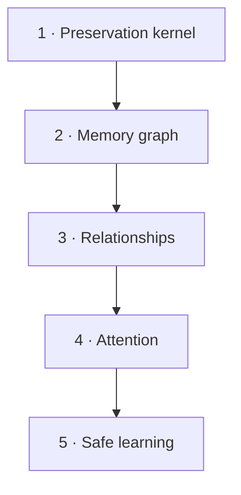

# Roadmap

AgentSpine is built as complete, measurable stages. Later stages do not weaken the preservation kernel.

## 1. Preservation kernel

Status: in progress for `v0.1`.

- byte-preserving discovery;
- SHA-256 provenance catalog;
- Codex and Claude hierarchy adapters;
- explicit link graph and ranged reading;
- CLI, MCP, hooks, tests, and dual-host packaging.

## 2. Memory graph

- one fact per local file, grouped by user, feedback, project, or reference;
- compact generated index with a configurable context ceiling;
- typed links, confidence, timestamps, source, and supersession without deletion;
- learning candidates separated from confirmed facts.

## 3. Relationships

- distinct identities for people, agents, channels, and groups;
- relationship state per agent and counterpart;
- responsibilities, delegation boundaries, preferences, goals, no-gos, and open threads;
- explicit identity linking instead of name-based merging;
- private facts prevented from leaking into group context.

## 4. Attention

- low-cost signals for neglected teammates, unanswered questions, promises, and meaningful changes;
- sparse, natural follow-ups rather than interview behavior;
- task focus always outranks social curiosity;
- configurable quiet periods and user-controlled disable/delete paths.

## 5. Safe learning

- observation candidates with evidence and confidence;
- new information changes relevance without silently erasing history;
- measurable before/after checks and rollback for automatic low-risk changes;
- code, secrets, billing, permissions, and production access remain approval-bound.

## Definition of done for every stage

1. A failing case is reproducible.
2. The smallest coherent stage is implemented.
3. Focused, mutation, and full-suite tests pass.
4. Source preservation and rollback are demonstrated.
5. Security boundaries and known limits are documented.
6. A real host installation path is exercised.
