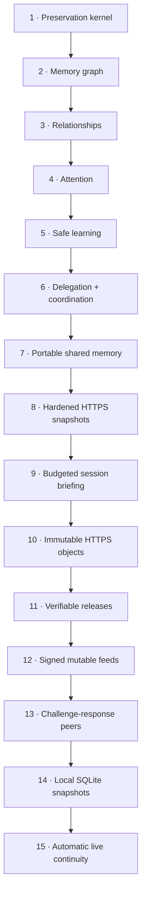

# Roadmap

AgentSpine is built as complete, measurable stages. Later stages do not weaken the preservation kernel.

## 1. Preservation kernel

Status: implemented for `v0.1`; ongoing hardening.

- byte-preserving discovery;
- SHA-256 provenance catalog;
- Codex and Claude hierarchy adapters;
- explicit link graph and ranged reading;
- CLI, MCP, hooks, tests, and dual-host packaging.

## 2. Memory graph

Status: local foundation, candidate workflow, provider-neutral exchange contract, and directory adapter implemented.

- existing one-fact-per-file layouts are discovered and linked without migration;
- compact generated index with a configurable context ceiling;
- typed links, confidence, timestamps, source, and supersession history without deletion;
- learning candidates separated from confirmed facts.
- accepted non-private learning can cross installations through quarantine and a second local review.

## 3. Relationships

Status: local relationship, explicit delegation, and open-thread foundations implemented.

- distinct identities for people, agents, channels, groups, and projects;
- privacy-scoped relationship state per agent and counterpart;
- responsibilities, delegation boundaries, preferences, goals, no-gos, and open threads;
- explicit identity linking instead of name-based merging;
- private facts prevented from leaking into group context.

## 4. Attention

Status: sparse local foundation implemented; host-specific notification adapters remain out of scope.

- low-cost signals for neglected teammates, unanswered questions, promises, and meaningful changes;
- sparse ranking and presentation throttling rather than interview behavior;
- task focus and quiet periods suppress all suggestions;
- private reads are explicit, automatic hooks disclose no cue text;
- user-controlled disable, resolve, per-cue deletion, and per-entity purge paths.

## 5. Safe learning

Status: local evidence, review, promotion, supersession, and rollback workflow implemented.

- observation candidates remain outside context until accepted;
- evidence, source fingerprints, confidence, and every prior candidate version are retained;
- new information changes relevance through explicit supersession instead of erasure;
- automatic promotion is default-off, thresholded, and limited to project facts and references;
- acceptance proof and rollback are audited;
- code, secrets, billing, permissions, and production access remain approval-bound.

## 6. Delegation and coordination

Status: local default-deny foundation implemented; remote dispatch remains deliberately out of scope.

- delegation policy physically separated from context and absent from MCP mutation tools;
- explicit actor, action, and target matching with owner-confirmed local grants;
- tasks, open threads, and handoffs with assignment snapshots and retained history;
- self-management without widening cross-entity delegation;
- exact private and group audiences, atomic writes, cross-process locking, and fail-closed validation;
- no task dispatch, messaging, host permissions, tool rights, deployment, billing, or spending authority.

## 7. Portable shared memory

Status: optional directory transport, Ed25519 origin authentication, hardened HTTPS snapshots, immutable object publication, signed mutable feeds, one-shot peer exchange, and local SQLite snapshot history implemented; hosted database transports remain extension work.

- directory adapter usable locally, on a network drive, or through a user-selected synchronization service;
- strict immutable event schema, canonical SHA-256 integrity, deterministic IDs, limits, and collision detection;
- private/source/evidence/task/policy data excluded before publication;
- imported events quarantined and invisible until a second local user review;
- exact group audience, idempotent concurrent pulls, retained supersession, rollback, and permanent local deletion;
- MCP restricted to reading reviewed shared context; adapter administration remains local CLI;
- digest integrity remains available for compatibility; signed mode verifies trusted Ed25519 manifest and event origins;
- local signer generation, explicit rotation, per-project public-key trust, revocation, retained proof, and audit replay;
- signatures authenticate configured keys only and never replace quarantine, content review, privacy, or authority boundaries.

## 8. Hardened HTTPS snapshots

Status: provider-neutral static export, hardened pull, create-only object publication, signed mutable-feed discovery, challenge-response peer exchange, and local SQLite snapshot retention implemented; hosted database adapters remain extension work.

- immutable signed snapshot export outside the scanned project;
- dependency-free HTTPS pull with TLS verification, vetted and pinned DNS, default SSRF protection, no redirects, and exact response limits;
- optional bearer token read only from an explicitly named environment variable;
- explicit private-network opt-in with local confirmation;
- strict bundle digest plus independent manifest and event signature verification before local mutation;
- import through the same quarantine, second local review, trust, privacy, supersession, rollback, and authority boundaries as the directory adapter;
- CLI-only transport administration; no network or token surface in MCP or hooks.

## 9. Budgeted session briefing

Status: provider-neutral CLI, MCP, hook guidance, privacy enforcement, and behavioral tests implemented.

- one read across native sources, relationships, accepted local learning, reviewed shared memory, open coordination, and optional attention;
- current-task-first ordering and local-over-shared deduplication;
- hard compact-JSON UTF-8 byte ceiling with atomic record inclusion and per-section omission counts;
- focus active by default and no attention presentation mutation during reads;
- exact group membership, no private/group mixing, and metadata-only source handling for group audiences;
- descriptive context only; no policy, credentials, transport administration, messages, or authority.

## 10. Immutable HTTPS objects

Status: provider-neutral create-only publish and verified read-back implemented; deletion remains out of scope. Feeds, peers, and local SQLite are implemented separately in later stages.

- signed snapshot publication under a deterministic SHA-256 object address;
- atomic create-only `PUT` with `If-None-Match: *` and no overwrite path;
- `201`/`204` creation and verified `412` idempotent retry semantics;
- mandatory hardened read-back before reporting success;
- TLS verification, DNS pinning, SSRF protection, no redirects, strict limits, and exact body length;
- bearer credentials read only from a named environment variable;
- explicit local confirmation for every network write and separate private-network opt-in;
- CLI-only transport surface; no endpoint, credential, publish, overwrite, or delete capability in MCP or hooks;
- snapshots remain context-only and imports still enter quarantine for a second local review.

## 11. Verifiable releases

Status: deterministic local gate and tag-authorized GitHub release pipeline implemented; npm publication remains deliberately disabled until registry trust is configured.

- exact SemVer parity across npm, lockfile, Claude Code, Codex, and marketplace metadata;
- strict package allow/deny boundary with size, count, integrity, path, state, key, and user-source checks;
- full action commit-SHA pinning and Dependabot tracking;
- tag must match the version, have a dated changelog section, and point to a commit contained in `main`;
- complete CI, audit, plugin, skill, and package gates run before artifact creation;
- release tarball, CycloneDX SBOM, and SHA-256 checksum bundle;
- OIDC-backed build-provenance and SBOM attestations;
- build/attestation and GitHub publication split into separate least-privilege jobs;
- optional protected `release` environment and documented consumer verification;
- no long-lived npm token or automatic registry publication.

## 12. Signed mutable feeds

Status: provider-neutral signed feed publication, continuity tracking, and quarantined pull implemented; hosted database transports remain extension work. Direct peers and local SQLite are implemented separately in stages 13 and 14.

- bounded 256-entry hash-chain window over immutable signed snapshot objects;
- full Ed25519 signature over feed identity, scope, adapter, sequence, and retained chain;
- strong ETag compare-and-swap with `If-None-Match: *` genesis and `If-Match` updates;
- explicit concurrency conflicts without hidden overwrite or retry;
- local external receipts with retained prior versions and fail-closed corruption handling;
- rollback, same-sequence equivocation, signer replacement, and continuity-gap rejection;
- hardened TLS, DNS pinning, SSRF, redirect, compression, size, token, and timeout boundaries;
- latest snapshot independently verified and imported only into quarantine;
- CLI-only endpoint and credential administration; no MCP or hook transport capability;
- feed state, signatures, remote authentication, and imported content remain context-only.

## 13. Challenge-response peers

Status: one-shot provider-neutral stdio server, owner-selected carrier process, and quarantined pull implemented. Local SQLite is implemented separately in stage 14; hosted database transports remain extension work.

- fresh 256-bit random challenge and request ID for every pull;
- live Ed25519 response binding the challenge to one independently validated signed snapshot;
- exact outer-response and snapshot-manifest signer equality plus project-local trust;
- strict request, response, command, argument, stderr, and timeout limits;
- carrier launched as an exact executable/argument array with the shell disabled;
- minimal environment allowlist instead of inherited application tokens;
- no AgentSpine listener, background daemon, vendor SDK, carrier credential store, or hidden retry;
- both serving and carrier execution require explicit local owner confirmation;
- received events enter quarantine and still need a second local content review;
- peer and process administration absent from MCP and hooks;
- challenge, signatures, carrier authentication, snapshots, and imports remain context-only.

## 14. Local SQLite snapshots

Status: provider-neutral local database initialization, append-only publication, full inspection, and quarantined pull implemented; hosted SQL services and database replication remain out of scope.

- optional built-in `node:sqlite` adapter with no package dependency or vendor SDK;
- database must remain outside the scanned project and cannot be a symbolic link;
- immutable binding to one authenticated directory manifest, scope, adapter, signer, and key;
- full signed snapshots retained as monotonically sequenced append-only revisions;
- SHA-256 revision chain and one atomic head updated in a `BEGIN IMMEDIATE` transaction;
- exact application-schema and SQLite-integrity validation plus full replay on every read or write;
- idempotent repeated publication without history duplication;
- read-only pull of the latest validated revision through the existing signed quarantine importer;
- explicit local owner confirmation for initialization and publication;
- CLI-only paths and administration; no SQLite surface in MCP or hooks;
- SQLite state, hashes, signatures, snapshots, and imports remain context-only.

## 15. Automatic live continuity

Status: implemented in `v0.2.0` for the ordered portal-neutral memory milestone. Automatic attention events followed in `v0.3.0`; rights-bound job resume remains a later stage.

- native Claude Code and Codex lifecycle bundle with one command per supported event;
- complete scoped session briefing injected at start, resume, prompt, and compaction boundaries without model-side MCP selection;
- separate one-time local privacy opt-in for minimal direct conversation signals;
- exact person, group, project, and task scope with no name-based identity merging;
- low-risk style, preference, no-go, correction, project-fact, and reference acceptance under recorded thresholds;
- full-prompt exclusion, SHA-256 provenance receipts, deduplication, locking, rollback, and confirmed purge;
- unconditional rejection of secrets, sensitive personal facts, private group content, identity claims, authority, access, payment, production, and operational permissions;
- `0.2.0` cache boundary, explicit Claude component registration, and reproducible fresh-install, stale-upgrade, and uninstall checks;
- visible fail-closed context when any dependent state is malformed.

## 16. Native attention events

Status: implemented in `v0.3.0` as the second ordered milestone. The rights-bound self-starter remains deliberately unimplemented.

- provider-neutral heartbeat, promise, and blocker lifecycle records written by installed native hooks;
- immutable person/agent, group, project, task, privacy, and event identity binding;
- hook receipt deduplication, repetition throttling, atomic multi-process writes, and retained prior versions;
- start, restart, and compaction injection through the real scoped briefing without MCP selection;
- current-task blocker and due-promise visibility under focus, with unrelated cues suppressed;
- quiet-hour, disable, deletion, and person-purge behavior across active state, receipts, history, and presentations;
- rejection of secret, identity, private-group, authority, access, production, payment, and permission claims;
- `0.3.0` cache boundary and install/upgrade proof that exactly one MCP server and one lifecycle hook set load;
- no messages, scheduling, task execution, permissions, or job resume.

## Definition of done for every stage

1. A failing case is reproducible.
2. The smallest coherent stage is implemented.
3. Focused, mutation, and full-suite tests pass.
4. Source preservation and rollback are demonstrated.
5. Security boundaries and known limits are documented.
6. A real host installation path is exercised.
