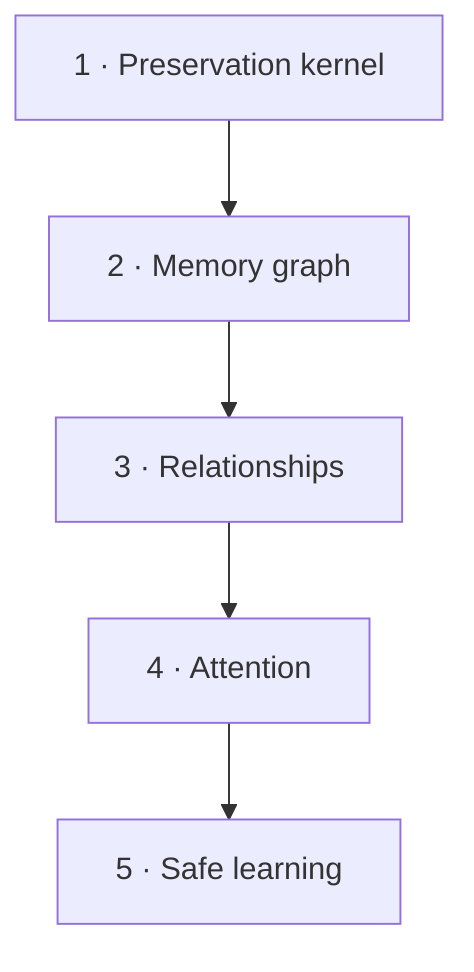

# Roadmap

AgentSpine is built as complete, measurable stages. Later stages do not weaken the preservation kernel.

## 1. Preservation kernel

Status: implemented for `v0.1`; ongoing hardening.

- byte-preserving discovery;
- SHA-256 provenance catalog;
- Codex and Claude hierarchy adapters;
- explicit link graph and ranged reading;
- CLI, MCP, hooks, tests, and dual-host packaging.

## 2. Memory graph

Status: local foundation and candidate workflow implemented; shared adapters remain planned.

- existing one-fact-per-file layouts are discovered and linked without migration;
- compact generated index with a configurable context ceiling;
- typed links, confidence, timestamps, source, and supersession history without deletion;
- learning candidates separated from confirmed facts.

## 3. Relationships

Status: foundation implemented; delegation policy and open-thread UX remain planned.

- distinct identities for people, agents, channels, groups, and projects;
- privacy-scoped relationship state per agent and counterpart;
- responsibilities, delegation boundaries, preferences, goals, no-gos, and open threads;
- explicit identity linking instead of name-based merging;
- private facts prevented from leaking into group context.

## 4. Attention

Status: sparse local foundation implemented; host-specific notification adapters remain out of scope.

- low-cost signals for neglected teammates, unanswered questions, promises, and meaningful changes;
- sparse ranking and presentation throttling rather than interview behavior;
- task focus and quiet periods suppress all suggestions;
- private reads are explicit, automatic hooks disclose no cue text;
- user-controlled disable, resolve, per-cue deletion, and per-entity purge paths.

## 5. Safe learning

Status: local evidence, review, promotion, supersession, and rollback workflow implemented.

- observation candidates remain outside context until accepted;
- evidence, source fingerprints, confidence, and every prior candidate version are retained;
- new information changes relevance through explicit supersession instead of erasure;
- automatic promotion is default-off, thresholded, and limited to project facts and references;
- acceptance proof and rollback are audited;
- code, secrets, billing, permissions, and production access remain approval-bound.

## Definition of done for every stage

1. A failing case is reproducible.
2. The smallest coherent stage is implemented.
3. Focused, mutation, and full-suite tests pass.
4. Source preservation and rollback are demonstrated.
5. Security boundaries and known limits are documented.
6. A real host installation path is exercised.
