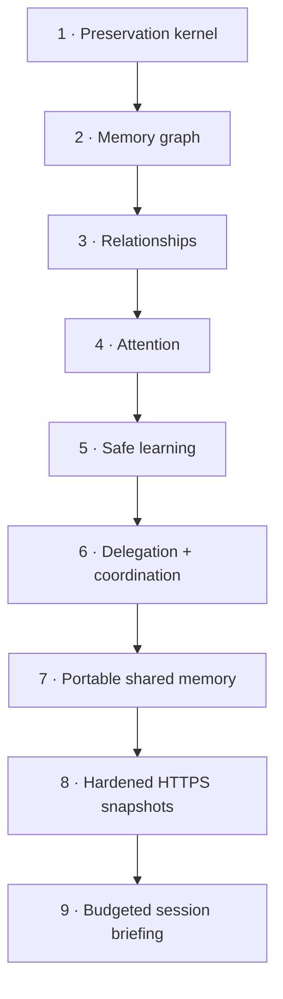

# Roadmap

AgentSpine is built as complete, measurable stages. Later stages do not weaken the preservation kernel.

## 1. Preservation kernel

Status: implemented for `v0.1`; ongoing hardening.

- byte-preserving discovery;
- SHA-256 provenance catalog;
- Codex and Claude hierarchy adapters;
- explicit link graph and ranged reading;
- CLI, MCP, hooks, tests, and dual-host packaging.

## 2. Memory graph

Status: local foundation, candidate workflow, provider-neutral exchange contract, and directory adapter implemented.

- existing one-fact-per-file layouts are discovered and linked without migration;
- compact generated index with a configurable context ceiling;
- typed links, confidence, timestamps, source, and supersession history without deletion;
- learning candidates separated from confirmed facts.
- accepted non-private learning can cross installations through quarantine and a second local review.

## 3. Relationships

Status: local relationship, explicit delegation, and open-thread foundations implemented.

- distinct identities for people, agents, channels, groups, and projects;
- privacy-scoped relationship state per agent and counterpart;
- responsibilities, delegation boundaries, preferences, goals, no-gos, and open threads;
- explicit identity linking instead of name-based merging;
- private facts prevented from leaking into group context.

## 4. Attention

Status: sparse local foundation implemented; host-specific notification adapters remain out of scope.

- low-cost signals for neglected teammates, unanswered questions, promises, and meaningful changes;
- sparse ranking and presentation throttling rather than interview behavior;
- task focus and quiet periods suppress all suggestions;
- private reads are explicit, automatic hooks disclose no cue text;
- user-controlled disable, resolve, per-cue deletion, and per-entity purge paths.

## 5. Safe learning

Status: local evidence, review, promotion, supersession, and rollback workflow implemented.

- observation candidates remain outside context until accepted;
- evidence, source fingerprints, confidence, and every prior candidate version are retained;
- new information changes relevance through explicit supersession instead of erasure;
- automatic promotion is default-off, thresholded, and limited to project facts and references;
- acceptance proof and rollback are audited;
- code, secrets, billing, permissions, and production access remain approval-bound.

## 6. Delegation and coordination

Status: local default-deny foundation implemented; remote dispatch remains deliberately out of scope.

- delegation policy physically separated from context and absent from MCP mutation tools;
- explicit actor, action, and target matching with owner-confirmed local grants;
- tasks, open threads, and handoffs with assignment snapshots and retained history;
- self-management without widening cross-entity delegation;
- exact private and group audiences, atomic writes, cross-process locking, and fail-closed validation;
- no task dispatch, messaging, host permissions, tool rights, deployment, billing, or spending authority.

## 7. Portable shared memory

Status: optional directory transport, Ed25519 origin authentication, and hardened static HTTPS snapshots implemented; writable hosted transports remain extension work.

- directory adapter usable locally, on a network drive, or through a user-selected synchronization service;
- strict immutable event schema, canonical SHA-256 integrity, deterministic IDs, limits, and collision detection;
- private/source/evidence/task/policy data excluded before publication;
- imported events quarantined and invisible until a second local user review;
- exact group audience, idempotent concurrent pulls, retained supersession, rollback, and permanent local deletion;
- MCP restricted to reading reviewed shared context; adapter administration remains local CLI;
- digest integrity remains available for compatibility; signed mode verifies trusted Ed25519 manifest and event origins;
- local signer generation, explicit rotation, per-project public-key trust, revocation, retained proof, and audit replay;
- signatures authenticate configured keys only and never replace quarantine, content review, privacy, or authority boundaries.

## 8. Hardened HTTPS snapshots

Status: provider-neutral static transport implemented; writable object-store, database, and peer adapters remain extension work.

- immutable signed snapshot export outside the scanned project;
- dependency-free HTTPS pull with TLS verification, vetted and pinned DNS, default SSRF protection, no redirects, and exact response limits;
- optional bearer token read only from an explicitly named environment variable;
- explicit private-network opt-in with local confirmation;
- strict bundle digest plus independent manifest and event signature verification before local mutation;
- import through the same quarantine, second local review, trust, privacy, supersession, rollback, and authority boundaries as the directory adapter;
- CLI-only transport administration; no network or token surface in MCP or hooks.

## 9. Budgeted session briefing

Status: provider-neutral CLI, MCP, hook guidance, privacy enforcement, and behavioral tests implemented.

- one read across native sources, relationships, accepted local learning, reviewed shared memory, open coordination, and optional attention;
- current-task-first ordering and local-over-shared deduplication;
- hard compact-JSON UTF-8 byte ceiling with atomic record inclusion and per-section omission counts;
- focus active by default and no attention presentation mutation during reads;
- exact group membership, no private/group mixing, and metadata-only source handling for group audiences;
- descriptive context only; no policy, credentials, transport administration, messages, or authority.

## Definition of done for every stage

1. A failing case is reproducible.
2. The smallest coherent stage is implemented.
3. Focused, mutation, and full-suite tests pass.
4. Source preservation and rollback are demonstrated.
5. Security boundaries and known limits are documented.
6. A real host installation path is exercised.
