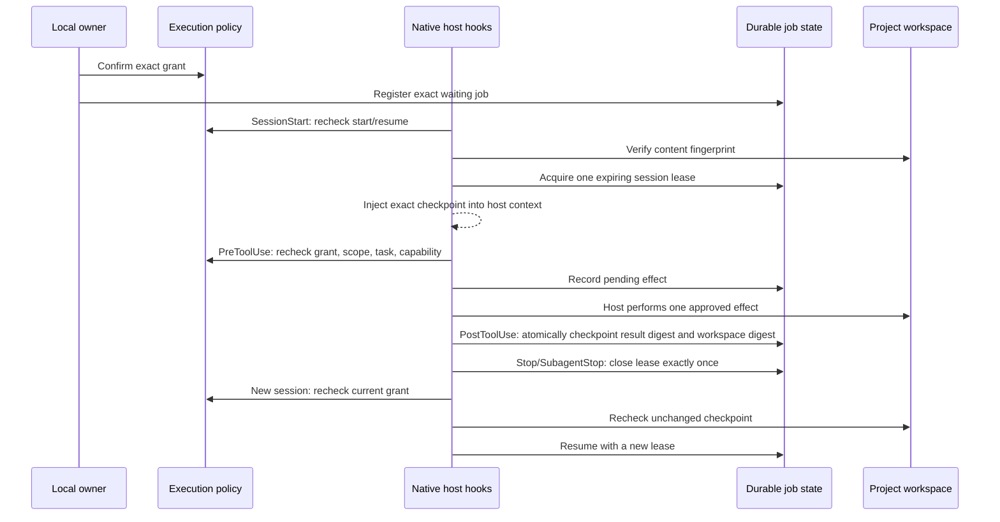

# Rights-bound self-starter

AgentSpine `0.72.2` can start or resume one waiting job through installed Claude Code and Codex lifecycle hooks. Its runtime is split into bounded core-state, workspace, owner-policy, job-lifecycle and leased-effect domains behind the unchanged public interface. This is intentionally narrower than general autonomy: an explicit local execution grant must bind the exact actor, action set, job, task, target, project, optional group, host, and finite tool capabilities. Memory, Markdown, learning, relationships, attention, task text, old approvals, and model claims never satisfy that grant.

## Lifecycle



The hook adapter resolves an active job from the native host session. A model does not need to select an MCP tool or repeat a job ID on each tool call. `PreToolUse` still blocks a protected source before evaluating job authority. `PostToolUse` stores only a bounded result digest, not tool output or chat content.

## Local owner setup

Create the normal context-only task first. Then create a separate execution grant and job from a trusted local integration:

```bash
agentspine execution-grant job:release \
  --id execution-grant:release \
  --actor agent:builder \
  --task task:release \
  --target person:owner \
  --project project:alpha \
  --host claude \
  --capabilities tool:Write,tool:Edit \
  --reason "Owner approved this exact local release preparation" \
  --confirm-local-execution \
  --root /path/to/project

agentspine job-register job:release \
  --grant execution-grant:release \
  --max-retries 3 \
  --lease-seconds 120 \
  --confirm-local-execution \
  --root /path/to/project
```

`--confirm-local-execution` is an integration attestation, not authentication. A wrapper must bind it to a genuine current local owner decision. It must never be inferred from a conversation, task, previous approval, model output, MCP response, or stored context.

Inspect or stop work locally:

```bash
agentspine jobs /path/to/project --json
agentspine execution-policy /path/to/project --json
agentspine execution-revoke execution-grant:release \
  --reason "Owner revoked the run" \
  --confirm-local-execution \
  --root /path/to/project
agentspine job-cancel job:release \
  --reason "Work is no longer required" \
  --confirm-local-execution \
  --root /path/to/project
```

Execution-policy mutation and job administration are absent from MCP. Hooks cannot invent grants, acknowledge host trust, widen capabilities, send messages, administer transports, or select credentials.

## Checkpoint and failure rules

- One expiring lease prevents two processes from acting on the same job.
- Each tool effect needs a stable host delivery ID and a capability such as `tool:Write`; wildcards are forbidden.
- A pending effect is recorded before the host tool runs. The matching result is checkpointed once.
- A crashed effect may be retried only if the workspace still matches its pre-effect digest. Any change produces `workspace-changed-after-uncheckpointed-effect` and stops.
- Changes outside a completed checkpoint produce `workspace-changed-outside-checkpoint` and stop.
- Current task assignment, task status, grant, host, actor, target, project, group, capability, session lease, and workspace are rechecked before start, resume, and effects.
- Revocation, expiration, conflict, retry exhaustion, missing scope, malformed state, or a changed task fails closed visibly.
- Retry count and exponential backoff are durable. Job history and receipts are append-only until an explicit local purge.
- Job state, policy, locks, and receipts stay in AgentSpine's external per-project state directory. Existing source Markdown is never used as checkpoint storage and is never modified or removed by uninstall.

AgentSpine does not authenticate a shell user, bypass host prompts, or guarantee that an arbitrary tool is sandboxed. Host and operating-system permissions remain authoritative. A grant authorizes only the listed AgentSpine lifecycle effects for one exact job; it creates no broader file, network, production, payment, deployment, or messaging right.

The exact configured Claude, Codex, or BLUN profile directory is never accepted as a self-starter workspace root. This check occurs before source catalog construction and before workspace fingerprinting, preventing a console started inside its profile root from recursively treating host state as a project. The exclusion is exact: a marked project below the profile root is scanned and governed normally.

Filesystem traversal availability is separate from execution authority. If a bounded scan encounters an inaccessible directory, lifecycle hooks skip or audit the scan failure and return successfully; they do not grant a job, capability, tool, identity, or permission. Ordinary self-starter scope and policy violations remain fail closed.
