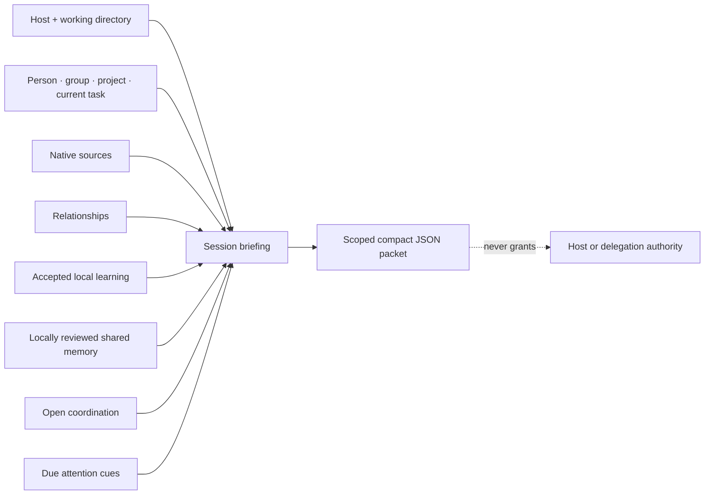

# Session briefing

As of `0.2.0`, native lifecycle hooks generate and inject this packet automatically at start, resume, prompt, and compaction boundaries. MCP and CLI remain inspection surfaces; model-side tool selection is not part of automatic continuity.

`session_briefing` assembles the smallest useful, provider-neutral context packet for one Claude Code, Codex, or generic MCP session. It replaces a chain of separate context reads without turning aggregation into authority.



## One scoped read

```bash
agentspine briefing /path/to/project \
  --host codex \
  --entity person:mayk \
  --project project:agentspine \
  --current-task task:release \
  --max-bytes 16384 \
  --json
```

The equivalent MCP tool is `session_briefing`. Its inputs are optional so a host can begin with native sources only and add stable entity, group, project, and task IDs when known.

The packet contains:

- host-native instruction, soul, memory-index, and linked-source descriptors;
- the current task first, followed by other visible scoped work;
- the requested entity and its visible relationship neighborhood;
- accepted local learning relevant to the entity or project;
- locally reviewed shared memory, deduplicated against equivalent local learning;
- due attention suggestions only when focus mode is explicitly disabled.

Candidates, rejected or superseded learning, pending shared imports, delegation grants, assignment proof, credentials, adapter configuration, signer material, and private keys are never included.

## Budget behavior

`maxBytes` is measured against the compact UTF-8 JSON representation of the complete result, not only source text. The response reports `usedBytes`, `remainingBytes`, the measurement mode, and omission counts by section.

Values are atomic: AgentSpine includes a complete source or record, or leaves it out. It never truncates a Markdown document, claim, relationship, task, or cue. Source content is capped at half the packet and 8 KiB so one large file cannot starve current-task context. Every source descriptor retains its original path, layer, byte size, and SHA-256; omitted content remains available through `read_document`.

The accepted range is 4 KiB through 256 KiB. The default is 16 KiB.

## Focus and privacy

Focus is active by default. In that mode attention reports `focus-active` and contributes no cues. `--allow-attention` disables focus suppression for an intentional review; reading a briefing never marks a cue as presented.

A group briefing requires an exact known `groupId`. It:

- rejects `includePrivate` rather than trying to mix private and group audiences;
- permits relationship members only through visible `member-of` edges for that exact group;
- excludes records scoped to every other group;
- returns source metadata without Markdown content, because arbitrary source text has no machine-verifiable group audience.

Direct private context remains an explicit, non-group request.

## Authority boundary

The whole packet and every overlay record remain `context-only`. A current task describes focus; it does not authorize execution. Relationships, learned claims, shared claims, attention cues, Markdown, and a `responsible-for` edge cannot create permissions or delegation. Host policy controls tools and external actions. AgentSpine's separate explicit local delegation policy controls only its own cross-entity coordination operations.

Lifecycle hooks inject only counts and kinds. They may recommend this single scoped read, but never inject briefing contents automatically.
