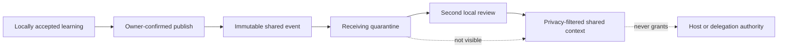

# Shared memory adapters

AgentSpine can exchange reviewed context between installations without requiring a vendor account, hosted database, or network service. The first reference adapter uses an ordinary directory. That directory may remain local or be placed on a user-controlled network drive or synchronization service.

Shared memory is optional. Local discovery, identity, learning, relationships, attention, coordination, and auditing remain complete when no adapter exists.

## Trust flow



Only an accepted local learning record can be published. The receiving installation imports the event as `pending`; it is absent from `shared_context` until a local user explicitly accepts it. This double-review model treats transport integrity and human trust as separate concerns.

AgentSpine never shares:

- private learning;
- source Markdown or document contents;
- evidence summaries or conversation transcripts;
- delegation policy or assignment grants;
- tasks, attention cues, credentials, or host settings;
- graph state or private relationship profiles.

## Directory adapter

Initialize a scope in a directory outside the scanned project:

```bash
agentspine share-init /srv/agent-memory/team-alpha \
  --scope team:alpha \
  --adapter adapter:team-alpha \
  --confirm-local-share
```

The resulting layout is deliberately portable:

```text
team-alpha/
  .agentspine-exchange.json
  events/
    <sha256-of-event-id>.json
```

The manifest binds the directory to one stable scope. Events are immutable JSON records. Their filenames derive from stable event IDs, which gives different writers deterministic collision behavior without relying on a central server.

The directory must be outside the scanned project, including after symlink resolution. Adapter manifests, event files, and the event directory must be regular filesystem objects rather than symlinks. A pull is capped at 2,000 events and 20 MiB; each manifest or event is capped at 64 KiB.

## Publish and receive

Publish an already accepted learning:

```bash
agentspine share-publish /srv/agent-memory/team-alpha \
  --root /path/to/source-project \
  --learning learning:release-process \
  --id shared:release-process-v1 \
  --confirm-local-share
```

Pull on another installation:

```bash
agentspine share-pull /srv/agent-memory/team-alpha \
  --root /path/to/receiving-project

agentspine share-inbox /path/to/receiving-project --status pending --json
```

Pulling reads the adapter and writes only to the receiving project's external `sharing.json`. It never changes the adapter, the project, or accepted context. Repeated and concurrent pulls are idempotent.

Review locally, then read:

```bash
agentspine share-review shared:release-process-v1 \
  --root /path/to/receiving-project \
  --decision accept \
  --reason "Confirmed for this installation" \
  --confirmed-by-user

agentspine share-context /path/to/receiving-project \
  --scope team:alpha \
  --json
```

`--confirmed-by-user` is an integration attestation, not authentication. A wrapper must bind it to a real local user action. It must never be inferred from an imported event, another agent, memory, Markdown, a task, or a prior confirmation at the publishing installation.

## Event contract

Every `agentspine.shared-event/v1` contains only:

- stable event, scope, and origin-instance IDs;
- learning kind and descriptive claim;
- optional subject and exact group scope;
- confidence and publication timestamp;
- minimal provenance: source learning ID, acceptance timestamp, automatic/manual marker, evidence count, and a digest of the original review proof;
- optional predecessor event ID;
- `authority: context-only`;
- a SHA-256 digest over canonical JSON.

Unknown fields are rejected. IDs are identifiers, not identities or authentication claims. An `originInstanceId` distinguishes local installations but does not prove who operated one.

The digest detects accidental damage and unsophisticated mutation. It is not a signature: anyone who can write the adapter directory can replace an event and recompute its digest. This is why imported events remain quarantined until a second local review. Deployments requiring authenticated authors should implement a future signed adapter without weakening the same quarantine and authority boundaries.

## Supersession and rollback

New shared information does not overwrite old context. Publish the replacement with an explicit predecessor:

```bash
agentspine share-publish /srv/agent-memory/team-alpha \
  --root /path/to/source-project \
  --learning learning:release-process-v2 \
  --id shared:release-process-v2 \
  --supersedes shared:release-process-v1 \
  --confirm-local-share
```

The adapter verifies that predecessor and replacement retain the same kind, subject, and privacy scope. When the receiver accepts the replacement, the old active record becomes `superseded` and remains in history. A rollback restores it atomically:

```bash
agentspine share-rollback shared:release-process-v2 \
  --root /path/to/receiving-project \
  --reason "The replacement was incorrect"
```

Permanent local deletion is CLI-only, requires `--confirm-local-share`, and removes the selected import plus retained local versions. It does not delete the immutable event from the shared adapter.

## Privacy and groups

Only `shared` and `group` learning can be published. Group events retain the exact group ID and optional subject. The receiving installation must know that group and its visible membership before acceptance. `includePrivate` cannot bypass a missing or different group audience.

Lifecycle hooks have no group audience. They expose only counts and kinds of already accepted, non-private shared context. They never inject claims, subjects, adapter paths, pending inbox records, or event provenance.

## MCP boundary

MCP exposes only `shared_context`, which reads locally accepted records. Adapter initialization, publication, pulling, inbox review, rollback, configuration, and deletion remain local CLI operations. An agent therefore cannot use AgentSpine's MCP surface to connect an arbitrary path, export data, accept its own import, or widen trust.

## Adapter compatibility

A future adapter may use object storage, a database, a peer protocol, or a hosted API. To remain compatible it must produce the same strict manifest and event semantics or map its transport into them before local import:

1. immutable stable event IDs;
2. canonical integrity digest or stronger authenticated proof;
3. one explicit scope per adapter connection;
4. no private, authority, source-document, evidence-text, task, or policy payloads;
5. quarantine before local review;
6. idempotent import and collision detection;
7. retained supersession history and rollback;
8. no dependency for local AgentSpine operation.

Transport plugins may strengthen authenticity, encryption, retention, and remote access control. They may never weaken privacy filtering, local confirmation, the context-only authority marker, or protected-source preservation.
