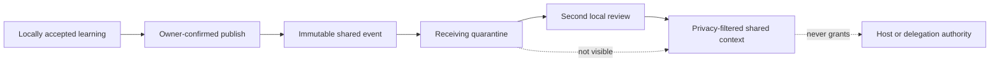
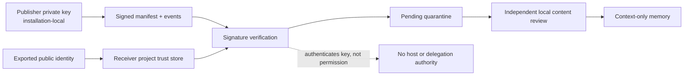

# Shared memory adapters

AgentSpine can exchange reviewed context between installations without requiring a vendor account, hosted database, or network service. The first reference adapter uses an ordinary directory. That directory may remain local or be placed on a user-controlled network drive or synchronization service.

A signed directory can also be exported as an immutable JSON file for the hardened, provider-neutral [HTTPS snapshot transport](https-transport.md). HTTPS is only another delivery path: all signer trust, quarantine, local review, privacy, history, and authority rules remain identical.

Shared memory is optional. Local discovery, identity, learning, relationships, attention, coordination, and auditing remain complete when no adapter exists.

## Trust flow



Only an accepted local learning record can be published. The receiving installation imports the event as `pending`; it is absent from `shared_context` until a local user explicitly accepts it. This double-review model treats transport integrity and human trust as separate concerns.

AgentSpine never shares:

- private learning;
- source Markdown or document contents;
- evidence summaries or conversation transcripts;
- delegation policy or assignment grants;
- tasks, attention cues, credentials, or host settings;
- graph state or private relationship profiles.

## Directory adapter

Initialize a scope in a directory outside the scanned project:

```bash
agentspine share-init /srv/agent-memory/team-alpha \
  --scope team:alpha \
  --adapter adapter:team-alpha \
  --confirm-local-share
```

The resulting layout is deliberately portable:

```text
team-alpha/
  .agentspine-exchange.json
  events/
    <sha256-of-event-id>.json
```

The manifest binds the directory to one stable scope. Events are immutable JSON records. Their filenames derive from stable event IDs, which gives different writers deterministic collision behavior without relying on a central server.

The directory must be outside the scanned project, including after symlink resolution. Adapter manifests, event files, and the event directory must be regular filesystem objects rather than symlinks. A pull is capped at 2,000 events and 20 MiB; each manifest or event is capped at 64 KiB.

## Authenticated signed mode

The baseline adapter uses canonical SHA-256 integrity for compatibility. Anyone with write access can replace a baseline event and recompute its digest. Signed mode adds Ed25519 origin authentication while preserving the same event payload, quarantine, privacy, and review workflow.



Create a local signer and export only its public identity:

```bash
agentspine share-keygen signer:team-alpha \
  --root /path/to/publisher-project \
  --public-out /safe/exchange/team-alpha-signer.json \
  --confirm-local-share
```

The private key is generated under the AgentSpine installation state directory. It is never returned by the command, copied into the project, placed in the adapter, exposed through MCP, or injected by hooks. The exported JSON contains the Ed25519 public key, stable signer ID, cryptographic key fingerprint, creation time, and integrity digest.

The receiving project must trust that exact exported key through a genuine local owner action:

```bash
agentspine share-trust /safe/exchange/team-alpha-signer.json \
  --root /path/to/receiving-project \
  --confirm-local-share

agentspine share-trust-list /path/to/receiving-project --json
```

Create and publish through a signed adapter:

```bash
agentspine share-init /srv/agent-memory/team-alpha \
  --root /path/to/publisher-project \
  --scope team:alpha \
  --signer signer:team-alpha \
  --confirm-local-share

agentspine share-publish /srv/agent-memory/team-alpha \
  --root /path/to/publisher-project \
  --learning learning:release-process \
  --id shared:release-process-v1 \
  --signer signer:team-alpha \
  --confirm-local-share
```

Require authentication at the receiver:

```bash
agentspine share-pull /srv/agent-memory/team-alpha \
  --root /path/to/receiving-project \
  --require-authenticated
```

Pull verifies the signed manifest and every signed event before any quarantine write. A signed adapter cannot mix unsigned events, and an unsigned adapter cannot smuggle signed files. Each event signer is checked independently, so a trusted adapter owner does not implicitly trust another writer.

### What a signature means

A valid signature proves that the envelope matches the private key corresponding to a public key explicitly trusted for this receiving project. It does not prove the operator's legal identity, truthfulness, current role, relationship, or permission. It does not approve the claim, grant delegation, authorize a tool, or bypass the second local content review.

Public-key exchange must therefore use a channel appropriate to the deployment. Compare the full key fingerprint out of band when identity matters. Encrypt the transport when metadata confidentiality matters; signatures provide authenticity and integrity, not encryption.

### Rotation and revocation

Rotation is explicit and never overwrites the old public identity silently:

```bash
agentspine share-keygen signer:team-alpha \
  --root /path/to/publisher-project \
  --rotate \
  --public-out /safe/exchange/team-alpha-signer-v2.json \
  --confirm-local-share
```

The installation retains the retired public identity in history and removes the retired local private key. Receivers import the new public identity as a separate trusted fingerprint. Old signatures remain cryptographically verifiable as long as the old public trust record remains available.

Revoke a compromised or retired key locally:

```bash
agentspine share-trust-revoke ed25519:<full-fingerprint> \
  --root /path/to/receiving-project \
  --reason "Key retired after verified rotation" \
  --confirm-local-share
```

Revocation blocks new acceptance immediately. If already accepted context depends on that key, shared context and audit fail closed until the user rolls back, rejects, or permanently deletes the affected import. Revocation never rewrites source Markdown or remote adapter files.

## Publish and receive

Publish an already accepted learning:

```bash
agentspine share-publish /srv/agent-memory/team-alpha \
  --root /path/to/source-project \
  --learning learning:release-process \
  --id shared:release-process-v1 \
  --confirm-local-share
```

Pull on another installation:

```bash
agentspine share-pull /srv/agent-memory/team-alpha \
  --root /path/to/receiving-project

agentspine share-inbox /path/to/receiving-project --status pending --json
```

Pulling reads the adapter and writes only to the receiving project's external `sharing.json`. It never changes the adapter, the project, or accepted context. Repeated and concurrent pulls are idempotent.

Review locally, then read:

```bash
agentspine share-review shared:release-process-v1 \
  --root /path/to/receiving-project \
  --decision accept \
  --reason "Confirmed for this installation" \
  --confirmed-by-user

agentspine share-context /path/to/receiving-project \
  --scope team:alpha \
  --json
```

`--confirmed-by-user` is an integration attestation, not authentication. A wrapper must bind it to a real local user action. It must never be inferred from an imported event, another agent, memory, Markdown, a task, or a prior confirmation at the publishing installation.

## Event contract

Every `agentspine.shared-event/v1` contains only:

- stable event, scope, and origin-instance IDs;
- learning kind and descriptive claim;
- optional subject and exact group scope;
- confidence and publication timestamp;
- minimal provenance: source learning ID, acceptance timestamp, automatic/manual marker, evidence count, and a digest of the original review proof;
- optional predecessor event ID;
- `authority: context-only`;
- a SHA-256 digest over canonical JSON.

Signed mode wraps the unchanged event in an `agentspine.signed-envelope/v1` containing a strict public identity, envelope kind, signing timestamp, `context-only` marker, and Ed25519 signature. The receiver retains the minimal signature proof with the quarantined record and replays it during reads and audits. Public keys and signatures are intentionally omitted from hook text and MCP context results; callers see only a signer ID, key fingerprint, and verification time.

Unknown fields are rejected. IDs are identifiers, not identities or authentication claims. An `originInstanceId` distinguishes local installations but does not prove who operated one.

The baseline digest detects accidental damage and unsophisticated mutation. It is not a signature: anyone who can write the adapter directory can replace an event and recompute its digest. Signed mode detects that replacement unless the attacker also controls a locally trusted private key. Both modes retain quarantine because authentication and content trust are different decisions.

## Supersession and rollback

New shared information does not overwrite old context. Publish the replacement with an explicit predecessor:

```bash
agentspine share-publish /srv/agent-memory/team-alpha \
  --root /path/to/source-project \
  --learning learning:release-process-v2 \
  --id shared:release-process-v2 \
  --supersedes shared:release-process-v1 \
  --confirm-local-share
```

The adapter verifies that predecessor and replacement retain the same kind, subject, and privacy scope. When the receiver accepts the replacement, the old active record becomes `superseded` and remains in history. A rollback restores it atomically:

```bash
agentspine share-rollback shared:release-process-v2 \
  --root /path/to/receiving-project \
  --reason "The replacement was incorrect"
```

Permanent local deletion is CLI-only, requires `--confirm-local-share`, and removes the selected import plus retained local versions. It does not delete the immutable event from the shared adapter.

## Privacy and groups

Only `shared` and `group` learning can be published. Group events retain the exact group ID and optional subject. The receiving installation must know that group and its visible membership before acceptance. `includePrivate` cannot bypass a missing or different group audience.

Lifecycle hooks have no group audience. They expose only counts and kinds of already accepted, non-private shared context. They never inject claims, subjects, adapter paths, pending inbox records, or event provenance.

## MCP boundary

MCP exposes only `shared_context`, which reads locally accepted records. Adapter initialization, publication, pulling, inbox review, rollback, configuration, deletion, key generation, rotation, trust, and revocation remain local CLI operations. An agent therefore cannot use AgentSpine's MCP surface to connect an arbitrary path, export data, accept its own import, read a private key, trust itself, or widen trust.

## Adapter compatibility

The implemented HTTPS, mutable-feed, peer, and local SQLite adapters map their transport back into the reference directory semantics before local import. Future hosted adapters must produce the same strict manifest and event semantics or map their transport into them before local import:

1. immutable stable event IDs;
2. canonical integrity digest and, for authenticated transports, a verifiable signed envelope;
3. one explicit scope per adapter connection;
4. no private, authority, source-document, evidence-text, task, or policy payloads;
5. quarantine before local review;
6. idempotent import and collision detection;
7. retained supersession history and rollback;
8. no dependency for local AgentSpine operation.
9. explicit key trust, rotation, and revocation without converting signatures into authority.

Transport plugins may strengthen authenticity, encryption, retention, and remote access control. They may never weaken privacy filtering, local confirmation, the context-only authority marker, or protected-source preservation.
