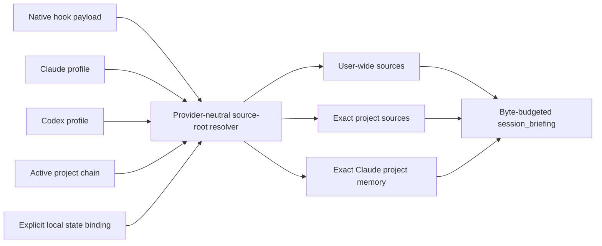

# Host-native source roots

## MCP preflight source parity (0.72.1)

`session_briefing`, `delivery_knowledge_query`, `resolve_context`, and
`read_document` resolve bounded sources internally. The knowledge query shares
one catalog across contract readers and its nested briefing; it never falls back
to a home-tree scan. Pass the exact resolved project root and choose the host
with `host` where supported. `read_document` accepts the same host selector and
host source IDs returned by the briefing. Generic mode loads project sources,
not another provider's profile or auto-memory.

Catalogs, source registries, environments and user-state locations are internal
inputs, not trusted MCP arguments. A required preflight with incomplete discovery
returns an error without a successful receipt. Retry after correcting the source
problem; no state reset is necessary. Read-only briefing may return bounded
available context with diagnostics, while hook scan errors retain their existing
fail-open lifecycle handling. Source metadata and receipts confer no authority.

Synthetic tests count directory accesses through actual MCP requests, exercise
permission-error retry, independent protocol instances, exact requirement scope,
source replacement and read races. They do not establish installed Codex, Claude
or Kimi tool availability; native discovery and live task outcomes need separate
measurements. No live configuration or user source is changed by this repair.

AgentSpine `0.8.0` resolves active user, project, and host-memory sources before every production lifecycle hook. Resolution does not depend on the directory from which the plugin was installed, and it never treats the entire home directory as one project.

## Resolution contract



Claude resolution follows the documented user and project hierarchy: `CLAUDE_CONFIG_DIR` or `~/.claude`, user `CLAUDE.md` and rules, the active project chain, and the exact project-memory directory evidenced by `autoMemoryDirectory`, `CLAUDE_CODE_PROJECT_DIR_NAME`, or the native hook `transcript_path`. Inside that directory, `MEMORY.md` is the only index. The live path never enumerates that directory and never follows links found inside a fact file. AgentSpine does not guess Claude's private project-directory encoding. See Anthropic's [memory hierarchy and storage-location documentation](https://code.claude.com/docs/en/memory) and [Claude configuration directory documentation](https://code.claude.com/docs/en/claude-directory).

## Indexed and lazy memory

Every direct index link is counted as indexed, but its target is opened only when a marker proves relevance:

```markdown
- [Communication style](style.md) <!-- agentspine:always -->
- [BLUN project](projects/blun.md) <!-- agentspine:project=project:blun -->
- [Alpha team](groups/alpha.md) <!-- agentspine:group=group:alpha -->
- [Owner preference](people/owner.md) <!-- agentspine:entity=person:owner -->
- [Current handoff](tasks/handoff.md) <!-- agentspine:task=task:handoff -->
- [Carbonara preference](food/pasta.md) <!-- agentspine:keywords=carbonara,pasta -->
```

An exact person, project, group, or task ID must match the current hook scope. Prompt relevance requires a normalized keyword match against the link label, filename, or explicit `keywords` marker. If relevance is uncertain, the target remains unopened. The index itself is always loaded so the host retains its native memory overview.

The persistent cache lives under AgentSpine's platform state directory, outside ordinary agent projects. If the active project root is exactly a recognized user home, the configured AgentSpine state subtree may be below that root but is explicitly pruned before source enumeration; it is never context. The exception does not apply to nested project roots. The cache stores integrity-checked snapshots keyed by an opaque root digest and relative path. A cache hit still opens and validates the original path and file identity, but does not reread or rehash unchanged source bytes. Corrections, deletion, link removal, source-binding rollback, purge, restart, and compaction invalidate or prune the affected cache record immediately. Cache contents and relevance markers are context-only.

Indexed targets use no-follow open semantics. Parent components, canonical scope, regular-file status, size, identity, modification metadata, and the pathname-to-handle identity are checked around the same read. A changing target is retried a bounded number of times and then rejected as a race; mixed snapshots are never injected.

The live resolver processes at most 128 direct index links, one target at a time, under the host resolver's two-second work budget. `MEMORY.md` and each target are limited to 4 MiB, while the complete external cache is capped at 16 MiB. Exceeding a bound fails closed instead of widening discovery.

Codex resolution uses `CODEX_HOME` or `~/.codex`, selects `AGENTS.override.md` before `AGENTS.md` at user scope, and walks from the configured project root to `cwd`. Per directory it selects override, regular, then the configured `project_doc_fallback_filenames`; `project_root_markers` and `project_doc_max_bytes` are read from the active profile's `config.toml`. Without a root marker, only `cwd` is the project root. See OpenAI's [AGENTS.md discovery order](https://developers.openai.com/codex/agent-configuration/agents-md) and [configuration reference](https://developers.openai.com/codex/config-reference).

Only regular files under these evidenced roots are read. Symlinks are skipped. The resolver caps source count, per-file bytes, aggregate bytes, and recursive host-rule files. Required native instructions are collected first. Optional project-wide Markdown then uses only the remaining aggregate budget, at most 240 files, 8,192 directory entries and the shared two-second resolution budget. Reaching one of those optional discovery bounds keeps the deterministic partial context, skips the remainder and emits an audited `bounded-truncated` warning instead of blocking tools. Mandatory-source, aggregate-byte and safety failures are unchanged.

A project-root scan is never run when the resolved root is the user's home directory or the exact configured Claude, Codex, or BLUN profile root. The self-starter applies the same exact-root exclusion before catalog construction or fingerprinting. A project nested inside a profile is not excluded and remains bounded and fully enforced. Foreign repositories and arbitrary hidden directories are not traversed.

An inaccessible or concurrently removed entry is omitted from a bounded scan and reported in its skipped-path diagnostics. If a deeper scanner still reports a raw `EPERM` or `EACCES` directory-enumeration error, or a scanner-tagged incomplete traversal, every native hook event returns successfully and appends the actual event, phase, code, and affected path to the local scan audit. This availability rule does not convert policy, identity, permission, protected-source, or execution-grant failures into allows.

## Portable user continuity

Accepted preferences, no-gos, corrections, and references can be attached once to the local user through an explicit state binding. The binding references the existing external AgentSpine state; it does not copy records between project hashes.

```bash
agentspine source-bind /path/where/continuity-was-configured \
  --host all \
  --scope state-user \
  --project /current/project \
  --host-home /current/profile \
  --confirm-local-binding
```

Only portable low-risk learning and the known person relationship context are read from this binding. Project facts, tasks, attention events, group/private project content, delegation policy, execution grants, jobs, secrets, and trust material remain in the exact project state. The registry is append-audited and supports explicit rollback and purge:

```bash
agentspine source-status --host claude --cwd /current/project --json
agentspine source-rollback binding:ID --confirm-local-binding
agentspine source-purge binding:ID --confirm-local-binding
```

Bindings and their provenance are context-only. They cannot create identity equivalence, roles, permissions, delegation, host trust, or self-starter rights.

## Empty and damaged state

Hook context includes a bounded `sourceResolution` report with checked scopes, counts, profile digest, project root, and the concrete empty or fail-closed reason. Indexed-memory diagnostics add counts for indexed, relevant, loaded, cache hits, cache misses, missing targets, scope omissions, path escapes, symlinks, size rejection, races, and live directory enumeration. They never include fact contents or fact paths. `agentspine doctor --host claude|codex --cwd … --json`, `agentspine source-status`, and `agentspine audit … --host … --json` expose the same report.

Live hooks never enumerate orphaned files. An operator can request the separate bounded offline diagnostic explicitly:

```bash
agentspine doctor --host claude --cwd /current/project --offline-memory-orphans --json
```

It reports counts only, reads no orphan content, follows no symlinks, and grants no cleanup or deletion authority.

The installed-bundle check reproduces the original zero-source failure from an AgentSpine checkout and a foreign `cwd`, repeats restart and compaction, exercises custom Claude and Codex homes, Codex fallback and nested override precedence, and proves no broad home scan, no foreign-project visibility, zero model-side MCP calls, exactly one hook set, and unchanged source bytes.

The scale acceptance creates 50,000 real unindexed files beside six indexed entries. For the fully matching scope it records five loaded facts, seven safe opens (`MEMORY.md` twice plus five targets), zero directory enumerations, and no opens, reads, hashes, or counts for the 50,000 files. The same instrumentation result is independent of the unindexed file count; wall-clock thresholds are deliberately not used as a correctness oracle.
