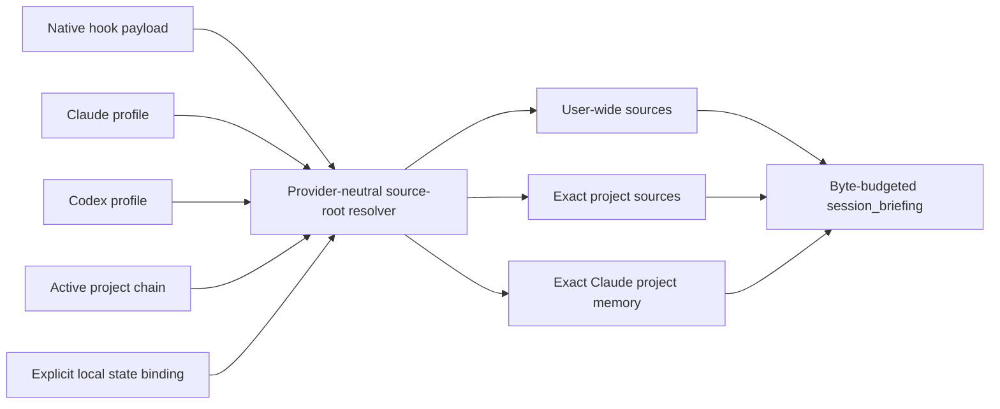

# Host-native source roots

AgentSpine `0.6.0` resolves active user, project, and host-memory sources before every production lifecycle hook. Resolution does not depend on the directory from which the plugin was installed, and it never treats the entire home directory as one project.

## Resolution contract



Claude resolution follows the documented user and project hierarchy: `CLAUDE_CONFIG_DIR` or `~/.claude`, user `CLAUDE.md` and rules, the active project chain, and the exact project-memory directory evidenced by `autoMemoryDirectory`, `CLAUDE_CODE_PROJECT_DIR_NAME`, or the native hook `transcript_path`. AgentSpine does not guess Claude's private project-directory encoding. See Anthropic's [memory hierarchy and storage-location documentation](https://code.claude.com/docs/en/memory) and [Claude configuration directory documentation](https://code.claude.com/docs/en/claude-directory).

Codex resolution uses `CODEX_HOME` or `~/.codex`, selects `AGENTS.override.md` before `AGENTS.md` at user scope, and walks from the configured project root to `cwd`. Per directory it selects override, regular, then the configured `project_doc_fallback_filenames`; `project_root_markers` and `project_doc_max_bytes` are read from the active profile's `config.toml`. Without a root marker, only `cwd` is the project root. See OpenAI's [AGENTS.md discovery order](https://developers.openai.com/codex/agent-configuration/agents-md) and [configuration reference](https://developers.openai.com/codex/config-reference).

Only regular files under these evidenced roots are read. Symlinks are skipped. The resolver caps source count, per-file bytes, aggregate bytes, and recursive host-rule files. A project-root scan is never run when the resolved root is the user's home directory. Foreign repositories and arbitrary hidden directories are not traversed.

## Portable user continuity

Accepted preferences, no-gos, corrections, and references can be attached once to the local user through an explicit state binding. The binding references the existing external AgentSpine state; it does not copy records between project hashes.

```bash
agentspine source-bind /path/where/continuity-was-configured \
  --host all \
  --scope state-user \
  --project /current/project \
  --host-home /current/profile \
  --confirm-local-binding
```

Only portable low-risk learning and the known person relationship context are read from this binding. Project facts, tasks, attention events, group/private project content, delegation policy, execution grants, jobs, secrets, and trust material remain in the exact project state. The registry is append-audited and supports explicit rollback and purge:

```bash
agentspine source-status --host claude --cwd /current/project --json
agentspine source-rollback binding:ID --confirm-local-binding
agentspine source-purge binding:ID --confirm-local-binding
```

Bindings and their provenance are context-only. They cannot create identity equivalence, roles, permissions, delegation, host trust, or self-starter rights.

## Empty and damaged state

Hook context includes a bounded `sourceResolution` report with checked scopes, counts, profile digest, project root, and the concrete empty or fail-closed reason. It never reports an empty source set as loaded personal continuity. `agentspine doctor --host claude|codex --cwd … --json`, `agentspine source-status`, and `agentspine audit … --host … --json` expose the same status without including source contents in diagnostics.

The installed-bundle check reproduces the original zero-source failure from an AgentSpine checkout and a foreign `cwd`, repeats restart and compaction, exercises custom Claude and Codex homes, Codex fallback and nested override precedence, and proves no broad home scan, no foreign-project visibility, zero model-side MCP calls, exactly one hook set, and unchanged source bytes.
