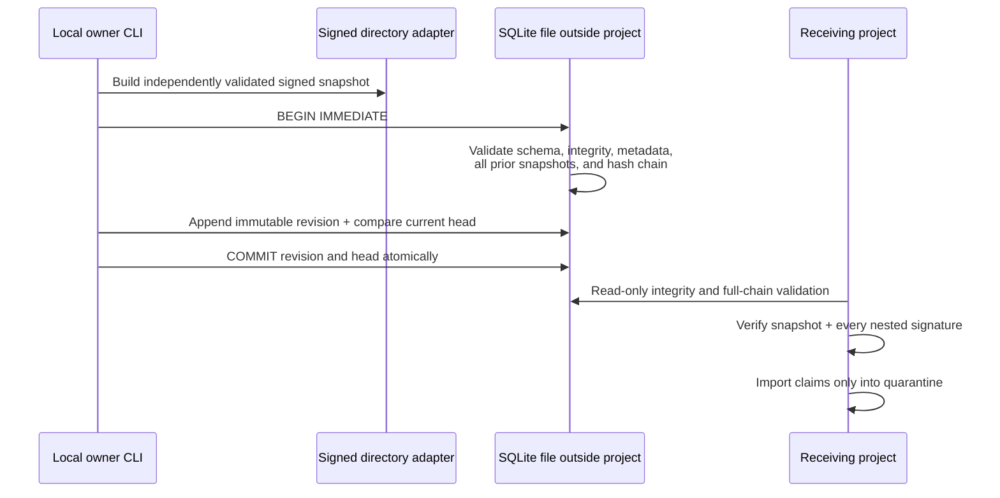

# Local SQLite snapshot transport

AgentSpine can retain authenticated shared-memory snapshots in one operator-selected SQLite file. The adapter is local, provider-neutral, optional, and implemented with Node.js `node:sqlite`; it adds no package dependency or cloud account. SQLite commands require Node.js 22.13 or newer for the hardened read-only and extension-control options. The rest of AgentSpine continues to support the runtime range declared by the package.

The database is a transport history, not a new source of identity, policy, or canonical memory. It stores complete signed snapshots outside the scanned project and imports only the latest verified snapshot into the existing quarantine.



## Initialize and publish

Start with an authenticated directory adapter. Keep the SQLite file outside every scanned agent project:

```bash
agentspine share-sqlite-init /srv/agent-memory/team-alpha \
  --root /path/to/publisher-project \
  --database /srv/agentspine-db/team-alpha.sqlite \
  --confirm-local-share

agentspine share-sqlite-publish /srv/agent-memory/team-alpha \
  --root /path/to/publisher-project \
  --database /srv/agentspine-db/team-alpha.sqlite \
  --id snapshot:team-alpha-2026-08-28 \
  --confirm-local-share
```

Initialization permanently binds the database to the directory adapter's signed manifest, scope, adapter ID, signer ID, and key ID. A later command cannot silently repurpose the file for another adapter or signing identity. Initialization and every publication require an explicit local owner confirmation.

Publication uses `BEGIN IMMEDIATE`, validates the entire retained state before mutation, then appends one revision and advances the single head in the same transaction. Repeating the exact same snapshot is idempotent. Different snapshots receive monotonically increasing sequence numbers and link to the previous revision digest. There is no update or delete command for revision history.

## Inspect and pull

```bash
agentspine share-sqlite-inspect \
  --root /path/to/project \
  --database /srv/agentspine-db/team-alpha.sqlite

agentspine share-sqlite-pull \
  --root /path/to/receiver-project \
  --database /srv/agentspine-db/team-alpha.sqlite
```

Inspection reports only transport metadata, hashes, counts, and context-only authority. Pull opens the database read-only, validates its SQLite integrity, exact application schema, authenticated manifest, every retained snapshot, the complete revision chain, and the atomic head. It then sends the latest snapshot through the normal signed importer. Received claims remain pending and invisible until a second local user review.

## Database contract

The v1 file has exactly three AgentSpine tables:

- `agentspine_meta`: one immutable binding to a signed directory manifest;
- `agentspine_revisions`: append-only signed-snapshot JSON plus a SHA-256 revision chain;
- `agentspine_head`: one transactionally advanced pointer to the newest revision.

Unexpected tables, views, triggers, indexes, schema versions, rows, broken digests, invalid JSON, malformed snapshots, signature failures, metadata changes, missing links, head mismatches, files over 128 MiB, symbolic-link or hard-link database and sidecar paths, and database paths inside the scanned project fail closed. SQLite extensions and double-quoted string literals are disabled, foreign keys and `trusted_schema=OFF` are set on every connection, defensive mode is enabled when the runtime exposes it, and SQL values use bound parameters.

The file contains repeated full snapshots so every retained revision is independently verifiable. It is intentionally capped at 1,000 revisions, 2,000 events per snapshot through the shared snapshot contract, 21 MiB per snapshot, and 128 MiB for the database and retained JSON validation budget. Operators should rotate to a new explicitly initialized file before reaching a limit; AgentSpine does not compact or delete history automatically.

## Security and authority boundary

Filesystem access to the SQLite file is the transport access-control boundary. AgentSpine requests owner-only file mode on platforms that support POSIX permissions, but operators remain responsible for directory permissions, backups, disk encryption, copying, OS-level locks, and physical device security. The adapter is not a multi-tenant database server, a replication protocol, or a remote credential store.

SQLite atomicity, integrity checks, hash chains, snapshot digests, and Ed25519 signatures detect defined corruption and origin-key mismatch. They do not establish real-world identity, freshness beyond the retained local head, truth, permission, delegation, production access, spending rights, or policy exceptions. Restoring an older but internally valid database copy cannot be distinguished without a separately retained external checkpoint.

Database initialization, publication, inspection, paths, and pull are absent from MCP and lifecycle hooks. Agents cannot select a database, write a revision, approve an import, or gain database access through AgentSpine's agent-controlled surfaces. Existing `AGENTS.md`, `CLAUDE.md`, `SOUL.md`, `MEMORY.md`, and every other discovered Markdown source remain in place and byte-for-byte unchanged.
